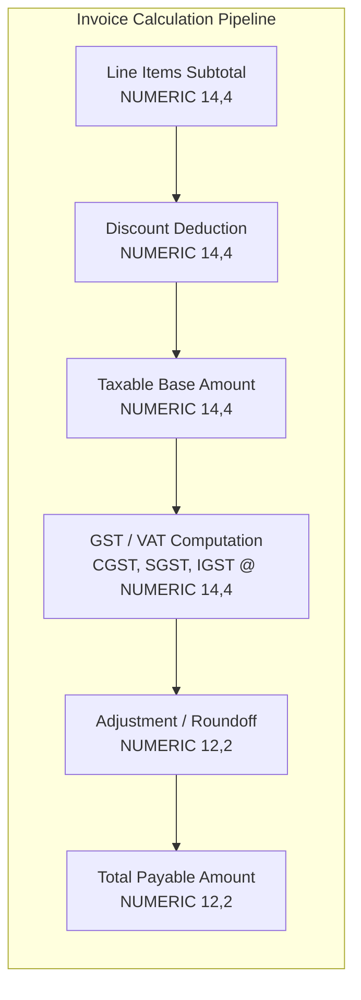
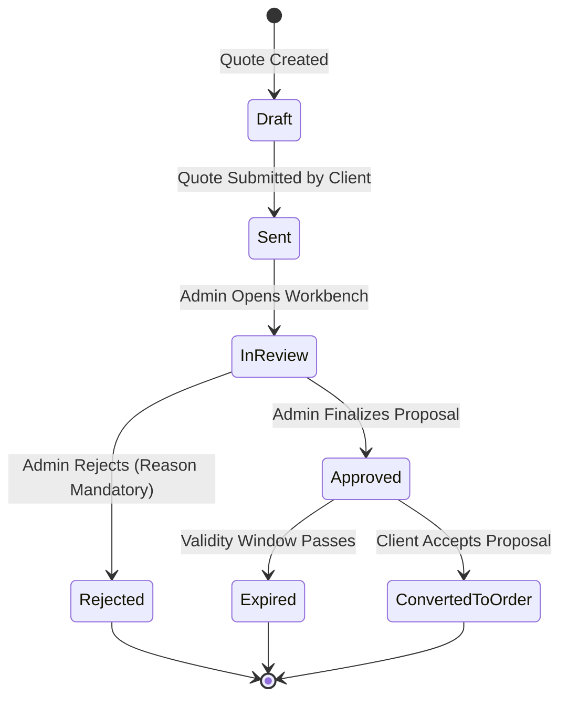
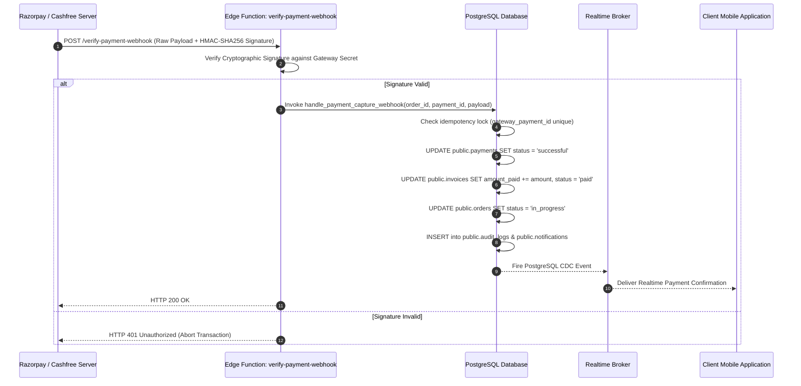

# HENU OS CLM — DATABASE, REALTIME & WEBHOOK ARCHITECTURE
**Document Version:** 1.0.0  
**Status:** Approved Database & Integration Specification  
**Target Platform:** Supabase PostgreSQL Platform  
**Authoritative References:** [HENU_OS_CLM_PRD.md](file:///j:/CLM%20HENU%20A%26M/HENU_OS_CLM_PRD.md), [HENU_OS_CLM_TECHNICAL_ARCHITECTURE.md](file:///j:/CLM%20HENU%20A%26M/HENU_OS_CLM_TECHNICAL_ARCHITECTURE.md), [HENU_OS_CLM_SECURITY_ACCESS.md](file:///j:/CLM%20HENU%20A%26M/HENU_OS_CLM_SECURITY_ACCESS.md), [HENU_OS_CLM_FRONTEND_SPECIFICATION.md](file:///j:/CLM%20HENU%20A%26M/HENU_OS_CLM_FRONTEND_SPECIFICATION.md), [HENU_OS_CLM_FEATURE_TICKETS.md](file:///j:/CLM%20HENU%20A%26M/HENU_OS_CLM_FEATURE_TICKETS.md)  

---

## TABLE OF CONTENTS
1. [Database Architecture & Design Principles](#1-database-architecture--design-principles)
2. [Sequential Identifier Generation Specifications](#2-sequential-identifier-generation-specifications)
3. [Monetary, Tax & Currency Precision Standards](#3-monetary-tax--currency-precision-standards)
4. [Deterministic State Machines & Transition Rules](#4-deterministic-state-machines--transition-rules)
5. [Complete Normalized Data Model (All Tables)](#5-complete-normalized-data-model)
   - 5.1 [Identity & Access Management Subsystem](#51-identity--access-management-subsystem)
   - 5.2 [Customer & CRM Subsystem](#52-customer--crm-subsystem)
   - 5.3 [Catalog, Services & Add-on Subsystem](#53-catalog-services--add-on-subsystem)
   - 5.4 [Portfolio & Showcase Subsystem](#54-portfolio--showcase-subsystem)
   - 5.5 [Digital Products & Software Subsystem](#55-digital-products--software-subsystem)
   - 5.6 [Special Offers & Campaigns Subsystem](#56-special-offers--campaigns-subsystem)
   - 5.7 [Commercial Quotation & Order Subsystem](#57-commercial-quotation--order-subsystem)
   - 5.8 [Invoicing, Billing & Ledgers Subsystem](#58-invoicing-billing--ledgers-subsystem)
   - 5.9 [Credit Notes & Client Account Statements](#59-credit-notes--client-account-statements)
   - 5.10 [Communication, Support & Ticket Desk Subsystem](#510-communication-support--ticket-desk-subsystem)
   - 5.11 [Notifications & Multi-Channel Alert Subsystem](#511-notifications--multi-channel-alert-subsystem)
   - 5.12 [CMS, Quick Actions & System Settings Subsystem](#512-cms-quick-actions--system-settings-subsystem)
   - 5.13 [Immutable Audit Logging Subsystem](#513-immutable-audit-logging-subsystem)
6. [Row Level Security (RLS) Policy Specifications](#6-row-level-security-rls-policy-specifications)
7. [Realtime Synchronization Architecture](#7-realtime-synchronization-architecture)
8. [Payment Gateway & Ingress Webhook Architecture](#8-payment-gateway--ingress-webhook-architecture)
9. [Storage Buckets & Media Access Policies](#9-storage-buckets--media-access-policies)
10. [Database Stored Procedures & Triggers Specification](#10-database-stored-procedures--triggers-specification)
11. [SQL Migration Execution Plan](#11-sql-migration-execution-plan)

---

# 1. DATABASE ARCHITECTURE & DESIGN PRINCIPLES

The **HENU OS Customer Lifecycle Management (CLM)** database is engineered around **Supabase PostgreSQL 15+**.

```mermaid
graph TD
    subgraph "Supabase PostgreSQL Database Core"
        AUTH_SCHEMA[auth Schema<br/>Users, Identities, Sessions]
        PUBLIC_SCHEMA[public Schema<br/>Business Entities, Ledgers, CMS]
        AUDIT_SCHEMA[audit Schema<br/>Append-Only Immutable Logs]
        STORAGE_SCHEMA[storage Schema<br/>Buckets, Objects, Policies]
    end

    subgraph "Database Logic & Security Layer"
        RLS[Row Level Security Engine]
        TRIGGERS[PL/pgSQL Triggers & Sequences]
        SPROC[Stored Procedures & Security Definers]
    end

    subgraph "Realtime & Serverless Connectivity"
        CDC[Logical Replication / pgoutput]
        EDGE[Supabase Edge Functions<br/>(Deno Runtime)]
    end

    AUTH_SCHEMA --> PUBLIC_SCHEMA
    PUBLIC_SCHEMA --> RLS
    PUBLIC_SCHEMA --> TRIGGERS
    TRIGGERS --> AUDIT_SCHEMA
    PUBLIC_SCHEMA --> CDC
    EDGE --> SPROC
    SPROC --> PUBLIC_SCHEMA
```

### Core Data Modeling Axioms
1. **Third Normal Form (3NF) Normalization**: Strict normalization across transactional ledgers; JSONB utilized solely for semi-structured dynamic payloads (e.g., raw webhook dumps, client preferences, metadata).
2. **Deterministic Foreign Key Cascades**: Explicit `ON DELETE RESTRICT` for financial and commercial ledgers (`quotes`, `orders`, `invoices`, `payments`) to prevent accidental data destruction; `ON DELETE CASCADE` for ephemeral metadata and junction tables.
3. **Optimistic Concurrency Control**: High-contention entities (`quotes`, `orders`, `invoices`) leverage PostgreSQL system row versioning (`xmin`) and `updated_at` timestamps.
4. **Soft-Delete Strategy**: Critical records utilize `deleted_at TIMESTAMPTZ DEFAULT NULL` with filtered indexes (`WHERE deleted_at IS NULL`) to ensure regulatory compliance and complete historical auditability.

---

# 2. SEQUENTIAL IDENTIFIER GENERATION SPECIFICATIONS

All business-facing entities utilize structured, human-readable, deterministic sequential identifiers generated via atomic PostgreSQL sequences.

| Entity | Identifier Format | Example Pattern | Generation Rule / Sequence |
| :--- | :--- | :--- | :--- |
| **Client / Customer** | `HENU-CL-YYYY-XXXXXX` | `HENU-CL-2026-000001` | Atomic sequence padded to 6 digits with year prefix. |
| **Quote Proposal** | `HENU-QT-YYYY-XXXXXX` | `HENU-QT-2026-000142` | Generated on quote submission via trigger. |
| **Sales Order** | `HENU-ORD-YYYY-XXXXXX` | `HENU-ORD-2026-000089`| Generated on quote conversion. |
| **Tax Invoice** | `HENU-INV-YYYY-XXXXXX`| `HENU-INV-2026-000312`| Generated upon invoice finalization/issuance. |
| **Payment Ledger** | `HENU-PAY-YYYY-XXXXXX`| `HENU-PAY-2026-000450`| Generated upon payment initiation. |
| **Credit Note** | `HENU-CR-YYYY-XXXXXX` | `HENU-CR-2026-000015` | Generated on credit note issue. |
| **Digital Product** | `HENU-PRD-XXXX` | `HENU-PRD-0042` | Generated on product creation. |
| **Support Ticket** | `HENU-SUP-YYYY-XXXXXX`| `HENU-SUP-2026-001024`| Generated on support conversation creation. |

---

# 3. MONETARY, TAX & CURRENCY PRECISION STANDARDS

To guarantee zero floating-point rounding errors across international currencies and tax regimes, all financial values adhere to fixed precision.



### Precision Standards & Tax Rules
- **Line Item Unit Rates & Quantities**: Stored as `NUMERIC(14, 4)` for high-precision fractions.
- **Aggregated Totals & Tax Balances**: Stored as `NUMERIC(12, 2)` (Banker's Rounding / Half-Even Rounding).
- **Supported Currencies**: ISO 4217 standard 3-character codes (`USD`, `INR`, `EUR`, `GBP`, `AED`). Default: `USD` / `INR`.
- **Tax Components**:
  - **CGST / SGST**: Intra-state Indian GST (e.g., 9% + 9% = 18%).
  - **IGST**: Inter-state Indian GST (18%).
  - **TDS / TCS**: Tax Deducted / Collected at Source where applicable.
  - **VAT**: Standard Value Added Tax for international jurisdictions.

---

# 4. DETERMINISTIC STATE MACHINES & TRANSITION RULES



### 1. Quotation State Machine (`quote_status_enum`)
- **Allowed States**: `draft`, `submitted`, `in_review`, `approved`, `rejected`, `expired`, `converted_to_order`.
- **Allowed Transitions**:
  - `draft` -> `submitted`
  - `submitted` -> `in_review`
  - `in_review` -> `approved` | `rejected`
  - `approved` -> `converted_to_order` | `expired`
- **Forbidden Transitions**: Any transition from `rejected`, `expired`, or `converted_to_order` to any other state.

### 2. Sales Order State Machine (`order_status_enum`)
- **Allowed States**: `pending_deposit`, `in_progress`, `review_pending`, `completed`, `cancelled`.
- **Allowed Transitions**:
  - `pending_deposit` -> `in_progress` (Triggered automatically upon deposit payment webhook)
  - `in_progress` -> `review_pending` | `cancelled`
  - `review_pending` -> `completed` | `in_progress`
  - `completed` -> `cancelled` (Forbidden once final assets released)

### 3. Invoice State Machine (`invoice_status_enum`)
- **Allowed States**: `draft`, `issued`, `partially_paid`, `paid`, `overdue`, `voided`, `refunded`.
- **Allowed Transitions**:
  - `draft` -> `issued`
  - `issued` -> `partially_paid` | `paid` | `overdue` | `voided`
  - `partially_paid` -> `paid` | `overdue`
  - `overdue` -> `partially_paid` | `paid` | `voided`
  - `paid` -> `refunded` (Only via authorized refund execution)

### 4. Payment State Machine (`payment_status_enum`)
- **Allowed States**: `initiated`, `processing`, `successful`, `failed`, `refunded`, `partially_refunded`.
- **Allowed Transitions**:
  - `initiated` -> `processing` | `failed`
  - `processing` -> `successful` | `failed`
  - `successful` -> `refunded` | `partially_refunded`

### 5. Support Ticket State Machine (`support_status_enum`)
- **Allowed States**: `open`, `waiting_on_client`, `waiting_on_agent`, `resolved`, `closed`, `reopened`.
- **Allowed Transitions**:
  - `open` -> `waiting_on_client` | `waiting_on_agent` | `resolved`
  - `waiting_on_client` -> `waiting_on_agent` | `resolved`
  - `resolved` -> `closed` | `reopened`
  - `closed` -> `reopened`

---

# 5. COMPLETE NORMALIZED DATA MODEL

---

### 5.1 Identity & Access Management Subsystem

#### 1. `public.profiles`
- **Purpose**: Master profile entity extending `auth.users` with client and admin attributes.
- **Primary Key**: `id UUID REFERENCES auth.users(id) ON DELETE CASCADE`
- **Foreign Keys**: None.
- **Columns**:
  - `id UUID PRIMARY KEY`
  - `client_code TEXT UNIQUE` (`HENU-CL-2026-000001`)
  - `first_name TEXT NOT NULL`
  - `last_name TEXT NOT NULL`
  - `company_name TEXT`
  - `email TEXT UNIQUE NOT NULL`
  - `phone TEXT`
  - `avatar_url TEXT`
  - `role user_role_enum NOT NULL DEFAULT 'client'`
  - `vip_tier TEXT NOT NULL DEFAULT 'Standard'`
  - `is_active BOOLEAN NOT NULL DEFAULT true`
  - `metadata JSONB NOT NULL DEFAULT '{}'::jsonb`
  - `deleted_at TIMESTAMPTZ DEFAULT NULL`
  - `created_at TIMESTAMPTZ NOT NULL DEFAULT NOW()`
  - `updated_at TIMESTAMPTZ NOT NULL DEFAULT NOW()`
- **Indexes**: `idx_profiles_role`, `idx_profiles_vip_tier`, `idx_profiles_email`, `idx_profiles_client_code`, `idx_profiles_trgm (GIN)`.
- **Audit Requirement**: Yes (All role, status, and metadata edits).
- **RLS Requirement**: Users read/update own; Admins with permissions read/update all.
- **Realtime Requirement**: Realtime broadcast on profile status/VIP tier update.

#### 2. `public.roles`
- **Purpose**: System and dynamic role definitions.
- **Primary Key**: `id UUID PRIMARY KEY DEFAULT gen_random_uuid()`
- **Columns**: `code TEXT UNIQUE NOT NULL`, `name TEXT NOT NULL`, `description TEXT`, `is_system_role BOOLEAN NOT NULL DEFAULT false`, `created_at TIMESTAMPTZ NOT NULL DEFAULT NOW()`.
- **Audit / RLS**: Super Admin only.

#### 3. `public.permissions`
- **Purpose**: Normalized granular permission registry (`module.resource.action`).
- **Primary Key**: `id UUID PRIMARY KEY DEFAULT gen_random_uuid()`
- **Columns**: `code TEXT UNIQUE NOT NULL`, `module TEXT NOT NULL`, `action TEXT NOT NULL`, `description TEXT`, `created_at TIMESTAMPTZ NOT NULL DEFAULT NOW()`.
- **Audit / RLS**: Super Admin only.

#### 4. `public.role_permissions`
- **Purpose**: Junction table mapping permissions to roles.
- **Primary Key**: `(role_id, permission_id)`
- **Foreign Keys**: `role_id REFERENCES public.roles(id) ON DELETE CASCADE`, `permission_id REFERENCES public.permissions(id) ON DELETE CASCADE`.

#### 5. `public.user_roles`
- **Purpose**: Junction table mapping users to assigned roles.
- **Primary Key**: `(user_id, role_id)`
- **Foreign Keys**: `user_id REFERENCES public.profiles(id) ON DELETE CASCADE`, `role_id REFERENCES public.roles(id) ON DELETE CASCADE`.

---

### 5.2 Customer & CRM Subsystem

#### 6. `public.customer_contacts`
- **Purpose**: Secondary contacts and stakeholders under a corporate client account.
- **Primary Key**: `id UUID PRIMARY KEY DEFAULT gen_random_uuid()`
- **Foreign Keys**: `customer_id UUID NOT NULL REFERENCES public.profiles(id) ON DELETE CASCADE`.
- **Columns**: `name TEXT NOT NULL`, `email TEXT NOT NULL`, `phone TEXT`, `designation TEXT`, `is_primary BOOLEAN NOT NULL DEFAULT false`, `created_at TIMESTAMPTZ NOT NULL DEFAULT NOW()`.

#### 7. `public.customer_addresses`
- **Purpose**: Billing and tax registration addresses for enterprise clients.
- **Primary Key**: `id UUID PRIMARY KEY DEFAULT gen_random_uuid()`
- **Foreign Keys**: `customer_id UUID NOT NULL REFERENCES public.profiles(id) ON DELETE CASCADE`.
- **Columns**: `address_type VARCHAR(20) NOT NULL CHECK (address_type IN ('billing', 'shipping', 'registered'))`, `street_line1 TEXT NOT NULL`, `street_line2 TEXT`, `city TEXT NOT NULL`, `state TEXT NOT NULL`, `postal_code TEXT NOT NULL`, `country TEXT NOT NULL DEFAULT 'India'`, `gstin TEXT`, `is_default BOOLEAN NOT NULL DEFAULT true`.

---

### 5.3 Catalog, Services & Add-on Subsystem

#### 8. `public.service_categories`
- **Purpose**: Taxonomy and grouping for services and digital offerings.
- **Primary Key**: `id UUID PRIMARY KEY DEFAULT gen_random_uuid()`
- **Columns**: `slug TEXT UNIQUE NOT NULL`, `name TEXT NOT NULL`, `description TEXT`, `icon_name TEXT NOT NULL`, `display_order INT NOT NULL DEFAULT 0`, `is_active BOOLEAN NOT NULL DEFAULT true`.

#### 9. `public.services`
- **Purpose**: Master service catalog items.
- **Primary Key**: `id UUID PRIMARY KEY DEFAULT gen_random_uuid()`
- **Foreign Keys**: `category_id UUID REFERENCES public.service_categories(id) ON DELETE SET NULL`.
- **Columns**: `slug TEXT UNIQUE NOT NULL`, `title TEXT NOT NULL`, `tagline TEXT`, `description TEXT NOT NULL`, `base_price NUMERIC(14, 4) NOT NULL DEFAULT 0.0000`, `currency VARCHAR(3) NOT NULL DEFAULT 'USD'`, `turnaround_time TEXT`, `is_featured BOOLEAN NOT NULL DEFAULT false`, `display_order INT NOT NULL DEFAULT 0`, `status content_status_enum NOT NULL DEFAULT 'published'`, `search_vector tsvector GENERATED ALWAYS AS (...) STORED`, `created_at TIMESTAMPTZ NOT NULL DEFAULT NOW()`, `updated_at TIMESTAMPTZ NOT NULL DEFAULT NOW()`.
- **Realtime**: Active broadcast on `public:catalog`.

#### 10. `public.service_media`
- **Purpose**: High-resolution gallery images, icons, and hero assets for services.
- **Primary Key**: `id UUID PRIMARY KEY DEFAULT gen_random_uuid()`
- **Foreign Keys**: `service_id UUID NOT NULL REFERENCES public.services(id) ON DELETE CASCADE`.
- **Columns**: `media_url TEXT NOT NULL`, `media_type VARCHAR(20) NOT NULL DEFAULT 'image'`, `caption TEXT`, `display_order INT NOT NULL DEFAULT 0`.

#### 11. `public.service_addons`
- **Purpose**: Modular add-on packages and customizable upgrades.
- **Primary Key**: `id UUID PRIMARY KEY DEFAULT gen_random_uuid()`
- **Foreign Keys**: `service_id UUID NOT NULL REFERENCES public.services(id) ON DELETE CASCADE`.
- **Columns**: `title TEXT NOT NULL`, `description TEXT`, `price NUMERIC(14, 4) NOT NULL DEFAULT 0.0000`, `currency VARCHAR(3) NOT NULL DEFAULT 'USD'`, `is_mandatory BOOLEAN NOT NULL DEFAULT false`, `display_order INT NOT NULL DEFAULT 0`, `status content_status_enum NOT NULL DEFAULT 'published'`.

---

### 5.4 Portfolio & Showcase Subsystem

#### 12. `public.portfolio_projects`
- **Purpose**: Case studies and creative portfolio showcases.
- **Primary Key**: `id UUID PRIMARY KEY DEFAULT gen_random_uuid()`
- **Columns**: `slug TEXT UNIQUE NOT NULL`, `title TEXT NOT NULL`, `client_name TEXT NOT NULL`, `category TEXT NOT NULL`, `summary TEXT NOT NULL`, `case_study_markdown TEXT`, `featured_image_url TEXT NOT NULL`, `deliverables TEXT[] DEFAULT '{}'`, `technologies TEXT[] DEFAULT '{}'`, `is_featured BOOLEAN NOT NULL DEFAULT false`, `display_order INT NOT NULL DEFAULT 0`, `status content_status_enum NOT NULL DEFAULT 'published'`.

#### 13. `public.portfolio_media`
- **Purpose**: Multi-image gallery attachments for portfolio projects.
- **Primary Key**: `id UUID PRIMARY KEY DEFAULT gen_random_uuid()`
- **Foreign Keys**: `project_id UUID NOT NULL REFERENCES public.portfolio_projects(id) ON DELETE CASCADE`.
- **Columns**: `media_url TEXT NOT NULL`, `display_order INT NOT NULL DEFAULT 0`.

---

### 5.5 Digital Products & Software Subsystem

#### 14. `public.products`
- **Purpose**: Digital software products, plugins, and source code repositories.
- **Primary Key**: `id UUID PRIMARY KEY DEFAULT gen_random_uuid()`
- **Columns**: `product_code TEXT UNIQUE NOT NULL`, `name TEXT NOT NULL`, `slug TEXT UNIQUE NOT NULL`, `description TEXT NOT NULL`, `current_version TEXT NOT NULL DEFAULT 'v1.0.0'`, `price NUMERIC(14, 4) NOT NULL DEFAULT 0.0000`, `currency VARCHAR(3) NOT NULL DEFAULT 'USD'`, `is_source_code_included BOOLEAN NOT NULL DEFAULT false`, `status content_status_enum NOT NULL DEFAULT 'published'`.

#### 15. `public.product_versions`
- **Purpose**: Version release archives and changelogs.
- **Primary Key**: `id UUID PRIMARY KEY DEFAULT gen_random_uuid()`
- **Foreign Keys**: `product_id UUID NOT NULL REFERENCES public.products(id) ON DELETE CASCADE`.
- **Columns**: `version_number TEXT NOT NULL`, `storage_path TEXT NOT NULL`, `file_checksum_sha256 TEXT NOT NULL`, `changelog_markdown TEXT`, `release_date TIMESTAMPTZ NOT NULL DEFAULT NOW()`.

---

### 5.6 Special Offers & Campaigns Subsystem

#### 16. `public.offers`
- **Purpose**: Promotional campaigns, coupon codes, and dynamic mobile hero banners.
- **Primary Key**: `id UUID PRIMARY KEY DEFAULT gen_random_uuid()`
- **Columns**: `code TEXT UNIQUE NOT NULL`, `title TEXT NOT NULL`, `subtitle TEXT`, `discount_type VARCHAR(20) NOT NULL CHECK (discount_type IN ('percentage', 'fixed_amount'))`, `discount_value NUMERIC(12, 2) NOT NULL`, `banner_image_url TEXT`, `accent_color TEXT DEFAULT '#06B6D4'`, `valid_from TIMESTAMPTZ NOT NULL`, `valid_until TIMESTAMPTZ NOT NULL`, `is_active BOOLEAN NOT NULL DEFAULT true`.

---

### 5.7 Commercial Quotation & Order Subsystem

#### 17. `public.quotes`
- **Purpose**: Bespoke commercial proposals and client estimation briefs.
- **Primary Key**: `id UUID PRIMARY KEY DEFAULT gen_random_uuid()`
- **Foreign Keys**: `user_id UUID NOT NULL REFERENCES public.profiles(id) ON DELETE RESTRICT`, `service_id UUID REFERENCES public.services(id) ON DELETE SET NULL`.
- **Columns**: `quote_number TEXT UNIQUE NOT NULL`, `title TEXT NOT NULL`, `project_scope TEXT NOT NULL`, `subtotal NUMERIC(14, 4) NOT NULL DEFAULT 0.0000`, `discount_amount NUMERIC(14, 4) NOT NULL DEFAULT 0.0000`, `tax_amount NUMERIC(14, 4) NOT NULL DEFAULT 0.0000`, `total_amount NUMERIC(12, 2) NOT NULL DEFAULT 0.00`, `currency VARCHAR(3) NOT NULL DEFAULT 'USD'`, `status quote_status_enum NOT NULL DEFAULT 'submitted'`, `rejection_reason TEXT`, `admin_notes TEXT`, `target_start_date DATE`, `target_delivery_date DATE`, `created_at TIMESTAMPTZ NOT NULL DEFAULT NOW()`, `updated_at TIMESTAMPTZ NOT NULL DEFAULT NOW()`.
- **Audit / Realtime**: Tracked on `user:{user_id}:quotes`.

#### 18. `public.quote_items`
- **Purpose**: Normalized line items and selected add-ons under a quote proposal.
- **Primary Key**: `id UUID PRIMARY KEY DEFAULT gen_random_uuid()`
- **Foreign Keys**: `quote_id UUID NOT NULL REFERENCES public.quotes(id) ON DELETE CASCADE`, `addon_id UUID REFERENCES public.service_addons(id) ON DELETE SET NULL`.
- **Columns**: `title TEXT NOT NULL`, `description TEXT`, `quantity NUMERIC(10, 2) NOT NULL DEFAULT 1.00`, `unit_price NUMERIC(14, 4) NOT NULL`, `total_price NUMERIC(14, 4) NOT NULL`.

#### 19. `public.quote_status_history`
- **Purpose**: Chronological timeline of quote state transitions.
- **Primary Key**: `id BIGSERIAL PRIMARY KEY`
- **Foreign Keys**: `quote_id UUID NOT NULL REFERENCES public.quotes(id) ON DELETE CASCADE`, `actor_id UUID REFERENCES public.profiles(id) ON DELETE SET NULL`.
- **Columns**: `from_status quote_status_enum`, `to_status quote_status_enum NOT NULL`, `notes TEXT`, `created_at TIMESTAMPTZ NOT NULL DEFAULT NOW()`.

#### 20. `public.orders`
- **Purpose**: Active commercial orders executing approved proposals.
- **Primary Key**: `id UUID PRIMARY KEY DEFAULT gen_random_uuid()`
- **Foreign Keys**: `order_number TEXT UNIQUE NOT NULL`, `quote_id UUID UNIQUE REFERENCES public.quotes(id) ON DELETE RESTRICT`, `user_id UUID NOT NULL REFERENCES public.profiles(id) ON DELETE RESTRICT`.
- **Columns**: `title TEXT NOT NULL`, `total_amount NUMERIC(12, 2) NOT NULL`, `currency VARCHAR(3) NOT NULL DEFAULT 'USD'`, `status order_status_enum NOT NULL DEFAULT 'pending_deposit'`, `progress_percentage INT NOT NULL DEFAULT 0 CHECK (progress_percentage BETWEEN 0 AND 100)`, `started_at TIMESTAMPTZ`, `completed_at TIMESTAMPTZ`, `created_at TIMESTAMPTZ NOT NULL DEFAULT NOW()`, `updated_at TIMESTAMPTZ NOT NULL DEFAULT NOW()`.

---

### 5.8 Invoicing, Billing & Ledgers Subsystem

#### 21. `public.invoices`
- **Purpose**: Legally binding tax invoices and accounts receivable ledger.
- **Primary Key**: `id UUID PRIMARY KEY DEFAULT gen_random_uuid()`
- **Foreign Keys**: `order_id UUID REFERENCES public.orders(id) ON DELETE SET NULL`, `quote_id UUID REFERENCES public.quotes(id) ON DELETE SET NULL`, `user_id UUID NOT NULL REFERENCES public.profiles(id) ON DELETE RESTRICT`.
- **Columns**: `invoice_number TEXT UNIQUE NOT NULL`, `subtotal NUMERIC(14, 4) NOT NULL`, `tax_amount NUMERIC(14, 4) NOT NULL DEFAULT 0.0000`, `discount_amount NUMERIC(14, 4) NOT NULL DEFAULT 0.0000`, `total_amount NUMERIC(12, 2) NOT NULL`, `amount_paid NUMERIC(12, 2) NOT NULL DEFAULT 0.00`, `amount_due NUMERIC(12, 2) NOT NULL`, `currency VARCHAR(3) NOT NULL DEFAULT 'USD'`, `status invoice_status_enum NOT NULL DEFAULT 'issued'`, `due_date DATE NOT NULL`, `pdf_storage_path TEXT`, `created_at TIMESTAMPTZ NOT NULL DEFAULT NOW()`, `updated_at TIMESTAMPTZ NOT NULL DEFAULT NOW()`.

#### 22. `public.invoice_items`
- **Purpose**: Normalized line items under a tax invoice.
- **Primary Key**: `id UUID PRIMARY KEY DEFAULT gen_random_uuid()`
- **Foreign Keys**: `invoice_id UUID NOT NULL REFERENCES public.invoices(id) ON DELETE CASCADE`.
- **Columns**: `description TEXT NOT NULL`, `hsn_sac_code TEXT`, `quantity NUMERIC(10, 2) NOT NULL DEFAULT 1.00`, `unit_rate NUMERIC(14, 4) NOT NULL`, `tax_rate_percentage NUMERIC(5, 2) NOT NULL DEFAULT 0.00`, `line_total NUMERIC(14, 4) NOT NULL`.

#### 23. `public.recurring_invoices`
- **Purpose**: Retainer and recurring subscription configurations.
- **Primary Key**: `id UUID PRIMARY KEY DEFAULT gen_random_uuid()`
- **Foreign Keys**: `user_id UUID NOT NULL REFERENCES public.profiles(id) ON DELETE RESTRICT`.
- **Columns**: `profile_id UUID NOT NULL`, `frequency VARCHAR(20) NOT NULL CHECK (frequency IN ('monthly', 'quarterly', 'annually'))`, `next_issue_date DATE NOT NULL`, `auto_charge BOOLEAN NOT NULL DEFAULT false`, `is_active BOOLEAN NOT NULL DEFAULT true`.

#### 24. `public.payments`
- **Purpose**: Master transaction ledger linking invoices to gateway settlements.
- **Primary Key**: `id UUID PRIMARY KEY DEFAULT gen_random_uuid()`
- **Foreign Keys**: `invoice_id UUID NOT NULL REFERENCES public.invoices(id) ON DELETE RESTRICT`, `user_id UUID NOT NULL REFERENCES public.profiles(id) ON DELETE RESTRICT`.
- **Columns**: `payment_reference TEXT UNIQUE NOT NULL`, `amount NUMERIC(12, 2) NOT NULL`, `currency VARCHAR(3) NOT NULL DEFAULT 'USD'`, `gateway payment_gateway_enum NOT NULL`, `gateway_order_id TEXT UNIQUE`, `gateway_payment_id TEXT UNIQUE`, `gateway_signature TEXT`, `status payment_status_enum NOT NULL DEFAULT 'initiated'`, `raw_response JSONB DEFAULT '{}'::jsonb`, `failure_reason TEXT`, `created_at TIMESTAMPTZ NOT NULL DEFAULT NOW()`, `updated_at TIMESTAMPTZ NOT NULL DEFAULT NOW()`.

---

### 5.9 Credit Notes & Client Account Statements

#### 25. `public.credit_notes`
- **Purpose**: Accounting credit adjustments, invoice write-offs, and refund credits.
- **Primary Key**: `id UUID PRIMARY KEY DEFAULT gen_random_uuid()`
- **Foreign Keys**: `credit_number TEXT UNIQUE NOT NULL`, `invoice_id UUID REFERENCES public.invoices(id) ON DELETE RESTRICT`, `user_id UUID NOT NULL REFERENCES public.profiles(id) ON DELETE RESTRICT`.
- **Columns**: `amount NUMERIC(12, 2) NOT NULL`, `reason TEXT NOT NULL`, `status VARCHAR(20) NOT NULL DEFAULT 'issued'`, `created_at TIMESTAMPTZ NOT NULL DEFAULT NOW()`.

---

### 5.10 Communication, Support & Ticket Desk Subsystem

#### 26. `public.conversations`
- **Purpose**: Messaging channels for quotation discussions, project delivery, and customer support.
- **Primary Key**: `id UUID PRIMARY KEY DEFAULT gen_random_uuid()`
- **Columns**: `channel_type VARCHAR(30) NOT NULL CHECK (channel_type IN ('quote_negotiation', 'project_support', 'general_support'))`, `reference_id UUID`, `title TEXT NOT NULL`, `created_at TIMESTAMPTZ NOT NULL DEFAULT NOW()`.

#### 27. `public.conversation_participants`
- **Purpose**: Active members in a conversation thread.
- **Primary Key**: `(conversation_id, user_id)`
- **Foreign Keys**: `conversation_id UUID NOT NULL REFERENCES public.conversations(id) ON DELETE CASCADE`, `user_id UUID NOT NULL REFERENCES public.profiles(id) ON DELETE CASCADE`.

#### 28. `public.messages`
- **Purpose**: Individual chat messages and attachments.
- **Primary Key**: `id UUID PRIMARY KEY DEFAULT gen_random_uuid()`
- **Foreign Keys**: `conversation_id UUID NOT NULL REFERENCES public.conversations(id) ON DELETE CASCADE`, `sender_id UUID NOT NULL REFERENCES public.profiles(id) ON DELETE RESTRICT`.
- **Columns**: `message_text TEXT NOT NULL`, `attachments JSONB DEFAULT '[]'::jsonb`, `is_internal_note BOOLEAN NOT NULL DEFAULT false`, `created_at TIMESTAMPTZ NOT NULL DEFAULT NOW()`.
- **Realtime**: Active broadcast on `conversation:{conversation_id}`.

---

### 5.11 Notifications & Multi-Channel Alert Subsystem

#### 29. `public.notifications`
- **Purpose**: In-app alert queue and unread counter.
- **Primary Key**: `id UUID PRIMARY KEY DEFAULT gen_random_uuid()`
- **Foreign Keys**: `user_id UUID NOT NULL REFERENCES public.profiles(id) ON DELETE CASCADE`.
- **Columns**: `title TEXT NOT NULL`, `body TEXT NOT NULL`, `category TEXT NOT NULL DEFAULT 'system'`, `action_url TEXT`, `is_read BOOLEAN NOT NULL DEFAULT false`, `metadata JSONB DEFAULT '{}'::jsonb`, `created_at TIMESTAMPTZ NOT NULL DEFAULT NOW()`.
- **Realtime**: Subscribed via `user:{user_id}:alerts`.

#### 30. `public.notification_preferences`
- **Purpose**: User opt-in/opt-out settings for push, email, and WhatsApp categories.
- **Primary Key**: `user_id UUID PRIMARY KEY REFERENCES public.profiles(id) ON DELETE CASCADE`
- **Columns**: `marketing_push BOOLEAN NOT NULL DEFAULT true`, `quote_updates_push BOOLEAN NOT NULL DEFAULT true`, `billing_push BOOLEAN NOT NULL DEFAULT true`, `email_receipts BOOLEAN NOT NULL DEFAULT true`.

---

### 5.12 CMS, Quick Actions & System Settings Subsystem

#### 31. `public.cms_quick_actions`
- **Purpose**: Dynamic Mobile Home shortcut buttons.
- **Primary Key**: `id UUID PRIMARY KEY DEFAULT gen_random_uuid()`
- **Columns**: `title TEXT NOT NULL`, `subtitle TEXT`, `icon_name TEXT NOT NULL`, `action_type VARCHAR(50) NOT NULL`, `target_route TEXT NOT NULL`, `badge_text TEXT`, `display_order INT NOT NULL DEFAULT 0`, `is_active BOOLEAN NOT NULL DEFAULT true`.

#### 32. `public.faqs`
- **Purpose**: Frequently Asked Questions for client help desk and service pages.
- **Primary Key**: `id UUID PRIMARY KEY DEFAULT gen_random_uuid()`
- **Columns**: `category TEXT NOT NULL`, `question TEXT NOT NULL`, `answer_markdown TEXT NOT NULL`, `display_order INT NOT NULL DEFAULT 0`, `is_active BOOLEAN NOT NULL DEFAULT true`.

#### 33. `public.legal_documents`
- **Purpose**: Terms of Service, Privacy Policy, Impressum, and SLA agreements.
- **Primary Key**: `id UUID PRIMARY KEY DEFAULT gen_random_uuid()`
- **Columns**: `slug TEXT UNIQUE NOT NULL`, `title TEXT NOT NULL`, `content_markdown TEXT NOT NULL`, `version TEXT NOT NULL DEFAULT 'v1.0'`, `published_at TIMESTAMPTZ NOT NULL DEFAULT NOW()`.

---

### 5.13 Immutable Audit Logging Subsystem

#### 34. `public.audit_logs`
- **Purpose**: Append-only, tamper-evident forensic ledger capturing all state mutations.
- **Primary Key**: `id BIGSERIAL PRIMARY KEY`
- **Foreign Keys**: `actor_id UUID REFERENCES public.profiles(id) ON DELETE SET NULL`.
- **Columns**: `actor_role TEXT NOT NULL`, `action TEXT NOT NULL`, `entity_table TEXT NOT NULL`, `entity_id TEXT NOT NULL`, `old_data JSONB`, `new_data JSONB`, `ip_address INET`, `user_agent TEXT`, `created_at TIMESTAMPTZ NOT NULL DEFAULT NOW()`.
- **Security**: Strict mutation revoke (`REVOKE UPDATE, DELETE ON public.audit_logs`).

---

# 6. ROW LEVEL SECURITY (RLS) POLICY SPECIFICATIONS

| Table Name | SELECT Policy | INSERT Policy | UPDATE Policy | DELETE Policy |
| :--- | :--- | :--- | :--- | :--- |
| `public.profiles` | `auth.uid() = id OR is_admin()` | Auto-provisioned by auth trigger | `auth.uid() = id OR is_admin()` (Role protected) | `is_admin()` |
| `public.services` | `status = 'published' OR is_admin()` | `has_permission('catalog.service.manage')` | `has_permission('catalog.service.manage')` | `has_permission('catalog.service.manage')` |
| `public.service_addons` | `status = 'published' OR is_admin()` | `has_permission('catalog.service.manage')` | `has_permission('catalog.service.manage')` | `has_permission('catalog.service.manage')` |
| `public.portfolio_projects` | `status = 'published' OR is_admin()` | `has_permission('cms.content.manage')` | `has_permission('cms.content.manage')` | `has_permission('cms.content.manage')` |
| `public.offers` | `is_active = true OR is_admin()` | `has_permission('catalog.offer.manage')` | `has_permission('catalog.offer.manage')` | `has_permission('catalog.offer.manage')` |
| `public.quotes` | `auth.uid() = user_id OR is_admin()` | `auth.uid() = user_id OR is_admin()` | `is_admin() OR (auth.uid() = user_id AND status = 'draft')` | `is_admin()` |
| `public.orders` | `auth.uid() = user_id OR is_admin()` | `is_admin() OR auth.role() = 'service_role'` | `is_admin()` | Forbidden |
| `public.invoices` | `auth.uid() = user_id OR is_admin()` | `has_permission('invoices.invoice.create')` | `has_permission('invoices.invoice.create')` | Forbidden |
| `public.payments` | `auth.uid() = user_id OR is_admin()` | `auth.role() = 'service_role'` | `auth.role() = 'service_role'` | Forbidden |
| `public.notifications` | `auth.uid() = user_id` | `auth.role() = 'service_role'` | `auth.uid() = user_id` (Only `is_read`) | `auth.uid() = user_id` |
| `public.messages` | Participant in conversation OR `is_admin()` | Participant in conversation OR `is_admin()` | Sender within 5 minutes | Forbidden |
| `public.audit_logs` | `has_permission('audit.logs.view')` | Trigger Security Definer Only | Forbidden | Forbidden |

---

# 7. REALTIME SYNCHRONIZATION ARCHITECTURE

```mermaid
graph TD
    subgraph "PostgreSQL CDC Replication"
        WAL[PostgreSQL WAL2JSON / pgoutput] --> PUB[Supabase Realtime Broker]
    end

    subgraph "Client Channels"
        PUB -->|Channel: public:catalog| C_CATALOG[Mobile Catalog Screen]
        PUB -->|Channel: public:cms| C_CMS[Mobile Home Quick Actions]
        PUB -->|Channel: user:{user_id}:quotes| C_QUOTES[Mobile Quotes Hub]
        PUB -->|Channel: user:{user_id}:orders| C_ORDERS[Mobile Order Progress Widget]
        PUB -->|Channel: user:{user_id}:payments| C_PAY[Mobile Checkout Modal]
        PUB -->|Channel: user:{user_id}:alerts| C_NOTIFS[Mobile In-App Alerts]
        PUB -->|Channel: conv:{conv_id}| C_CHAT[Live Support Chat]
    end
```

### Realtime Channel Specification Table

| Entity / Event | Publisher | Subscriber | Channel Name | Payload Format | UI Action |
| :--- | :--- | :--- | :--- | :--- | :--- |
| **Catalog Services Update** | PostgreSQL Trigger | All Mobile Clients | `public:catalog` | `{table: 'services', event: 'UPDATE', new: {...}}` | Invalidate TanStack catalog query & re-render. |
| **Quick Actions Reorder** | Admin CMS Save | All Mobile Clients | `public:cms` | `{table: 'cms_quick_actions', new: [...]}` | Live rearrange Home shortcut grid. |
| **Quote Status Changed** | Admin Quote Approval | Target Client Device | `user:{user_id}:quotes` | `{quote_id, status: 'approved', final_amount}` | Proposal popup banner & badge shift. |
| **Order Progress Advanced**| Admin Order Update | Target Client Device | `user:{user_id}:orders` | `{order_id, progress_percentage, status}` | Animate order progress bar to new percentage. |
| **Payment Captured** | Gateway Webhook | Active Checkout View | `user:{user_id}:payments` | `{payment_id, invoice_id, status: 'successful'}` | Auto-close checkout webview & fire confetti. |
| **New Support Message** | Admin / Client Post | Chat Screen Members | `conv:{conv_id}` | `{id, sender_id, message_text, created_at}` | Append message bubble instantly to thread. |
| **System Notification** | Dispatcher Trigger | Target Client Device | `user:{user_id}:alerts` | `{id, title, body, action_url}` | Slide down glass toast banner. |

---

# 8. PAYMENT GATEWAY & INGRESS WEBHOOK ARCHITECTURE



### 10-Step Webhook Lifecycle
1. **Gateway Event Ingress**: Gateway emits `payment.captured` (Razorpay) or `PAYMENT_SUCCESS` (Cashfree) to Supabase Edge Function URL.
2. **Signature Verification**: Edge Function computes HMAC-SHA256 hash using the secret key from Supabase Vault; matches against `x-razorpay-signature` or `x-webhook-signature`.
3. **Idempotency Guard**: PostgreSQL checks if `gateway_payment_id` already exists in `public.payments`. If found with status `successful`, immediately returns `200 OK`.
4. **Transaction Record Creation/Update**: Sets `status = 'successful'`, stores complete webhook JSON in `raw_response`.
5. **Invoice Reconciliation**: Decrements `amount_due`, increments `amount_paid`; if `amount_due == 0`, transitions invoice status to `paid`.
6. **Order State Advancement**: Linked sales order status transitions from `pending_deposit` to `in_progress`.
7. **Realtime Broadcast**: PostgreSQL CDC event emitted to `user:{user_id}:payments`.
8. **Client Notification**: In-app notification and push notification generated and queued for delivery.
9. **Immutable Audit Record**: Record inserted into `public.audit_logs` capturing full transaction metadata.
10. **Gateway Acknowledgement**: Returns HTTP `200 OK` with JSON `{status: 'success'}` within 800ms.

---

# 9. STORAGE BUCKETS & MEDIA ACCESS POLICIES

| Bucket Identifier | Visibility | Max Size | Allowed MIME Types | Storage Path Pattern | Access Enforcement |
| :--- | :--- | :--- | :--- | :--- | :--- |
| `public-assets` | Public | 15 MB | `image/*`, `video/mp4`, `image/svg+xml` | `cms/*`, `services/*`, `portfolio/*` | Public CDN cache with WebP transform. |
| `client-attachments` | Private | 25 MB | `application/pdf`, `image/*`, `application/zip` | `{user_id}/quotes/{quote_id}/*` | 15-min signed URLs; RLS owner check. |
| `system-invoices` | Restricted | 10 MB | `application/pdf` | `{user_id}/invoices/{invoice_number}.pdf` | 30-min signed URLs; Edge Function write only. |
| `product-builds` | Restricted | 250 MB | `application/zip`, `application/x-tar` | `{product_code}/{version}/*` | Edge Function signed token verification. |
| `user-avatars` | Public | 3 MB | `image/jpeg`, `image/png`, `image/webp` | `avatars/{user_id}.webp` | Public CDN URL; owner update policy. |

---

# 10. DATABASE STORED PROCEDURES & TRIGGERS SPECIFICATION

### Essential Stored Procedures (PL/pgSQL)
1. `public.generate_sequential_identifier(entity_prefix TEXT, sequence_name TEXT)`: Returns formatted sequential codes (e.g., `HENU-CL-2026-000001`).
2. `public.handle_new_user_registration()`: Trigger on `auth.users` auto-provisioning `public.profiles`.
3. `public.convert_quote_to_order(p_quote_id UUID)`: Atomic stored procedure converting approved quotes into orders and issuing initial invoices.
4. `public.handle_payment_capture_webhook(p_gateway_order_id TEXT, p_gateway_payment_id TEXT, p_raw_response JSONB)`: Reconciles payments, invoices, orders, and audits in a single transaction.
5. `public.audit_log_trigger_handler()`: Universal trigger recording all table mutations into `public.audit_logs`.
6. `public.set_updated_at_timestamp()`: Automatically sets `updated_at = NOW()` on row updates.

---

# 11. SQL MIGRATION EXECUTION PLAN

The following sequential migration scripts will be generated and executed in the next implementation phase:

```text
migrations/
├── 00_extensions.sql              # Enable uuid-ossp, pgcrypto, pg_trgm
├── 01_enums.sql                   # User roles, quote/order/invoice/payment statuses
├── 02_sequences.sql               # Atomic sequences for client, quote, invoice IDs
├── 03_identity_and_rbac.sql       # Profiles, roles, permissions, user_roles
├── 04_customer_management.sql     # Contacts, addresses, custom fields
├── 05_catalog_services.sql        # Categories, services, media, add-ons
├── 06_portfolio_showcase.sql      # Projects, project media, deliverables
├── 07_digital_products.sql        # Products, versions, software licenses
├── 08_special_offers.sql          # Promo campaigns, banners, discount RPC
├── 09_commercial_quotes.sql       # Quotes, quote items, quote status history
├── 10_sales_orders.sql            # Orders, milestone tracking, conversion RPC
├── 11_invoicing_billing.sql       # Invoices, invoice items, recurring retainers
├── 12_payment_ledgers.sql         # Payments, gateway order references, webhook handler
├── 13_credit_notes.sql            # Credit notes, statements, adjustment RPC
├── 14_communication_support.sql   # Conversations, messages, attachments
├── 15_notifications_queue.sql     # Notifications, user preference flags
├── 16_cms_and_settings.sql        # Quick actions, FAQs, legal markdown docs
├── 17_storage_buckets.sql         # Storage buckets, size limits, RLS policies
├── 18_audit_logging.sql           # Append-only audit table and universal trigger
├── 19_rls_security_policies.sql   # Comprehensive SELECT/INSERT/UPDATE/DELETE policies
├── 20_realtime_publications.sql   # Add tables to supabase_realtime publication
└── 21_seed_initial_data.sql       # Seed super-admin, permissions, base catalog, CMS
```

---

### DATABASE SPECIFICATION APPROVAL
- **Status:** Complete, Comprehensive & Authoritative
- **Target Backend:** Supabase PostgreSQL Managed Cluster
- **Execution Ready:** Authoritative design for subsequent SQL migration scripts.
