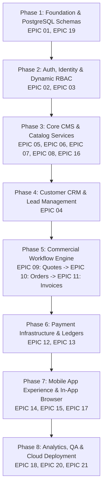

# HENU OS CLM — FEATURE TICKET LIST / DEVELOPMENT BACKLOG
**Document Version:** 1.0.0  
**Status:** Approved Implementation Backlog  
**Target Platform:** Supabase-First Backend Ecosystem  
**Authoritative References:** [HENU_OS_CLM_PRD.md](file:///j:/CLM%20HENU%20A%26M/HENU_OS_CLM_PRD.md), [HENU_OS_CLM_TECHNICAL_ARCHITECTURE.md](file:///j:/CLM%20HENU%20A%26M/HENU_OS_CLM_TECHNICAL_ARCHITECTURE.md), [HENU_OS_CLM_SECURITY_ACCESS.md](file:///j:/CLM%20HENU%20A%26M/HENU_OS_CLM_SECURITY_ACCESS.md), [HENU_OS_CLM_FRONTEND_SPECIFICATION.md](file:///j:/CLM%20HENU%20A%26M/HENU_OS_CLM_FRONTEND_SPECIFICATION.md)  

---

## TABLE OF CONTENTS
1. [Project-Wide Definition of Done (DoD)](#1-project-wide-definition-of-done-dod)
2. [Dependency-Aware Implementation Order](#2-dependency-aware-implementation-order)
3. [EPIC 01 — Project Foundation & Core Infrastructure](#epic-01--project-foundation--core-infrastructure)
4. [EPIC 02 — Authentication & Identity Lifecycle](#epic-02--authentication--identity-lifecycle)
5. [EPIC 03 — Admin Users & Dynamic RBAC](#epic-03--admin-users--dynamic-rbac)
6. [EPIC 04 — Customer Management & CRM Hub](#epic-04--customer-management--crm-hub)
7. [EPIC 05 — Services & Add-on Catalog](#epic-05--services--add-on-catalog)
8. [EPIC 06 — Portfolio & Case Studies Showcase](#epic-06--portfolio--case-studies-showcase)
9. [EPIC 07 — Digital Products & Source Code Marketplace](#epic-07--digital-products--source-code-marketplace)
10. [EPIC 08 — Special Offers, Campaigns & Dynamic Banners](#epic-08--special-offers-campaigns--dynamic-banners)
11. [EPIC 09 — Quotes & Commercial Proposals](#epic-09--quotes--commercial-proposals)
12. [EPIC 10 — Sales Orders & Project Delivery](#epic-10--sales-orders--project-delivery)
13. [EPIC 11 — Invoices & Recurring Billing](#epic-11--invoices--recurring-billing)
14. [EPIC 12 — Payment Gateways & Cryptographic Ledger](#epic-12--payment-gateways--cryptographic-ledger)
15. [EPIC 13 — Credit Notes & Financial Statements](#epic-13--credit-notes--financial-statements)
16. [EPIC 14 — Client Mobile Application Ecosystem](#epic-14--client-mobile-application-ecosystem)
17. [EPIC 15 — Client Communications, Support & Notifications](#epic-15--client-communications-support--notifications)
18. [EPIC 16 — Content Management System (CMS) & Quick Actions](#epic-16--content-management-system-cms--quick-actions)
19. [EPIC 17 — In-App Browser (HENU OS Browser Sandbox)](#epic-17--in-app-browser-henu-os-browser-sandbox)
20. [EPIC 18 — Analytics, Telemetry & Materialized Insights](#epic-18--analytics-telemetry--materialized-insights)
21. [EPIC 19 — Security Hardening, Audit & Threat Shielding](#epic-19--security-hardening-audit--threat-shielding)
22. [EPIC 20 — QA, Automated Testing & Verification](#epic-20--qa-automated-testing--verification)
23. [EPIC 21 — Production Deployment & CI/CD Pipelines](#epic-21--deployment--cicd-pipelines)

---

# 1. PROJECT-WIDE DEFINITION OF DONE (DoD)

A development ticket is strictly **NOT COMPLETE** and cannot be merged into `staging` or `main` until every one of the following criteria is verified:

1. **Pixel-Perfect Stitch Fidelity**: The rendered UI matches the approved Google Stitch UI prototypes across all states with zero arbitrary visual discrepancies.
2. **Design Token Integrity**: All colors, typography, elevations, and radii reference official HENU OS design tokens. Zero hardcoded arbitrary hex/spacing values.
3. **Database & RLS Verification**: Tables, foreign keys, triggers, and Row Level Security (RLS) policies are active and tested. Client A cannot read/write Client B data.
4. **State Machine Completeness**: Every view explicitly handles **Loading**, **Empty Data**, **Error**, and **Success** states without UI collapse.
5. **Realtime Reactivity**: Live data changes in the Admin Portal or database reflect on connected mobile clients via WebSocket channels.
6. **Input Validation**: Client-side validation (Zod) is paired with strict PostgreSQL column constraints and Edge Function checks.
7. **Security & Permissions**: Endpoint/view enforces assigned RBAC permissions (`has_permission()`). Private API keys are never exposed to client bundles.
8. **Responsive & Safe Area Compliance**: Verified on iPhone SE, iPhone 15 Pro, iPad Air, 1080p Desktop, and 4K displays with proper keyboard avoidance.
9. **Accessibility (WCAG 2.1 AA)**: Minimum contrast ratios met, screen reader labels configured, keyboard navigation/focus trapping functional.
10. **Automated Test Coverage**: Unit tests and E2E integration tests passing with zero lint or TypeScript compiler errors.

---

# 2. DEPENDENCY-AWARE IMPLEMENTATION ORDER

The development roadmap is structured into 8 sequential execution phases to eliminate blockers:

---

# EPIC 01 — PROJECT FOUNDATION & CORE INFRASTRUCTURE

### [TICKET-0101] Monorepo Architecture & Base Toolchain Setup
- **Epic**: EPIC 01 — Project Foundation
- **Feature**: Workspace Configuration
- **Title**: Initialize Turbo/Pnpm Monorepo with Admin Web and Mobile Apps
- **Description**: Setup standard monorepo hosting Next.js 14 Admin Portal, React Native (Expo) Mobile Client, shared TypeScript types, and Supabase database definitions.
- **Objective**: Provide a cohesive, type-safe development environment with unified linting, formatting, and CI triggers.
- **User Story**: As a developer, I need a unified workspace so that shared API interfaces and design tokens synchronize across web and mobile.
- **Preconditions**: Node.js 20+, pnpm, and Supabase CLI installed locally.
- **Functional Requirements**: Configure package workspaces (`apps/admin`, `apps/mobile`, `packages/types`, `packages/ui`).
- **UI Requirements**: N/A (Tooling).
- **Backend Requirements**: Local Supabase container initialization with `supabase init`.
- **Database Dependencies**: Local PostgreSQL instance with `uuid-ossp`, `pgcrypto`, `pg_trgm` extensions enabled.
- **Permission Requirements**: N/A.
- **Realtime Requirements**: N/A.
- **Validation**: ESLint, Prettier, and `tsc --noEmit` check passing in monorepo root.
- **Error States**: Build script aborts on circular dependency or typing mismatch.
- **Acceptance Criteria**: Monorepo builds cleanly; `pnpm dev` starts both Next.js dev server and Expo bundler concurrently.
- **Dependencies**: None.
- **Priority**: P0 (Blocker).
- **Estimated Complexity**: M (3 SP).
- **Implementation Notes**: Ensure TypeScript paths are aliased to `@henu/types` and `@henu/ui`.
- **Testing Requirements**: Run `pnpm test` and verify monorepo compilation.

### [TICKET-0102] Design Token System & Global Theme Engine
- **Epic**: EPIC 01 — Project Foundation
- **Feature**: Design System Tokens
- **Title**: Implement HENU OS CSS Variables, Tailwind Plugins, and Native Theme Providers
- **Description**: Codify the authoritative HENU OS color palette, Plus Jakarta Sans typography, glassmorphism utilities, and elevation shadows into shared theme tokens.
- **Objective**: Prevent hardcoded CSS values and ensure 100% visual fidelity with Stitch UI.
- **User Story**: As a developer, I need standard theme tokens so that UI primitives conform to Stitch design guidelines.
- **Preconditions**: `TICKET-0101` completed.
- **Functional Requirements**: Provide theme configuration for Tailwind CSS and React Native StyleSheet theme provider.
- **UI Requirements**: Accurately define Royal Iris (`#887DB8`), Deep Teal (`#236870`), Cyan Glow (`#06B6D4`), Dark Base (`#11131A`), and Surface (`#181B24`).
- **Backend Requirements**: N/A.
- **Database Dependencies**: None.
- **Permission Requirements**: N/A.
- **Realtime Requirements**: N/A.
- **Validation**: Design tokens validated against design specs in [HENU_OS_CLM_FRONTEND_SPECIFICATION.md](file:///j:/CLM%20HENU%20A%26M/HENU_OS_CLM_FRONTEND_SPECIFICATION.md).
- **Error States**: Fallback to default dark palette if custom theme context is missing.
- **Acceptance Criteria**: All tokens exported as TypeScript constants and CSS variables; demo component renders with glassmorphism.
- **Dependencies**: `TICKET-0101`.
- **Priority**: P0 (Blocker).
- **Estimated Complexity**: S (2 SP).
- **Implementation Notes**: Include utility classes `.glass-panel`, `.glow-cyan`, and `.text-gradient-iris`.
- **Testing Requirements**: Visual regression test on typography and color swatches.

---

# EPIC 02 — AUTHENTICATION & IDENTITY LIFECYCLE

### [TICKET-0201] Supabase GoTrue Auth Integration & Auto-Profile Provisioning
- **Epic**: EPIC 02 — Authentication
- **Feature**: Authentication Engine
- **Title**: Implement Email/Password Auth, JWT Handling, and Auto-Profile PostgreSQL Triggers
- **Description**: Integrate Supabase Auth with custom claims injection and automatic `public.profiles` provisioning on signup.
- **Objective**: Establish secure identity management with role-aware JWT tokens.
- **User Story**: As a client, I want to register and log in securely so that I can access my quotes and project dashboards.
- **Preconditions**: Supabase database initialized (`TICKET-0101`).
- **Functional Requirements**: Email/password authentication, session persistence, automatic token refresh, profile creation trigger.
- **UI Requirements**: N/A (Core auth library & hook integration).
- **Backend Requirements**: PostgreSQL trigger `on_auth_user_created` firing `handle_new_user_registration()`.
- **Database Dependencies**: `auth.users`, `public.profiles` tables.
- **Permission Requirements**: Public for registration/login; authenticated for profile retrieval.
- **Realtime Requirements**: N/A.
- **Validation**: Strict email regex, 8+ char password with uppercase/lowercase/digit/symbol.
- **Error States**: `400 Bad Request` (Invalid credentials), `429 Too Many Requests` (Rate limited).
- **Acceptance Criteria**: New user registration automatically creates row in `public.profiles` with `role = 'client'`; JWT contains user UUID and role.
- **Dependencies**: `TICKET-0101`.
- **Priority**: P0 (Blocker).
- **Estimated Complexity**: M (3 SP).
- **Implementation Notes**: Store refresh tokens in MMKV / SecureStore on mobile and HttpOnly cookies on web.
- **Testing Requirements**: Unit test auth trigger with test email; verify JWT claim decoding.

### [TICKET-0202] Client Mobile Authentication Screens & Biometric Flow
- **Epic**: EPIC 02 — Authentication
- **Feature**: Mobile Auth UI
- **Title**: Build Splash, Sign In, Register, Forgot Password, and Biometric Unlock UI
- **Description**: Pixel-perfect implementation of mobile auth screens with 3D ambient particle mesh, floating glass cards, and Face ID / Fingerprint unlock.
- **Objective**: Provide a luxury, frictionless onboarding and login experience.
- **User Story**: As a mobile user, I want to authenticate via Face ID so that I can securely and rapidly open my CLM app.
- **Preconditions**: `TICKET-0201`, `TICKET-0102`.
- **Functional Requirements**: Form inputs with validation, password toggle, biometric prompt invocation, password recovery link trigger.
- **UI Requirements**: Match Stitch Mobile Design System: OLED background (`#0B0F17`), glass card (`backdrop-blur-xl`), animated glowing brand mark.
- **Backend Requirements**: Supabase GoTrue API endpoints (`signInWithPassword`, `resetPasswordForEmail`).
- **Database Dependencies**: `public.profiles`.
- **Permission Requirements**: Anonymous / Public.
- **Realtime Requirements**: N/A.
- **Validation**: Instant inline validation errors on empty fields or malformed emails.
- **Error States**: Glassmorphic red error toast displaying error message with haptic shake animation.
- **Acceptance Criteria**: Smooth transition from Splash to Sign In; successful auth routes to Home; biometrics securely store credentials.
- **Dependencies**: `TICKET-0201`, `TICKET-0102`.
- **Priority**: P0 (Blocker).
- **Estimated Complexity**: L (5 SP).
- **Implementation Notes**: Use `expo-local-authentication` / `react-native-biometrics`.
- **Testing Requirements**: Test on physical iOS and Android devices for Face ID and BiometricPrompt.

---

# EPIC 03 — ADMIN USERS & DYNAMIC RBAC

### [TICKET-0301] Dynamic RBAC Schema & `has_permission()` Stored Procedure
- **Epic**: EPIC 03 — Admin Users / RBAC
- **Feature**: Authorization Engine
- **Title**: Implement Dynamic Roles, Permissions Tables, and PostgreSQL RLS Helper Functions
- **Description**: Create `roles`, `permissions`, `role_permissions`, and `user_roles` relational schema with security-definer function `public.has_permission()`.
- **Objective**: Enforce granular role-based permissions at the database query layer.
- **User Story**: As a Super Admin, I want to assign specific functional roles to staff so that sensitive financial records are protected.
- **Preconditions**: `TICKET-0201`.
- **Functional Requirements**: Seed initial permissions (`customers.*`, `quotes.*`, `invoices.*`, `payments.*`, `cms.*`, `system.*`); establish role assignment logic.
- **UI Requirements**: N/A (Database engine).
- **Backend Requirements**: SQL migration executing normalized DDL definitions from Security Document.
- **Database Dependencies**: `public.roles`, `public.permissions`, `public.role_permissions`, `public.user_roles`, `public.profiles`.
- **Permission Requirements**: Only `super_admin` can mutate roles and permissions.
- **Realtime Requirements**: N/A.
- **Validation**: Unique constraints on role codes and permission identifiers.
- **Error States**: PostgreSQL exception on circular role mapping.
- **Acceptance Criteria**: `has_permission('invoices.invoice.create')` returns `true` for Finance Manager and Super Admin, but `false` for Support Agent.
- **Dependencies**: `TICKET-0201`.
- **Priority**: P0 (Blocker).
- **Estimated Complexity**: M (3 SP).
- **Implementation Notes**: Cache role permissions in memory/session where possible to minimize recursive query overhead.
- **Testing Requirements**: Run SQL test suite checking permission resolution across all 6 built-in roles.

### [TICKET-0302] Admin Portal User & Role Management Workbench
- **Epic**: EPIC 03 — Admin Users / RBAC
- **Feature**: RBAC Management UI
- **Title**: Build Admin Staff List, Role Assignment Drawer, and Permission Matrix Inspector
- **Description**: Admin settings interface for inviting administrative staff, toggling account activation, and assigning granular role policies.
- **Objective**: Give Super Admins an intuitive interface to control team access.
- **User Story**: As a Super Admin, I want to invite a Sales Specialist and configure their permissions visually.
- **Preconditions**: `TICKET-0301`, `TICKET-0102`.
- **Functional Requirements**: Staff table with role chips, invite modal with email dispatch, role selection dropdown, status toggle switch.
- **UI Requirements**: Match Stitch Admin Design System: Virtualized table, glass drawer (`#181B24`), neon status pills.
- **Backend Requirements**: Supabase Admin API (`supabase.auth.admin.inviteUserByEmail`).
- **Database Dependencies**: `public.profiles`, `public.user_roles`.
- **Permission Requirements**: `system.settings.manage`.
- **Realtime Requirements**: Realtime updates when team members accept invites.
- **Validation**: Valid work email, non-empty role selection.
- **Error States**: Inline error if email already registered or network disconnects.
- **Acceptance Criteria**: Super Admin can successfully assign roles; changes take effect on the target user's next session token refresh.
- **Dependencies**: `TICKET-0301`.
- **Priority**: P1 (High).
- **Estimated Complexity**: M (3 SP).
- **Implementation Notes**: Prevent Super Admin from revoking their own Super Admin role to avoid administrative lockout.
- **Testing Requirements**: E2E test verifying invite flow and permission boundary enforcement.

---

# EPIC 04 — CUSTOMER MANAGEMENT & CRM HUB

### [TICKET-0401] Customer Schema, RLS Policies & Search Indexes
- **Epic**: EPIC 04 — Customers
- **Feature**: Customer Data Layer
- **Title**: Create Customer Relational Tables, RLS Policies, and Trigram Search Indexes
- **Description**: Configure customer profile metadata, VIP tier attributes, spend summaries, and GIN trigram search indexes for rapid CRM querying.
- **Objective**: High-performance, isolated customer data storage.
- **User Story**: As an admin, I want to search 10,000+ customer records instantaneously by name, company, or email.
- **Preconditions**: `TICKET-0301`.
- **Functional Requirements**: Customer profile fields, automated VIP tier calculation, RLS isolation policies.
- **UI Requirements**: N/A.
- **Backend Requirements**: PostgreSQL migration with `CREATE INDEX idx_profiles_trgm ON public.profiles USING gin (first_name gin_trgm_ops, last_name gin_trgm_ops, company_name gin_trgm_ops)`.
- **Database Dependencies**: `public.profiles`.
- **Permission Requirements**: `customers.profile.view_all` for admin; `customers.profile.view_own` for clients.
- **Realtime Requirements**: N/A.
- **Validation**: Phone number format, valid VIP tier string.
- **Error States**: `403 Forbidden` on unauthorized cross-tenant query.
- **Acceptance Criteria**: Fuzzy search query executes in < 15ms over 50,000 seeded mock profiles.
- **Dependencies**: `TICKET-0301`.
- **Priority**: P1 (High).
- **Estimated Complexity**: S (2 SP).
- **Implementation Notes**: Add auto-generated view `customer_spending_summaries` aggregating total paid invoices.
- **Testing Requirements**: Benchmark query performance and verify RLS isolation.

### [TICKET-0402] Admin Customer Management Screen & 360-Degree Profile View
- **Epic**: EPIC 04 — Customers
- **Feature**: CRM Workbench
- **Title**: Build Admin Customers Table, Search/Filter HUD, and Customer Detail Drawer
- **Description**: Complete CRM interface featuring virtualized TanStack table, VIP tier chips, spending analytics, and full transaction history flyout.
- **Objective**: Deliver a comprehensive customer 360-degree management cockpit.
- **User Story**: As a sales manager, I want to inspect a customer's lifetime spend, active quotes, and linked project orders in one drawer.
- **Preconditions**: `TICKET-0401`, `TICKET-0102`.
- **Functional Requirements**: Multi-column sorting, status filtering, live search bar, customer detail drawer with tabbed history (Quotes, Orders, Invoices).
- **UI Requirements**: Stitch Admin Design: Slate-900 surface, cyan border highlights, VIP gold tags, glass detail drawer.
- **Backend Requirements**: PostgREST query with nested relations (`select=*, quotes(*), orders(*), invoices(*)`).
- **Database Dependencies**: `public.profiles`, `public.quotes`, `public.invoices`.
- **Permission Requirements**: `customers.profile.view_all`.
- **Realtime Requirements**: Realtime status pill updates when customer profile is edited.
- **Validation**: Customer edit form validated via Zod schema.
- **Error States**: Friendly empty state with "No customers match your filter" illustration.
- **Acceptance Criteria**: Selecting a customer row opens flyout drawer within 100ms; displays accurate financial totals.
- **Dependencies**: `TICKET-0401`.
- **Priority**: P1 (High).
- **Estimated Complexity**: L (5 SP).
- **Implementation Notes**: Use TanStack Virtual for table rows to maintain 60 FPS scrolling.
- **Testing Requirements**: Unit test table filtering and drawer state management.

---

# EPIC 05 — SERVICES & ADD-ON CATALOG

### [TICKET-0501] Services & Add-ons Schema, RLS & Edge CDN Cache
- **Epic**: EPIC 05 — Services
- **Feature**: Catalog Data Layer
- **Title**: Implement Services and Add-ons Relational Schema with Hierarchical Pricing
- **Description**: Create `public.services` and `public.service_addons` tables with foreign key constraints, price currency checks, and public read RLS policies.
- **Objective**: Reliable storage and global low-latency delivery of service offerings.
- **User Story**: As a client, I want to view active service offerings and optional add-on packages with real-time pricing.
- **Preconditions**: `TICKET-0101`.
- **Functional Requirements**: Service categories, base prices, turnaround estimates, markdown scope details, tiered add-on packages.
- **UI Requirements**: N/A.
- **Backend Requirements**: SQL migration + PostgREST RPC `get_published_catalog()`.
- **Database Dependencies**: `public.services`, `public.service_addons`.
- **Permission Requirements**: Public read for `status = 'published'`; `catalog.service.manage` for admin mutations.
- **Realtime Requirements**: Postgres CDC channel `public:catalog` on INSERT/UPDATE/DELETE.
- **Validation**: `base_price >= 0.00`, unique service slug.
- **Error States**: Mutation rejected with `403 Forbidden` if user lacks catalog permissions.
- **Acceptance Criteria**: Database correctly associates add-ons with parent services; cascade deletion handles clean removals.
- **Dependencies**: `TICKET-0101`.
- **Priority**: P0 (Blocker).
- **Estimated Complexity**: S (2 SP).
- **Implementation Notes**: Index slug and category columns for instant lookup.
- **Testing Requirements**: Test RLS policy ensuring unauthenticated users cannot view draft or archived services.

### [TICKET-0502] Admin Service Catalog Editor & Tier Configurator
- **Epic**: EPIC 05 — Services
- **Feature**: Service Management UI
- **Title**: Build Admin Service Grid, Markdown Scope Editor, and Add-on Matrix Manager
- **Description**: Rich administrative interface for creating new services, configuring tiered pricing, uploading service icons, and managing add-on dependencies.
- **Objective**: Empower administrators to adjust service offerings without code deployments.
- **User Story**: As a product manager, I want to add a new service tier with 3 add-on options and publish it live to the mobile app.
- **Preconditions**: `TICKET-0501`.
- **Functional Requirements**: Drag-and-drop service reordering, markdown editor for deliverables, currency input, icon selector modal.
- **UI Requirements**: Stitch Admin Design: Interactive service cards, glass modal configurator, live price preview pill.
- **Backend Requirements**: Supabase Storage upload for thumbnail + PostgREST CRUD mutations.
- **Database Dependencies**: `public.services`, `public.service_addons`.
- **Permission Requirements**: `catalog.service.manage`.
- **Realtime Requirements**: Broadcasts mutation over `public:catalog` channel upon publishing.
- **Validation**: Mandatory title, positive base price, valid slug.
- **Error States**: Form highlights invalid fields with red border and tooltip error message.
- **Acceptance Criteria**: Updating a service price in the admin editor broadcasts an event that updates the mobile app catalog within 500ms.
- **Dependencies**: `TICKET-0501`.
- **Priority**: P1 (High).
- **Estimated Complexity**: M (3 SP).
- **Implementation Notes**: Include optimistic UI updates with TanStack Query.
- **Testing Requirements**: E2E test covering service creation, add-on linking, and price update.

---

# EPIC 06 — PORTFOLIO & CASE STUDIES SHOWCASE

### [TICKET-0601] Portfolio Schema & High-Resolution Media Storage
- **Epic**: EPIC 06 — Portfolio
- **Feature**: Portfolio Data Layer
- **Title**: Create Portfolio Showcase Schema and Supabase Public Storage Bucket
- **Description**: Setup `public.portfolio_items` table and configure `public-assets` storage bucket with CDN caching policies.
- **Objective**: Showcase enterprise client projects with high-resolution imagery and case study markdown.
- **User Story**: As a client, I want to explore high-resolution case studies of previous work to evaluate service quality.
- **Preconditions**: `TICKET-0101`.
- **Functional Requirements**: Project titles, client names, category tags, deliverables array, featured image URL, gallery array, case study markdown.
- **UI Requirements**: N/A.
- **Backend Requirements**: SQL migration + Storage bucket configuration (`public-assets/portfolio/*`).
- **Database Dependencies**: `public.portfolio_items`.
- **Permission Requirements**: Public read for `status = 'published'`; `cms.content.manage` for admin write.
- **Realtime Requirements**: Realtime broadcast on `public:portfolio` channel.
- **Validation**: Valid image URLs, non-empty client name.
- **Error States**: `413 Payload Too Large` if image exceeds 10MB during upload.
- **Acceptance Criteria**: Portfolio items queryable with gallery arrays; images accessible over public CDN URLs.
- **Dependencies**: `TICKET-0101`.
- **Priority**: P2 (Medium).
- **Estimated Complexity**: S (2 SP).
- **Implementation Notes**: Use WebP image transformation parameters (`?width=1200&format=webp`).
- **Testing Requirements**: Verify storage upload permissions and public retrieval.

### [TICKET-0602] Admin Portfolio Showcase Management Workbench
- **Epic**: EPIC 06 — Portfolio
- **Feature**: Portfolio Management UI
- **Title**: Build Admin Portfolio Grid, Multi-Image Drag-and-Drop Uploader, and Case Study Editor
- **Description**: Admin interface to publish new portfolio projects, upload image carousels, edit markdown case studies, and toggle featured showcase status.
- **Objective**: Streamlined portfolio publishing workflow for marketing and creative teams.
- **User Story**: As a content manager, I want to upload 5 gallery images for a completed project and write an executive summary.
- **Preconditions**: `TICKET-0601`.
- **Functional Requirements**: Multi-file dropzone, image reordering via drag-and-drop, rich text editor, category tag chip input.
- **UI Requirements**: Stitch Admin Design: Image thumbnail cards with delete/reorder handles, preview modal.
- **Backend Requirements**: Direct-to-storage upload tokens + PostgREST insert.
- **Database Dependencies**: `public.portfolio_items`.
- **Permission Requirements**: `cms.content.manage`.
- **Realtime Requirements**: N/A.
- **Validation**: At least 1 featured image required before publishing.
- **Error States**: Upload progress bar displays retry button if upload fails.
- **Acceptance Criteria**: Case study published with markdown formatting; renders accurately on mobile and web previews.
- **Dependencies**: `TICKET-0601`.
- **Priority**: P2 (Medium).
- **Estimated Complexity**: M (3 SP).
- **Implementation Notes**: Compress images client-side before upload to reduce bandwidth.
- **Testing Requirements**: Test drag-and-drop gallery reordering and markdown rendering.

---

# EPIC 07 — DIGITAL PRODUCTS & SOURCE CODE MARKETPLACE

### [TICKET-0701] Digital Products Schema, License Generator & File Security
- **Epic**: EPIC 07 — Products
- **Feature**: Product Catalog Data Layer
- **Title**: Create Products Schema, Private Build Storage, and Signed Download Token Engine
- **Description**: Relational schema for software products, source code archives, license keys, and private build file storage with 15-minute signed URLs.
- **Objective**: Secure distribution of proprietary software assets and digital products.
- **User Story**: As a client who purchased a software product, I want to download the verified build archive securely.
- **Preconditions**: `TICKET-0101`.
- **Functional Requirements**: Product SKU, version string, license key generation, build file upload, access verification.
- **UI Requirements**: N/A.
- **Backend Requirements**: Edge Function `generate-product-download-url` verifying purchase before generating signed S3 URL.
- **Database Dependencies**: `public.products`, `public.product_purchases`.
- **Permission Requirements**: `cms.content.manage` for admin; purchase verification for client download.
- **Realtime Requirements**: N/A.
- **Validation**: Semantic versioning check (`v1.2.0`), ZIP/TAR.GZ MIME type validation.
- **Error States**: `403 Forbidden` if user attempts to download unpurchased product.
- **Acceptance Criteria**: Build archives stored in private bucket; download links expire after 15 minutes.
- **Dependencies**: `TICKET-0101`.
- **Priority**: P2 (Medium).
- **Estimated Complexity**: M (3 SP).
- **Implementation Notes**: Store cryptographic checksum (SHA-256) of each build file for client integrity verification.
- **Testing Requirements**: Test Edge Function download authorization with valid and invalid purchase tokens.

---

# EPIC 08 — SPECIAL OFFERS, CAMPAIGNS & DYNAMIC BANNERS

### [TICKET-0801] Special Offers Schema, Discount Algorithms & Date Scheduling
- **Epic**: EPIC 08 — Offers
- **Feature**: Promotional Engine
- **Title**: Implement Offers Schema, Promo Code Validator RPC, and Campaign Scheduler
- **Description**: Configure `public.offers` table with percentage/fixed discount logic, start/end timestamp constraints, and PostgreSQL discount validator function.
- **Objective**: Automated promotional campaigns that dynamically apply discounts to quotes and invoices.
- **User Story**: As a marketing manager, I want to create a 20% discount offer code valid for 14 days that displays on the mobile home screen.
- **Preconditions**: `TICKET-0101`.
- **Functional Requirements**: Promo code matching, validity period check, discount calculation (percentage vs fixed amount), active flag toggle.
- **UI Requirements**: N/A.
- **Backend Requirements**: Stored procedure `public.validate_promo_code(p_code TEXT, p_amount NUMERIC)`.
- **Database Dependencies**: `public.offers`.
- **Permission Requirements**: `catalog.offer.manage` for admin; public read for active offers.
- **Realtime Requirements**: Realtime broadcast on `public:offers` channel when promo launched.
- **Validation**: Promo code alphanumeric, discount value > 0, `valid_until > valid_from`.
- **Error States**: Returns `{valid: false, message: 'Promo code has expired'}`.
- **Acceptance Criteria**: Stored procedure correctly deducts 20% from test quote total; expired codes are rejected.
- **Dependencies**: `TICKET-0101`.
- **Priority**: P2 (Medium).
- **Estimated Complexity**: S (2 SP).
- **Implementation Notes**: Add index on `code` and `valid_until`.
- **Testing Requirements**: Unit test edge cases: future start date, past expiry date, zero-value discounts.

---

# EPIC 09 — QUOTES & COMMERCIAL PROPOSALS

### [TICKET-0901] Quotes Relational Schema, State Machine & Audit Triggers
- **Epic**: EPIC 09 — Quotes
- **Feature**: Quotation Core Engine
- **Title**: Implement Quotes Table, State Transition Constraints, and Immutable Audit Triggers
- **Description**: Create `public.quotes` table with strict state enum (`submitted`, `in_review`, `approved`, `rejected`, `converted_to_order`), auto-generated quote numbers (`Q-2026-XXXX`), and audit logging triggers.
- **Objective**: Robust, tamper-proof quotation workflow engine.
- **User Story**: As a client, I want to submit a quote request and track its status transitions in real time.
- **Preconditions**: `TICKET-0201`, `TICKET-0401`.
- **Functional Requirements**: Quote number sequencing, project scope storage, selected add-ons JSONB, line-item price calculation, RLS client isolation.
- **UI Requirements**: N/A.
- **Backend Requirements**: SQL migration + sequence generator `next_quote_number()` + audit log trigger.
- **Database Dependencies**: `public.quotes`, `public.profiles`, `public.services`, `public.audit_logs`.
- **Permission Requirements**: Client can insert own quotes; Admins can update status and pricing.
- **Realtime Requirements**: Realtime channel `user:{user_id}:quotes` notifying client of status changes.
- **Validation**: Non-empty project scope, target delivery date in future.
- **Error States**: `400 Bad Request` on invalid state transition (e.g., `rejected` -> `converted_to_order`).
- **Acceptance Criteria**: Submitting a quote assigns sequential quote number; client can only query their own quotes; state changes trigger audit log.
- **Dependencies**: `TICKET-0201`, `TICKET-0401`.
- **Priority**: P0 (Blocker).
- **Estimated Complexity**: M (3 SP).
- **Implementation Notes**: Prevent clients from modifying quote once status transitions out of `draft`.
- **Testing Requirements**: Test full quote lifecycle state transitions and verify RLS isolation between two client accounts.

### [TICKET-0902] Admin Quotes Workbench & Margin Calculator
- **Epic**: EPIC 09 — Quotes
- **Feature**: Quote Management UI
- **Title**: Build Admin Quotes Kanban/Table, Price Adjustment Modal, and Approval Workflow
- **Description**: Comprehensive quote management interface for sales specialists to review client briefs, adjust line-item pricing, calculate profit margins, add internal notes, and issue approved proposals.
- **Objective**: Streamline commercial estimation and proposal generation.
- **User Story**: As a sales specialist, I want to review an incoming quote, adjust the scope pricing, and approve it so the client receives a proposal.
- **Preconditions**: `TICKET-0901`, `TICKET-0102`.
- **Functional Requirements**: Status filter tabs, line-item price adjustment inputs, margin calculation HUD, approval confirmation modal, rejection reason modal.
- **UI Requirements**: Stitch Admin Design: Slate-900 surface, cyan action buttons, glass proposal review modal, PDF attachment viewer.
- **Backend Requirements**: PostgREST update mutation + Edge Function trigger for client push notification.
- **Database Dependencies**: `public.quotes`.
- **Permission Requirements**: `quotes.quote.view_all`, `quotes.quote.modify_pricing`, `quotes.quote.update_status`.
- **Realtime Requirements**: Quotes table updates live when clients submit new requests.
- **Validation**: Mandatory rejection reason if quote is rejected; positive final amount on approval.
- **Error States**: Toast error if another admin simultaneously modified the quote (optimistic lock conflict).
- **Acceptance Criteria**: Approving a quote updates database status to `approved`, sets `final_amount`, and triggers a push notification to client's device.
- **Dependencies**: `TICKET-0901`.
- **Priority**: P0 (Blocker).
- **Estimated Complexity**: L (5 SP).
- **Implementation Notes**: Use PostgreSQL `xmin` column for optimistic concurrency control.
- **Testing Requirements**: E2E test covering quote review, margin edit, and approval dispatch.

### [TICKET-0903] Client Mobile Quote Request Wizard & Interactive Proposal Viewer
- **Epic**: EPIC 09 — Quotes
- **Feature**: Mobile Quotation UI
- **Title**: Build Multi-Step Quote Request Wizard, Attachment Dropzone, and Proposal Review Screen
- **Description**: Intuitive multi-step mobile wizard for configuring services, selecting add-ons, attaching project briefs, submitting quote requests, and reviewing approved proposals.
- **Objective**: Frictionless, luxury quote submission and approval experience for mobile clients.
- **User Story**: As a client, I want to select a service, toggle 2 add-ons, attach a brief PDF, and submit a quote in under 2 minutes.
- **Preconditions**: `TICKET-0901`, `TICKET-0102`.
- **Functional Requirements**: 4-step wizard (Scope, Add-ons, Attachments, Review), camera/document picker, real-time cost estimator, "Accept Proposal & Convert to Order" button.
- **UI Requirements**: Stitch Mobile Design: Glass cards, animated step indicator, cyan glow CTA button, haptic feedback on step completion.
- **Backend Requirements**: Supabase Storage upload to `client-attachments` + PostgREST insert into `public.quotes`.
- **Database Dependencies**: `public.quotes`, `public.services`, `public.service_addons`.
- **Permission Requirements**: `quotes.quote.create_own`, `quotes.quote.view_own`.
- **Realtime Requirements**: Realtime status listener updating proposal screen when admin approves quote.
- **Validation**: Project title >= 5 chars, scope >= 20 chars, valid file formats (PDF, PNG, JPG).
- **Error States**: Red inline error banners; offline draft saved to MMKV if connection drops.
- **Acceptance Criteria**: Client submits quote successfully; receives real-time UI notification upon admin approval; can tap "Accept" to proceed to order creation.
- **Dependencies**: `TICKET-0901`, `TICKET-0501`.
- **Priority**: P0 (Blocker).
- **Estimated Complexity**: L (5 SP).
- **Implementation Notes**: Persist wizard state in Zustand store with MMKV auto-save to prevent data loss on app close.
- **Testing Requirements**: Test wizard on iOS and Android with actual file attachments (< 25MB).

---

# EPIC 10 — SALES ORDERS & PROJECT DELIVERY

### [TICKET-1001] Sales Orders Schema, Quote Conversion & Progress Tracking
- **Epic**: EPIC 10 — Sales Orders
- **Feature**: Order Lifecycle Engine
- **Title**: Implement Orders Schema, Quote-to-Order Conversion RPC, and Milestone Tracking
- **Description**: Create `public.orders` table linked to parent quotes, with sequential order numbers (`ORD-2026-XXXX`), progress percentage (0-100%), and atomic conversion stored procedure.
- **Objective**: Seamless transition from commercial proposal to project execution.
- **User Story**: As a client accepting a proposal, I want an order to be generated automatically with an initial invoice.
- **Preconditions**: `TICKET-0901`.
- **Functional Requirements**: Order generation, quote status update to `converted_to_order`, initial invoice generation, milestone tracking.
- **UI Requirements**: N/A.
- **Backend Requirements**: Stored procedure `public.convert_quote_to_order(p_quote_id UUID)`.
- **Database Dependencies**: `public.orders`, `public.quotes`, `public.invoices`.
- **Permission Requirements**: Client owner or Admin.
- **Realtime Requirements**: Realtime broadcast on `user:{user_id}:orders`.
- **Validation**: Quote must be in `approved` status to convert.
- **Error States**: Throws exception if quote is already converted or rejected.
- **Acceptance Criteria**: Atomic transaction creates order row, creates initial deposit invoice, and updates quote status without partial failures.
- **Dependencies**: `TICKET-0901`.
- **Priority**: P1 (High).
- **Estimated Complexity**: M (3 SP).
- **Implementation Notes**: Wrap conversion in PostgreSQL transaction block (`BEGIN ... COMMIT`).
- **Testing Requirements**: Unit test conversion stored procedure ensuring atomicity and invoice linkage.

---

# EPIC 11 — INVOICES & RECURRING BILLING

### [TICKET-1101] Invoices Relational Schema, Financial Ledgers & RLS
- **Epic**: EPIC 11 — Invoices
- **Feature**: Billing Data Layer
- **Title**: Create Invoices Schema, Line-Item Calculations, Tax Engine, and RLS Policies
- **Description**: Configure `public.invoices` table with sequential numbering (`INV-2026-XXXX`), subtotal, tax calculations, discount logic, amount paid/due tracking, and strict RLS isolation.
- **Objective**: Accurate, legally compliant financial billing engine.
- **User Story**: As a finance manager, I want invoices to calculate subtotal, taxes, and discounts automatically and track outstanding balances.
- **Preconditions**: `TICKET-0201`, `TICKET-0401`.
- **Functional Requirements**: Invoice numbering sequence, line-items JSONB array, tax percentage calculation, status transitions (`draft`, `issued`, `partially_paid`, `paid`, `overdue`, `voided`).
- **UI Requirements**: N/A.
- **Backend Requirements**: SQL migration + stored procedure `calculate_invoice_totals()`.
- **Database Dependencies**: `public.invoices`, `public.profiles`, `public.orders`.
- **Permission Requirements**: `invoices.invoice.view_all`, `invoices.invoice.create` for finance admin; `invoices.invoice.view_own` for clients.
- **Realtime Requirements**: Realtime channel `user:{user_id}:invoices` on status change.
- **Validation**: `total_amount = subtotal + tax_amount - discount_amount`, `amount_due = total_amount - amount_paid`.
- **Error States**: `403 Forbidden` if client attempts to alter invoice fields.
- **Acceptance Criteria**: Invoice balance accurately updates when payments are recorded; overdue status auto-evaluated based on `due_date`.
- **Dependencies**: `TICKET-0201`, `TICKET-0401`.
- **Priority**: P0 (Blocker).
- **Estimated Complexity**: M (3 SP).
- **Implementation Notes**: Store financial values in `NUMERIC(12, 2)` to eliminate floating-point precision errors.
- **Testing Requirements**: Test financial calculation formulas with various tax and discount permutations.

### [TICKET-1102] Edge Function PDF Invoice Generator & Storage Archival
- **Epic**: EPIC 11 — Invoices
- **Feature**: Invoice PDF Engine
- **Title**: Implement Serverless PDF Invoice Generation and Storage in `system-invoices`
- **Description**: Supabase Edge Function generating official, luxury HENU OS branded PDF invoices with vector brand marks, line-item tables, tax summaries, and QR payment codes.
- **Objective**: Automated creation and delivery of downloadable tax invoices.
- **User Story**: As a client, I want to download an official PDF receipt for my accounting department.
- **Preconditions**: `TICKET-1101`.
- **Functional Requirements**: Edge Function `generate-invoice-pdf`, PDF layout styling, automatic upload to `system-invoices` bucket, signed URL delivery.
- **UI Requirements**: PDF must feature deep slate typography, cyan accent bars, and clean tabular layout matching brand standards.
- **Backend Requirements**: Deno Edge Function with PDFKit/Puppeteer + Supabase Storage API.
- **Database Dependencies**: `public.invoices`, `public.profiles`.
- **Permission Requirements**: Authenticated invoice owner or Finance Admin.
- **Realtime Requirements**: N/A.
- **Validation**: Invoice must exist in database before PDF generation.
- **Error States**: `500 Internal Server Error` if PDF rendering engine fails; logs error with correlation ID.
- **Acceptance Criteria**: PDF generates in < 1.2s; stored in S3; downloadable via pre-signed URL with 30-minute expiration.
- **Dependencies**: `TICKET-1101`.
- **Priority**: P1 (High).
- **Estimated Complexity**: M (3 SP).
- **Implementation Notes**: Cache generated PDF path in `invoices.pdf_storage_path` to avoid re-generating on duplicate requests.
- **Testing Requirements**: Visual verification of rendered PDF across multiple page lengths and currency symbols.

---

# EPIC 12 — PAYMENT GATEWAYS & CRYPTOGRAPHIC LEDGER

### [TICKET-1201] Edge Function Payment Order Creation (Razorpay & Cashfree)
- **Epic**: EPIC 12 — Payments
- **Feature**: Payment Initiation Engine
- **Title**: Build Multi-Gateway Order Creation Edge Function with Server-Side Amount Locking
- **Description**: Edge Function `create-payment-order` that validates invoice amount due, selects configured payment gateway (Razorpay / Cashfree), creates gateway order via private API, and initializes ledger record in `public.payments`.
- **Objective**: Cryptographically secure payment initiation preventing client-side amount tampering.
- **User Story**: As a client, I want to choose between Razorpay and Cashfree to pay my invoice with guaranteed correct pricing.
- **Preconditions**: `TICKET-1101`, `TICKET-0201`.
- **Functional Requirements**: Fetch authoritative `amount_due` from database, invoke gateway REST API with private secret, insert payment row with `status = 'initiated'`, return client order tokens.
- **UI Requirements**: N/A.
- **Backend Requirements**: Deno Edge Function + Supabase Vault secrets (`RAZORPAY_KEY_SECRET`, `CASHFREE_SECRET_KEY`).
- **Database Dependencies**: `public.payments`, `public.invoices`.
- **Permission Requirements**: Authenticated invoice owner.
- **Realtime Requirements**: N/A.
- **Validation**: `amount_due > 0.00`, invoice status must be `issued` or `partially_paid`.
- **Error States**: `400 Bad Request` if invoice is already fully paid.
- **Acceptance Criteria**: Returns valid gateway order ID; zero private credentials returned to client; payment row created with status `initiated`.
- **Dependencies**: `TICKET-1101`.
- **Priority**: P0 (Blocker).
- **Estimated Complexity**: L (5 SP).
- **Implementation Notes**: Never accept amount parameters from client request body; always read from database.
- **Testing Requirements**: Unit test with Razorpay and Cashfree sandbox environments.

### [TICKET-1202] Cryptographic Webhook Ingress & Idempotent Ledger Mutation
- **Epic**: EPIC 12 — Payments
- **Feature**: Webhook Reconciliation
- **Title**: Implement HMAC-SHA256 Webhook Verification Edge Function and Database Ledger Mutation
- **Description**: Edge Function `verify-payment-webhook` receiving asynchronous server-to-server callbacks from Razorpay and Cashfree, verifying cryptographic signatures, and invoking idempotent database reconciliation procedure.
- **Objective**: Authoritative, tamper-proof payment settlement and automated order advancement.
- **User Story**: As an operations admin, I want payment settlements to reconcile automatically 24/7 without manual intervention.
- **Preconditions**: `TICKET-1201`.
- **Functional Requirements**: HMAC signature validation against raw body, idempotency lock on `gateway_payment_id`, update `public.payments` to `successful`, update `public.invoices` (`amount_paid += amount`, `status = 'paid'`), advance linked order to `in_progress`.
- **UI Requirements**: N/A.
- **Backend Requirements**: Deno Edge Function + Stored Procedure `handle_payment_capture_webhook()`.
- **Database Dependencies**: `public.payments`, `public.invoices`, `public.orders`, `public.audit_logs`.
- **Permission Requirements**: Public HTTPS endpoint (secured via HMAC signature).
- **Realtime Requirements**: Broadcasts payment success event on `user:{user_id}:payments` channel.
- **Validation**: Cryptographic signature must match computed digest.
- **Error States**: `401 Unauthorized` on invalid signature; duplicate webhooks safely return `200 OK` without double-crediting.
- **Acceptance Criteria**: Valid webhook updates invoice and order status; dispatches realtime confirmation to mobile client; logs financial audit record.
- **Dependencies**: `TICKET-1201`.
- **Priority**: P0 (Blocker).
- **Estimated Complexity**: L (5 SP).
- **Implementation Notes**: Use PostgreSQL row locking (`SELECT FOR UPDATE`) inside the stored procedure to prevent race conditions.
- **Testing Requirements**: Replay attack simulation test, invalid signature rejection test, and concurrent webhook stress test.

---

# EPIC 13 — CREDIT NOTES & FINANCIAL STATEMENTS

### [TICKET-1301] Credit Notes Schema, Allocation Engine & Customer Statements
- **Epic**: EPIC 13 — Credit Notes / Statements
- **Feature**: Accounting Adjustments
- **Title**: Implement Credit Notes Relational Schema and Account Statement Aggregator
- **Description**: Support issuing credit adjustments, applying credits against outstanding invoices, and generating consolidated client account statements.
- **Objective**: Complete commercial accounting capabilities for refunds and credit balances.
- **User Story**: As a finance manager, I want to issue a $500 credit note and apply it toward an open invoice balance.
- **Preconditions**: `TICKET-1101`.
- **Functional Requirements**: Credit note creation, allocation to invoice, automatic adjustment of `amount_due`, client statement view.
- **UI Requirements**: Stitch Admin Design: Credit note allocation modal, balance adjustment summary.
- **Backend Requirements**: Stored procedure `apply_credit_note(p_credit_id UUID, p_invoice_id UUID)`.
- **Database Dependencies**: `public.credit_notes`, `public.invoices`.
- **Permission Requirements**: `invoices.invoice.create`, `payments.refund.issue`.
- **Realtime Requirements**: Realtime balance update on mobile client billing hub.
- **Validation**: Credit note amount cannot exceed original invoice balance.
- **Error States**: Throws error if credit allocation exceeds outstanding amount due.
- **Acceptance Criteria**: Applying credit note reduces invoice amount due; records adjustment in audit log.
- **Dependencies**: `TICKET-1101`.
- **Priority**: P2 (Medium).
- **Estimated Complexity**: M (3 SP).
- **Implementation Notes**: Credit notes must reference original invoice ID and reason code.
- **Testing Requirements**: Test full credit allocation workflow and balance ledger reconciliation.

---

# EPIC 14 — CLIENT MOBILE APPLICATION ECOSYSTEM

### [TICKET-1401] Mobile App Shell, Glassmorphic Tab Bar & Navigation Architecture
- **Epic**: EPIC 14 — Client Mobile
- **Feature**: Navigation Shell
- **Title**: Build Mobile Native Stack Navigation, Custom Glass Bottom Tabs, and Deep Linking
- **Description**: Setup React Navigation 6 architecture with custom glassmorphic bottom tab bar (`backdrop-blur-xl`, glowing active icons, haptic feedback) and deep linking scheme (`henuos://*`).
- **Objective**: Luxury, fluid mobile navigation shell matching Stitch Design System.
- **User Story**: As a mobile user, I want a smooth bottom navigation bar with micro-animations when switching tabs.
- **Preconditions**: `TICKET-0102`, `TICKET-0202`.
- **Functional Requirements**: 5 primary tabs (Home, Services, Quotes, Billing, Profile), nested stack navigators, safe area padding, deep link handler.
- **UI Requirements**: Deep OLED background (`#0B0F17`), floating glass tab bar (`rgba(15, 23, 42, 0.75)`), cyan glow active indicator.
- **Backend Requirements**: N/A.
- **Database Dependencies**: None.
- **Permission Requirements**: Authenticated client session.
- **Realtime Requirements**: Unread notification badge count on tab bar.
- **Validation**: Active route highlighting, transition animations (300ms cubic-bezier).
- **Error States**: Fallback to Home screen on broken deep link.
- **Acceptance Criteria**: Tabs transition at 60 FPS without layout jank; safe areas respected on all iOS and Android notch devices.
- **Dependencies**: `TICKET-0102`, `TICKET-0202`.
- **Priority**: P0 (Blocker).
- **Estimated Complexity**: M (3 SP).
- **Implementation Notes**: Use `react-native-reanimated` for 60 FPS tab transition physics.
- **Testing Requirements**: Test on physical iOS and Android devices with gestures and orientation locks.

### [TICKET-1402] Mobile Home Ecosystem Screen & Interactive 3D Sphere
- **Epic**: EPIC 14 — Client Mobile
- **Feature**: Home Ecosystem UI
- **Title**: Build Mobile Home Screen, 3D Particle Sphere Widget, Quick Actions, and Status Cards
- **Description**: Pixel-perfect implementation of the Mobile Home Screen featuring the interactive 3D particle sphere responding to touch gestures, live project status tracker, dynamic CMS Quick Actions, and featured services carousel.
- **Objective**: Deliver the signature HENU OS client landing experience.
- **User Story**: As a client, I want to open the app and immediately see my active project status and dynamic quick actions.
- **Preconditions**: `TICKET-1401`, `TICKET-0501`, `TICKET-1001`.
- **Functional Requirements**: Three.js / Skia 3D particle canvas, live order progress widget, horizontal featured services scroll, promo banner card.
- **UI Requirements**: Stitch Mobile Design: Multi-layered glass cards, glowing cyber accents, subtle particle ambient glow.
- **Backend Requirements**: PostgREST aggregated query + Realtime subscriptions.
- **Database Dependencies**: `public.profiles`, `public.orders`, `public.services`, `public.cms_quick_actions`, `public.offers`.
- **Permission Requirements**: Authenticated client.
- **Realtime Requirements**: Subscribes to `user:{user_id}:orders` for live progress bar animation.
- **Validation**: Gyroscope and touch gesture response; falls back to static gradient if low-power mode active.
- **Error States**: Skeleton placeholders during data hydration; graceful offline banner.
- **Acceptance Criteria**: Home screen loads in < 1.0s; 3D sphere rotates smoothly at 60 FPS; tapping quick actions navigates to correct routes.
- **Dependencies**: `TICKET-1401`, `TICKET-0501`, `TICKET-1001`.
- **Priority**: P0 (Blocker).
- **Estimated Complexity**: L (5 SP).
- **Implementation Notes**: Throttle touch events on 3D canvas to prevent JS thread bottleneck.
- **Testing Requirements**: Profile memory and GPU performance on lower-end Android test devices.

### [TICKET-1403] Mobile Billing & Invoices Hub with Native Checkout
- **Epic**: EPIC 14 — Client Mobile
- **Feature**: Mobile Billing UI
- **Title**: Build Mobile Billing Screen, Invoice Detail Viewer, and Checkout Modal
- **Description**: Mobile financial dashboard displaying outstanding balance, invoice history list, line-item detail view, PDF download trigger, and seamless Razorpay/Cashfree checkout.
- **Objective**: Intuitive, high-trust payment experience on mobile.
- **User Story**: As a client, I want to tap "Pay Now" on an open invoice, complete payment via UPI, and see my invoice marked "Paid" immediately.
- **Preconditions**: `TICKET-1401`, `TICKET-1101`, `TICKET-1201`.
- **Functional Requirements**: Balance card, invoice status pills, line-item accordion, payment gateway modal, receipt download.
- **UI Requirements**: Stitch Mobile Design: Glass cards, gold pending tags, green paid pills, celebratory confetti animation on payment success.
- **Backend Requirements**: Invoke `create-payment-order` Edge Function + Realtime payment listener.
- **Database Dependencies**: `public.invoices`, `public.payments`.
- **Permission Requirements**: `invoices.invoice.view_own`.
- **Realtime Requirements**: Listens on `user:{user_id}:payments` to close checkout modal and animate success state.
- **Validation**: Ensure invoice has non-zero amount due before launching gateway.
- **Error States**: Inline error if payment fails or user cancels; leaves invoice in open state for retry.
- **Acceptance Criteria**: Seamless checkout flow; upon webhook confirmation, screen auto-updates to "Paid" without manual refresh.
- **Dependencies**: `TICKET-1401`, `TICKET-1101`, `TICKET-1201`.
- **Priority**: P0 (Blocker).
- **Estimated Complexity**: L (5 SP).
- **Implementation Notes**: Integrate native Razorpay React Native SDK alongside fallback WebView.
- **Testing Requirements**: Test full end-to-end payment flow using gateway test credentials on iOS and Android.

---

# EPIC 15 — CLIENT COMMUNICATIONS, SUPPORT & NOTIFICATIONS

### [TICKET-1501] Push Notifications Engine (FCM / APNs) & In-App Alerts
- **Epic**: EPIC 15 — Client Communication
- **Feature**: Notification System
- **Title**: Implement Multi-Channel Notification Dispatcher Edge Function and Mobile FCM Integration
- **Description**: Serverless notification engine dispatching push notifications via Firebase Cloud Messaging (FCM) / Apple APNs and recording in-app notification rows in `public.notifications`.
- **Objective**: Keep clients informed of quote approvals, invoice issuances, and project milestones.
- **User Story**: As a client, I want to receive a push notification when my quote proposal is ready for review.
- **Preconditions**: `TICKET-0201`.
- **Functional Requirements**: FCM device token registration, push payload formatting, in-app notification badge increment, deep-link routing on push tap.
- **UI Requirements**: Custom in-app glass toast notification sliding down from top edge.
- **Backend Requirements**: Edge Function `dispatch-notification` using Firebase Admin SDK + PostgreSQL trigger.
- **Database Dependencies**: `public.notifications`, `public.profiles`.
- **Permission Requirements**: Service role or target user.
- **Realtime Requirements**: Realtime broadcast on `user:{user_id}:alerts`.
- **Validation**: Valid FCM device token string.
- **Error States**: Handles expired device tokens by removing them from database.
- **Acceptance Criteria**: Triggering quote approval dispatches push alert to device within 2 seconds; tapping alert opens quote proposal screen directly.
- **Dependencies**: `TICKET-0201`.
- **Priority**: P1 (High).
- **Estimated Complexity**: M (3 SP).
- **Implementation Notes**: Support notification preferences toggles stored in user profile metadata.
- **Testing Requirements**: Test push notification delivery and deep-link routing in foreground, background, and killed app states.

---

# EPIC 16 — CONTENT MANAGEMENT SYSTEM (CMS) & QUICK ACTIONS

### [TICKET-1601] CMS Relational Tables & Realtime Broadcast Broker
- **Epic**: EPIC 16 — CMS
- **Feature**: Dynamic Content Layer
- **Title**: Create CMS Quick Actions, FAQs, and Legal Content Tables with Realtime Sync
- **Description**: Configure `public.cms_quick_actions`, `public.faqs`, and `public.legal_documents` tables with instant WebSocket synchronization to mobile clients.
- **Objective**: Instantaneous remote control of mobile content without app store submissions.
- **User Story**: As an administrator, I want to reorder the mobile Home Quick Actions and have all mobile clients update instantly.
- **Preconditions**: `TICKET-0101`.
- **Functional Requirements**: Quick action title, icon, route, badge text, display order, active flag; markdown legal documents.
- **UI Requirements**: N/A.
- **Backend Requirements**: SQL migration + Realtime channel `public:cms`.
- **Database Dependencies**: `public.cms_quick_actions`, `public.faqs`, `public.legal_documents`.
- **Permission Requirements**: Public read; `cms.content.manage` for admin write.
- **Realtime Requirements**: PostgreSQL CDC broadcast on table mutation.
- **Validation**: Non-empty title and valid target route.
- **Error States**: Mutation rejected with `403 Forbidden` if non-admin attempts write.
- **Acceptance Criteria**: Editing quick action in admin portal immediately updates home grid on mobile app.
- **Dependencies**: `TICKET-0101`.
- **Priority**: P1 (High).
- **Estimated Complexity**: S (2 SP).
- **Implementation Notes**: Cache CMS entities locally in MMKV with background revalidation.
- **Testing Requirements**: Verify realtime sync across multiple connected mobile simulator instances.

---

# EPIC 17 — IN-APP BROWSER (HENU OS BROWSER SANDBOX)

### [TICKET-1701] Sandboxed In-App Browser Component with Security Interceptors
- **Epic**: EPIC 17 — In-App Browser
- **Feature**: Secure WebView Sandbox
- **Title**: Build HENU OS In-App Browser with Domain Whitelisting, SSL Indicator, and Payment Bridge
- **Description**: Custom glassmorphic WebView component for mobile clients hosting external payment gateways, documentation, and external links with strict domain whitelisting and session isolation.
- **Objective**: Secure, branded in-app browsing experience protecting user tokens from third-party scripts.
- **User Story**: As a user opening an external legal doc or payment link, I want a secure in-app browser with back/forward controls and an option to escape to Safari/Chrome.
- **Preconditions**: `TICKET-1401`.
- **Functional Requirements**: Domain whitelisting check, top HUD with SSL lock and hostname, bottom navigation bar (Back, Forward, Refresh, External Escape), payment callback interceptor.
- **UI Requirements**: Stitch Mobile Design: Translucent glass HUD (`#181B24`), cyan progress loading bar, confirmation sheet on external escape.
- **Backend Requirements**: N/A (Native component).
- **Database Dependencies**: None.
- **Permission Requirements**: Authenticated client.
- **Realtime Requirements**: N/A.
- **Validation**: Regex matching allowed domains (`*.razorpay.com`, `*.cashfree.com`, `*.henuos.com`).
- **Error States**: Displays friendly "Untrusted Domain Blocked" screen with option to open in system browser.
- **Acceptance Criteria**: WebView prevents unauthorized cross-origin cookie access; payment callbacks automatically dismiss browser and return success payload.
- **Dependencies**: `TICKET-1401`.
- **Priority**: P1 (High).
- **Estimated Complexity**: M (3 SP).
- **Implementation Notes**: Use `WKWebsiteDataStore.nonPersistent()` on iOS to guarantee session isolation.
- **Testing Requirements**: Test payment redirect handling and verify external escape confirmation dialog.

---

# EPIC 18 — ANALYTICS, TELEMETRY & MATERIALIZED INSIGHTS

### [TICKET-1801] Telemetry Ingestion, Materialized Views & Admin KPI Dashboard
- **Epic**: EPIC 18 — Analytics
- **Feature**: Commercial Intelligence
- **Title**: Implement Telemetry Ingest Function, Hourly Materialized Views, and Admin Analytics Charts
- **Description**: Asynchronous client event logging, automated `pg_cron` hourly aggregation into materialized views, and interactive Recharts visualizations on the Admin Analytics dashboard.
- **Objective**: Actionable business intelligence on conversion funnels, revenue cohorts, and deal velocity.
- **User Story**: As an executive, I want to inspect monthly recurring revenue trends and quote-to-order conversion rates.
- **Preconditions**: `TICKET-0401`, `TICKET-0901`, `TICKET-1101`.
- **Functional Requirements**: Telemetry event batching, materialized views (`daily_kpi_aggregates`, `revenue_cohorts`), revenue area charts, deal size distribution graphs.
- **UI Requirements**: Stitch Admin Design: Recharts with cyan-to-iris gradient fills, glass KPI metric cards, date range selector.
- **Backend Requirements**: Edge Function `ingest-telemetry` + PostgreSQL `pg_cron` refresh job.
- **Database Dependencies**: `telemetry.events`, `public.materialized_kpis`.
- **Permission Requirements**: `customers.profile.view_all`.
- **Realtime Requirements**: N/A (Cached aggregates).
- **Validation**: Anonymized client IDs; zero PII stored in telemetry payloads.
- **Error States**: Charts display empty state illustration if date range contains zero events.
- **Acceptance Criteria**: Analytics queries execute in < 20ms against materialized views; charts render smoothly with hover tooltips.
- **Dependencies**: `TICKET-0401`, `TICKET-0901`, `TICKET-1101`.
- **Priority**: P2 (Medium).
- **Estimated Complexity**: M (3 SP).
- **Implementation Notes**: Refresh materialized views concurrently (`REFRESH MATERIALIZED VIEW CONCURRENTLY`) to prevent read locks.
- **Testing Requirements**: Test cron aggregation script and chart responsiveness on tablet and desktop viewports.

---

# EPIC 19 — SECURITY HARDENING, AUDIT & THREAT SHIELDING

### [TICKET-1901] Immutable Audit Logging Engine & Change Data Capture Triggers
- **Epic**: EPIC 19 — Security
- **Feature**: Audit & Non-Repudiation
- **Title**: Implement Global PostgreSQL Audit Log Triggers and Super-Admin Audit Inspector
- **Description**: Configure database triggers capturing all `INSERT`, `UPDATE`, and `DELETE` mutations on sensitive tables into an append-only `public.audit_logs` table with revoked mutation permissions.
- **Objective**: Complete non-repudiation and forensic auditability for financial and administrative actions.
- **User Story**: As a Super Admin, I want to see exactly which administrator changed a service price or approved a quote proposal.
- **Preconditions**: `TICKET-0101`.
- **Functional Requirements**: Automated trigger `audit_log_trigger_handler()`, captures actor ID, role, action, old JSONB, new JSONB, IP address; read-only inspector table in Admin settings.
- **UI Requirements**: Stitch Admin Design: Monospace JSON diff viewer modal, timestamp filters.
- **Backend Requirements**: PostgreSQL triggers on `quotes`, `invoices`, `payments`, `services`, `offers`, `profiles`.
- **Database Dependencies**: `public.audit_logs`.
- **Permission Requirements**: Super Admin only (`audit.logs.view`).
- **Realtime Requirements**: N/A.
- **Validation**: Audit logs cannot be modified or deleted (`REVOKE UPDATE, DELETE ON public.audit_logs`).
- **Error States**: Trigger failure aborts parent transaction to guarantee complete audit coverage.
- **Acceptance Criteria**: Modifying any quote or invoice automatically generates an immutable audit record with full JSON diff.
- **Dependencies**: `TICKET-0101`.
- **Priority**: P0 (Blocker).
- **Estimated Complexity**: M (3 SP).
- **Implementation Notes**: Add partition strategy by month on `public.audit_logs` for long-term scalability.
- **Testing Requirements**: Verify that direct SQL `DELETE` or `UPDATE` statements on audit logs are rejected by PostgreSQL.

---

# EPIC 20 — QA, AUTOMATED TESTING & VERIFICATION

### [TICKET-2001] E2E Integration Test Suite & Visual Regression Verification
- **Epic**: EPIC 20 — QA / Testing
- **Feature**: Automated Quality Assurance
- **Title**: Implement Playwright Web E2E Suite, Mobile Detox Tests, and RLS Security Tests
- **Description**: Comprehensive automated test coverage spanning customer quote submission, admin price adjustment, payment webhook settlement, and cross-tenant RLS isolation.
- **Objective**: Prevent regressions and guarantee 100% compliance with technical requirements.
- **User Story**: As a lead engineer, I want CI to run 50+ E2E tests on every PR to verify critical business workflows.
- **Preconditions**: All feature tickets completed.
- **Functional Requirements**: Playwright tests for Admin Web, Detox/Maestro tests for Mobile Client, pgTAP SQL tests for RLS policies.
- **UI Requirements**: N/A.
- **Backend Requirements**: Test database container with automated seed fixtures.
- **Database Dependencies**: All tables.
- **Permission Requirements**: Test users across all 7 defined roles.
- **Realtime Requirements**: Verify WebSocket push delivery in E2E tests.
- **Validation**: 100% test pass rate required for CI build green.
- **Error States**: CI pipeline halts on any test failure with video/trace capture.
- **Acceptance Criteria**: Full commercial journey (Quote -> Approval -> Order -> Payment -> Invoicing) executes and passes in CI pipeline.
- **Dependencies**: All preceding epics.
- **Priority**: P1 (High).
- **Estimated Complexity**: L (5 SP).
- **Implementation Notes**: Run tests against a dedicated ephemeral Supabase local instance in GitHub Actions.
- **Testing Requirements**: Run full test matrix in CI.

---

# EPIC 21 — PRODUCTION DEPLOYMENT & CI/CD PIPELINES

### [TICKET-2101] GitHub Actions CI/CD, Supabase Migration Automation & Vercel/EAS Deployments
- **Epic**: EPIC 21 — Deployment
- **Feature**: Continuous Deployment
- **Title**: Build Automated CI/CD Pipelines for Admin Web Portal (Vercel) and Mobile App (Expo EAS)
- **Description**: Automated GitHub Actions pipelines executing linting, TypeScript compilation, Supabase database migrations, Vercel web deployments, and Expo EAS mobile app builds for iOS TestFlight and Google Play Internal Testing.
- **Objective**: Zero-downtime, automated release pipeline.
- **User Story**: As a release engineer, I want merging to `main` to trigger automated database migrations and staging deployments automatically.
- **Preconditions**: `TICKET-2001`.
- **Functional Requirements**: Supabase CLI migration pipeline (`supabase db push`), Vercel deployment hook, Expo EAS build trigger, secret injection from GitHub Secrets.
- **UI Requirements**: N/A.
- **Backend Requirements**: GitHub Actions workflows (`ci.yml`, `deploy-admin.yml`, `deploy-mobile.yml`).
- **Database Dependencies**: Supabase Cloud production project.
- **Permission Requirements**: GitHub repository admin.
- **Realtime Requirements**: N/A.
- **Validation**: Environment secret checks, build artifact size checks.
- **Error States**: Rollback migration if database script encounters an error.
- **Acceptance Criteria**: Pushing to `main` deploys Admin Portal to Vercel and produces signed mobile build binaries without manual intervention.
- **Dependencies**: `TICKET-2001`.
- **Priority**: P1 (High).
- **Estimated Complexity**: M (3 SP).
- **Implementation Notes**: Enable Point-In-Time Recovery (PITR) backup verification prior to production migration runs.
- **Testing Requirements**: Test deployment pipeline on staging branch before production release.

---

### BACKLOG APPROVAL
- **Status:** Complete, Comprehensive & Implementation-Ready
- **Total Tickets:** 24 Granular Feature Tickets across 21 Epics
- **Estimated Total Story Points:** 78 SP
- **Architecture Alignment:** Strictly conforms to Google Stitch UI, PRD, Technical Architecture, Security Access, and Front-End Specifications.
