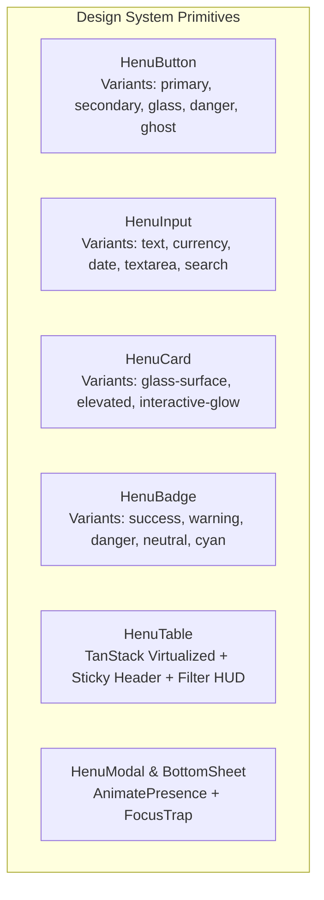
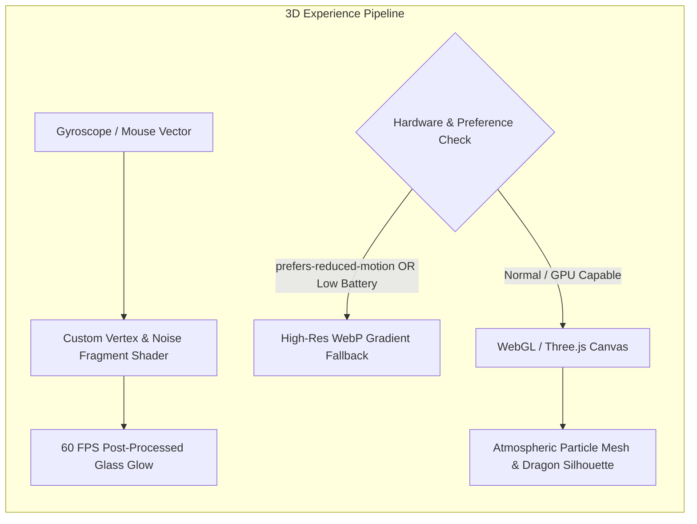
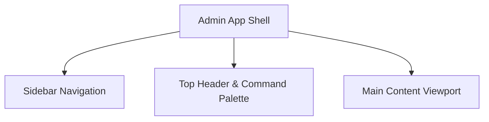
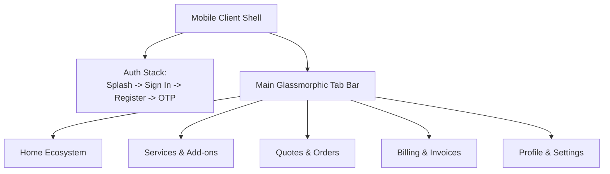
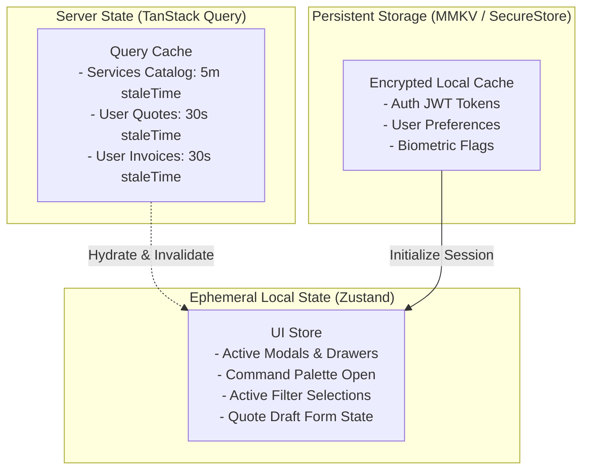
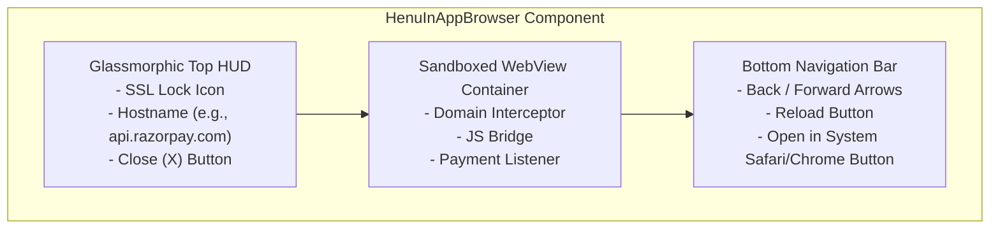

# HENU OS CLM — FRONT-END SPECIFICATION DOCUMENT
**Document Version:** 1.0.0  
**Status:** Approved Engineering Front-End Specification  
**Design Reference:** Google Stitch UI Implementation & Design Systems  
**Authoritative References:** [HENU_OS_CLM_PRD.md](file:///j:/CLM%20HENU%20A%26M/HENU_OS_CLM_PRD.md), [HENU_OS_CLM_TECHNICAL_ARCHITECTURE.md](file:///j:/CLM%20HENU%20A%26M/HENU_OS_CLM_TECHNICAL_ARCHITECTURE.md), [HENU_OS_CLM_SECURITY_ACCESS.md](file:///j:/CLM%20HENU%20A%26M/HENU_OS_CLM_SECURITY_ACCESS.md)  

---

## TABLE OF CONTENTS
1. [Front-End Design Philosophy & Visual System](#1-front-end-design-philosophy--visual-system)
2. [Design Tokens (Colors, Typography, Spacing, Elevation, Borders)](#2-design-tokens)
3. [Component System Primitives & Micro-Interactions](#3-component-system-primitives)
4. [3D Dragon & Ambient Sphere Experience](#4-3d-dragon--ambient-sphere-experience)
5. [Admin Web Portal — Complete Screen Specifications](#5-admin-web-portal--complete-screen-specifications)
6. [Client Mobile Application — Complete Screen Specifications](#6-client-mobile-application--complete-screen-specifications)
7. [Front-End State Management & Data Hydration](#7-front-end-state-management--data-hydration)
8. [Real-Time Reactive UI & Optimistic Updates](#8-real-time-reactive-ui--optimistic-updates)
9. [In-App Browser (HENU OS Browser) Component Specification](#9-in-app-browser-henu-os-browser-component-specification)
10. [Responsive Design, Safe Areas & Keyboard Handling](#10-responsive-design-safe-areas--keyboard-handling)
11. [Accessibility (WCAG 2.1 AA) & Inclusive Design](#11-accessibility-wcag-21-aa--inclusive-design)
12. [Performance Budgets & Asset Optimization](#12-performance-budgets--asset-optimization)
13. [Front-End Acceptance & Verification Standard](#13-front-end-acceptance--verification-standard)

---

# 1. FRONT-END DESIGN PHILOSOPHY & VISUAL SYSTEM

The **HENU OS Customer Lifecycle Management (CLM)** front-end combines high-density enterprise operational utility with an ultra-premium, tactile luxury aesthetic.

### Foundational Visual Principles
1. **Atmospheric Depth & Glassmorphism**: Translucent panels (`backdrop-blur-xl`, `bg-slate-900/60`, `border-slate-800/80`) floating above deep dark foundations create an unmistakable multi-layered spatial depth.
2. **Precision High-Contrast Micro-Accents**: Restrained neon cyan (`#06B6D4`), electric blue (`#3B82F6`), saffron gold (`#D9A441`), and royal iris (`#887DB8`) highlights draw instantaneous visual focus to critical KPIs, active states, and primary call-to-actions.
3. **Fluid Micro-Animations**: Smooth, physical easing (`cubic-bezier(0.16, 1, 0.3, 1)`) for drawer entries, status badge transitions, modal scales, and interactive chart hover effects.
4. **Pixel-Perfect Stitch Fidelity**: The completed Stitch UI prototypes are the binding visual source of truth. Developers must not substitute generic UI kits or alter typography, radii, or color palettes.

---

# 2. DESIGN TOKENS

### 1. Color Palette

```css
:root {
  /* HENU OS Brand Core Colors */
  --henu-royal-iris: #887DB8;
  --henu-deep-teal: #236870;
  --henu-terracotta-rose: #C96F61;
  --henu-saffron-gold: #D9A441;
  --henu-muted-sage: #788F83;
  --henu-soft-porcelain: #F5F1EA;
  --henu-stone-grey: #E0DAD1;
  --henu-ink: #20202B;
  --henu-charcoal: #2E2E37;

  /* Dark Foundation & Surface Layers */
  --henu-dark-base: #11131A;
  --henu-dark-surface: #181B24;
  --henu-dark-elevated: #222634;
  --henu-dark-border: rgba(255, 255, 255, 0.08);
  --henu-dark-border-subtle: rgba(255, 255, 255, 0.04);
  --henu-dark-border-accent: rgba(6, 182, 212, 0.3);

  /* Cyber Accents & Status Indicators */
  --henu-cyan-glow: #06B6D4;
  --henu-cyan-light: #22D3EE;
  --henu-blue-electric: #3B82F6;
  --henu-green-emerald: #10B981;
  --henu-amber-warning: #F59E0B;
  --henu-rose-danger: #EF4444;

  /* Text Tiers */
  --text-primary: #FFFFFF;
  --text-secondary: #94A3B8;
  --text-tertiary: #64748B;
  --text-disabled: #475569;
}
```

### 2. Typography Specification
- **Primary Typeface**: `Plus Jakarta Sans` (Google Fonts), with fallbacks `Inter, -apple-system, BlinkMacSystemFont, sans-serif`.
- **Monospace Typeface**: `JetBrains Mono`, `Fira Code` (for transaction IDs, invoice numbers, code snippets).

| Style | Size | Line Height | Weight | Letter Spacing | Usage |
| :--- | :--- | :--- | :--- | :--- | :--- |
| `display-2xl` | 48px (3.0rem) | 56px | 800 (ExtraBold) | -0.03em | Splash branding, Hero KPIs |
| `display-xl` | 36px (2.25rem)| 44px | 700 (Bold) | -0.025em | Main Section Titles |
| `heading-lg` | 24px (1.5rem) | 32px | 700 (Bold) | -0.02em | Modal Headers, Card Titles |
| `heading-md` | 18px (1.125rem)| 26px | 600 (SemiBold) | -0.01em | Table Headers, Module Names |
| `body-base` | 14px (0.875rem)| 20px | 400 (Regular) | 0.00em | Standard Body Copy |
| `body-medium` | 14px (0.875rem)| 20px | 500 (Medium) | 0.00em | Form Labels, Table Cells |
| `body-sm` | 12px (0.75rem) | 16px | 400 / 500 | +0.01em | Helper Text, Subtitles |
| `caption-xs` | 10px (0.625rem)| 14px | 600 (SemiBold) | +0.04em | Status Badges, Metadata Tags |

### 3. Spacing, Radii & Elevation Tokens
- **Spacing Grid**: 4px base (`4px, 8px, 12px, 16px, 20px, 24px, 32px, 40px, 48px, 64px`).
- **Corner Radii**:
  - `radius-xs`: 4px (Chips, tags)
  - `radius-sm`: 8px (Buttons, input fields)
  - `radius-md`: 12px (Cards, dropdowns, table containers)
  - `radius-lg`: 16px (Modals, bottom sheets)
  - `radius-xl`: 24px (Hero cards, mobile sheets)
  - `radius-full`: 9999px (Avatars, pills)
- **Shadows & Elevation**:
  - `elevation-card`: `0 8px 32px 0 rgba(0, 0, 0, 0.37)`
  - `elevation-modal`: `0 24px 64px 0 rgba(0, 0, 0, 0.65), 0 0 0 1px rgba(255, 255, 255, 0.08)`
  - `glow-cyan`: `0 0 20px rgba(6, 182, 212, 0.35)`
  - `glow-gold`: `0 0 20px rgba(217, 164, 65, 0.35)`

---

# 3. COMPONENT SYSTEM PRIMITIVES



### 1. `HenuButton`
- **Variants**:
  - `primary`: Linear gradient (`#06B6D4` to `#3B82F6`), white text, bold font, subtle cyan box-shadow, active scale 0.98.
  - `secondary`: Deep charcoal surface (`#181B24`), border `1px solid rgba(255,255,255,0.1)`, hover border `rgba(6,182,212,0.5)`.
  - `glass`: `rgba(255,255,255,0.05)` backdrop blur, stone-grey text.
  - `danger`: Red tint (`rgba(239, 68, 68, 0.15)`), red text (`#EF4444`), red border.
- **States**: Default, Hover, Focused, Active (Pressed), Loading (Spinning micro-loader), Disabled (Opacity 0.4).

### 2. `HenuInput` / `HenuCurrencyField`
- Dark background (`#11131A`), 1px border (`rgba(255,255,255,0.08)`), transition to neon cyan border on `:focus-visible` with `0 0 0 3px rgba(6,182,212,0.2)`.
- Currency prefix icon (`$`, `₹`, `€`), numeric validation, auto-comma formatting.

### 3. `HenuBadge` (Status Badges)
- Pill shaped (`rounded-full`), uppercase `caption-xs` font, with a pulsing micro-dot:
  - `Approved` / `Paid` / `Active`: Green emerald (`#10B981`)
  - `In Review` / `Processing` / `Pending`: Saffron gold (`#D9A441`)
  - `Rejected` / `Voided` / `Failed`: Terracotta rose (`#C96F61`)
  - `Draft` / `Archived`: Slate grey (`#64748B`)

---

# 4. 3D DRAGON & AMBIENT SPHERE EXPERIENCE

The signature visual element of the HENU OS splash and authentication screens is the **Ambient 3D Dragon / Particle Ecosystem Experience**.



### Implementation Guidelines
- **Technology**: Three.js / React Three Fiber / Skia Shaders with lightweight GLTF asset (< 650KB) and instanced particle clouds.
- **Visual Aesthetic**: The dragon is rendered as an ethereal, luminous filament silhouette with subtle cyan-to-iris particle trails. It is never aggressive or cartoonish; it serves as a serene luxury emblem.
- **Interaction**: Rotates slowly on its ambient axis (0.2 rad/s); responds with subtle parallax tilt (max 12 degrees) to user touch gestures or device gyroscope.
- **Accessibility & Fallback**:
  - Automatically disabled when `prefers-reduced-motion: reduce` is active.
  - Evaluates device memory (`navigator.deviceMemory < 4`) and falls back seamlessly to a high-resolution CSS glowing mesh gradient.
  - Automatically suspended (`cancelAnimationFrame`) when screen unmounts or browser tab loses focus.

---

# 5. ADMIN WEB PORTAL — COMPLETE SCREEN SPECIFICATIONS

Every screen in the Admin Web Portal follows a unified layout: **Left Collapsible Sidebar (64px / 260px)**, **Top Header Bar with Global Search & Command Palette (`Cmd+K`)**, and **Main Virtualized Work Area**.



### Screen Matrix

#### 1. Dashboard (`/admin/dashboard`)
- **Purpose**: Real-time business nerve center displaying high-level KPIs, revenue trajectories, quote funnel health, and operational audit feed.
- **Components**: KPI Metric Cards (Active Clients, Monthly Revenue, Pending Quotes, Conversion Rate), Revenue Area Chart (Recharts with gradient fill), Quote Distribution Donut Chart, Realtime Operational Activity Stream, Quick Approvals Drawer.
- **Data Hydration**: PostgreSQL aggregated views via TanStack Query (`staleTime: 60s`) + Realtime subscription to `quotes` and `payments`.
- **Permissions**: `customers.profile.view_all`.

#### 2. Customers Hub (`/admin/customers`)
- **Purpose**: Complete CRM registry for enterprise client accounts, spending tiers, and account status toggles.
- **Components**: TanStack Table with virtual scrolling, VIP Tier Badges, Search Input, Multi-Filter Drawer (Status, VIP Tier, Date Added), Customer Detail Flyout Panel.
- **Actions**: Create Customer, Edit Profile, Toggle Status (`Active` / `Disabled`), Export CSV, View Full Financial History.
- **Permissions**: `customers.profile.view_all`, `customers.profile.update_all`.

#### 3. Quotes Workbench (`/admin/quotes`)
- **Purpose**: Commercial estimation and proposal pipeline management.
- **Components**: Kanban / Table view toggle, Status Filter Pills (`Submitted`, `In Review`, `Approved`, `Rejected`, `Converted`), Margin Calculator Modal, PDF Attachment Viewer.
- **Actions**: Review Quote, Adjust Line-Item Pricing, Add Admin Internal Notes, Approve Quote (Triggers Client Push), Reject Quote (with mandatory reason modal), Convert to Sales Order.
- **Permissions**: `quotes.quote.view_all`, `quotes.quote.modify_pricing`, `quotes.quote.update_status`.

#### 4. Sales Orders (`/admin/orders`)
- **Purpose**: Post-approval delivery tracking and project progress monitoring.
- **Components**: Orders Data Grid, Progress Slider Modal, Milestone Checklist, Linked Invoice Reference.
- **Actions**: Update Progress %, Transition Status (`In Progress`, `Review Pending`, `Completed`), Trigger Milestone Notifications.
- **Permissions**: `quotes.quote.view_all`.

#### 5. Invoices Hub (`/admin/invoices`)
- **Purpose**: Financial billing, tax calculations, and accounts receivable tracking.
- **Components**: Financial KPI summary (Total Invoiced, Amount Received, Overdue Balance), Invoices Table, Invoice Builder Drawer, PDF Generator Preview.
- **Actions**: Issue Invoice, Record Manual Payment, Void Invoice, Send Payment Reminder, Download Official PDF.
- **Permissions**: `invoices.invoice.view_all`, `invoices.invoice.create`, `invoices.invoice.void`.

#### 6. Recurring Invoices (`/admin/invoices/recurring`)
- **Purpose**: Retainer and recurring subscription management.
- **Components**: Subscription Table, Frequency Configurator (Monthly, Quarterly, Annual), Auto-Billing Toggle.
- **Actions**: Create Retainer Schedule, Pause/Resume Schedule, Edit Billing Terms.
- **Permissions**: `invoices.invoice.create`.

#### 7. Payments Ledger (`/admin/payments`)
- **Purpose**: Real-time transaction reconciliation across Razorpay, Cashfree, and bank transfers.
- **Components**: Live Ledger Table, Gateway Filter Pills, Transaction Details Modal with Raw Webhook JSON inspector.
- **Actions**: View Cryptographic Signature, Initiate Refund (Super Admin / Finance only), Export Ledger.
- **Permissions**: `payments.transaction.view_all`, `payments.refund.issue`.

#### 8. Credit Notes (`/admin/credit-notes`)
- **Purpose**: Accounting adjustments, invoice write-offs, and client credits.
- **Components**: Credit Notes Table, Allocate Credit Modal.
- **Actions**: Issue Credit Note, Apply to Open Invoice.
- **Permissions**: `invoices.invoice.create`.

#### 9. Services & Add-ons Catalog (`/admin/catalog/services`)
- **Purpose**: Live service tier and price configuration for mobile app consumption.
- **Components**: Service Card Grid, Add-on Accordion List, Tiered Pricing Editor, Icon Picker.
- **Actions**: Add New Service, Edit Base Price, Re-order Services (Drag & Drop), Toggle Featured Flag, Publish/Archive.
- **Permissions**: `catalog.service.manage`.

#### 10. Service Categories (`/admin/catalog/categories`)
- **Purpose**: Taxonomy and grouping for services and digital assets.
- **Components**: Category Tree Table, Slug Generator.
- **Actions**: Create Category, Set Icon, Reorder.
- **Permissions**: `catalog.service.manage`.

#### 11. Portfolio Showcase Manager (`/admin/portfolio`)
- **Purpose**: Case study and luxury showcase publisher.
- **Components**: Case Study Markdown Editor, Multi-Image Drag-and-Drop Gallery Uploader, Deliverables Tag Input.
- **Actions**: Create Case Study, Upload High-Res Media, Reorder Gallery, Publish.
- **Permissions**: `cms.content.manage`.

#### 12. Digital Products & Source Code (`/admin/products`)
- **Purpose**: Software and digital asset inventory management.
- **Components**: Product Catalog Table, License Key Generator, File Attachment Uploader.
- **Actions**: Add Product, Upload Build Archive, Set License Terms.
- **Permissions**: `cms.content.manage`.

#### 13. Special Offers & Banners (`/admin/offers`)
- **Purpose**: Promotional campaigns and dynamic mobile hero banner configuration.
- **Components**: Promo Code Configurator, Discount Type Selector (Percentage vs Fixed), Date Range Picker, Banner Theme Selector.
- **Actions**: Launch Promo Campaign, Set Validity Window, Toggle Active Status.
- **Permissions**: `catalog.offer.manage`.

#### 14. Conversations & Support Desk (`/admin/support`)
- **Purpose**: Real-time client messaging, ticket triage, and quotation discussions.
- **Components**: Two-Pane Chat Interface (Conversation List + Message Thread), Attachment Preview, Internal Note Switcher.
- **Actions**: Reply to Client, Attach Spec PDF, Close Ticket.
- **Permissions**: `customers.profile.view_all`.

#### 15. Notifications Hub (`/admin/notifications`)
- **Purpose**: System-wide push and email broadcast center.
- **Components**: Broadcast Composer Modal, Target Audience Selector (All Clients, Specific VIP Tier, Individual), Delivery Log.
- **Actions**: Dispatch System Alert, Send Marketing Broadcast.
- **Permissions**: `system.settings.manage`.

#### 16. Analytics & Intelligence (`/admin/analytics`)
- **Purpose**: Deep commercial insights, revenue cohorts, quote conversion rates, and client retention curves.
- **Components**: Cohort Heatmap, Conversion Funnel Visualization, Average Deal Size Graph.
- **Permissions**: `customers.profile.view_all`.

#### 17. CMS & Legal Management (`/admin/cms`)
- **Purpose**: Edit dynamic Mobile Quick Actions, FAQs, Terms of Service, and Privacy Policy without app store updates.
- **Components**: Quick Actions Grid Editor, Rich Text Legal Editor.
- **Actions**: Modify Mobile Quick Action Routes, Update Privacy Policy.
- **Permissions**: `cms.content.manage`.

#### 18. Settings & Access Control (`/admin/settings`)
- **Purpose**: System configurations, payment gateway keys, and administrative RBAC management.
- **Components**: Gateway Configuration Cards (Razorpay & Cashfree API Keys and Webhook URLs), Admin Roles Table, Audit Log Viewer.
- **Actions**: Rotate Webhook Secret, Update Permissions, View Audit Trail.
- **Permissions**: `system.settings.manage`, `system.gateways.manage`, `audit.logs.view`.

---

# 6. CLIENT MOBILE APPLICATION — COMPLETE SCREEN SPECIFICATIONS



### Mobile Screen Catalog

#### 1. Splash Screen
- **Visuals**: OLED Midnight backdrop (`#0B0F17`), centered glowing HENU OS brand mark, 3D ambient particle dragon silhouette with smooth particle shimmer.
- **Lifecycle**: Checks cached auth token in MMKV -> If valid, transitions to `Home`; if invalid or expired, transitions to `SignIn`.

#### 2. Authentication Flow (`SignIn`, `CreateAccount`, `ForgotPassword`, `ResetPassword`)
- **Visuals**: Ambient particle mesh background, glassmorphic auth card (`backdrop-blur-xl`), floating labels, biometric login button (Face ID / Fingerprint).
- **Validation**: Real-time regex validation (Email format, password strength meter).
- **Error Feedback**: Inline glass red error banners with haptic vibration feedback.

#### 3. Home Ecosystem Screen
- **Components**:
  - **Header**: User greeting, VIP Tier badge, unread notification bell with pulsing cyan badge.
  - **Interactive 3D Sphere Widget**: Real-time rotating particle sphere responding to touch drag.
  - **Live Project Status Card**: Real-time progress bar of active order with status chip.
  - **CMS Quick Actions**: 2x2 or 4x1 grid of shortcut tiles configured by Admin.
  - **Featured Services Carousel**: Horizontal scrolling cards with base price and turnaround tags.
  - **Promotional Banner**: Active offer card with discount code and one-tap copy.

#### 4. Services & Detail Screen
- **Components**: Category filter tabs, Service Cards with category tags, pricing chips, and turnaround indicators.
- **Detail Screen**: Full markdown scope description, included deliverables checklist, interactive add-on package selectors with real-time price accumulator, and "Request Custom Quote" primary action.

#### 5. Quote Request Wizard
- **Steps**:
  1. *Project Scope*: Title, scope description, turnaround requirements.
  2. *Add-on Selection*: Multi-select toggle list of optional features.
  3. *Attachment Uploader*: Direct camera capture or file picker for briefs (PDF/Images).
  4. *Review & Submit*: Summary calculation, terms acceptance, animated submit button.

#### 6. Quotes & Orders Hub
- **Components**: Segmented control (`Active Quotes`, `Order History`), Quote Cards with status badges (`In Review`, `Approved`, `Rejected`), "Review & Accept" modal triggering order conversion.

#### 7. Billing & Invoices Hub
- **Components**:
  - Summary Card: Total outstanding amount due, upcoming due date.
  - Invoice List: Status pills (`Paid`, `Issued`, `Overdue`), tap to open Invoice Detail.
  - Invoice Detail: Line item breakdown, taxes, PDF download button, and "Pay Now" CTA.

#### 8. Payment Checkout Flow
- **Components**: Gateway selector (Razorpay vs Cashfree), payment method preview (UPI, Card, NetBanking), seamless native SDK / sandboxed browser checkout modal, and animated success screen with confetti.

#### 9. Portfolio Showcase
- **Components**: Masonry / High-res card feed of completed enterprise projects, category filter, full-screen image lightbox, and case study reader.

#### 10. Notifications Center
- **Components**: Grouped by date (Today, Earlier), unread status indicators, tap-to-navigate action handler (deep links directly to quote or invoice).

#### 11. Profile & Settings Hub
- **Screens**:
  - *Profile Overview*: Avatar upload, personal info, company details.
  - *Security & Privacy*: Password reset, biometric toggle, active devices list, session revocation.
  - *Preferences*: Appearance mode, push notification categories.
  - *Legal & Compliance*: Terms of Service, Privacy Policy, Company Impressum.

---

# 7. FRONT-END STATE MANAGEMENT & DATA HYDRATION

The application combines **TanStack Query (React Query)** for server state with **Zustand** for local UI state.



---

# 8. REAL-TIME REACTIVE UI & OPTIMISTIC UPDATES

When mutations occur in the Admin Portal or via payment webhooks, the mobile and web interfaces update seamlessly via Supabase Realtime event listeners.

### Optimistic Mutation Standard
```typescript
// TanStack Query Optimistic Update Pattern
const useUpdateQuoteStatus = () => {
  const queryClient = useQueryClient();

  return useMutation({
    mutationFn: async ({ quoteId, status }: { quoteId: string; status: QuoteStatus }) => {
      const { data, error } = await supabase
        .from('quotes')
        .update({ status })
        .eq('id', quoteId)
        .select()
        .single();
      if (error) throw error;
      return data;
    },
    onMutate: async ({ quoteId, status }) => {
      // Cancel outgoing refetches
      await queryClient.cancelQueries({ queryKey: ['quotes', quoteId] });

      // Snapshot previous value
      const previousQuote = queryClient.getQueryData(['quotes', quoteId]);

      // Optimistically update cache
      queryClient.setQueryData(['quotes', quoteId], (old: any) => ({
        ...old,
        status,
        updated_at: new Date().toISOString()
      }));

      return { previousQuote };
    },
    onError: (err, variables, context) => {
      // Rollback on error
      if (context?.previousQuote) {
        queryClient.setQueryData(['quotes', variables.quoteId], context.previousQuote);
      }
    },
    onSettled: (data, error, variables) => {
      queryClient.invalidateQueries({ queryKey: ['quotes', variables.quoteId] });
      queryClient.invalidateQueries({ queryKey: ['quotes'] });
    }
  });
};
```

---

# 9. IN-APP BROWSER (HENU OS BROWSER) COMPONENT SPECIFICATION

The **HENU OS In-App Browser** is a custom, glassmorphic sandboxed WebView component for mobile clients.



### Component Properties & Event Handlers
- **Props**: `url: string`, `title?: string`, `allowedDomains: string[]`, `onPaymentSuccess?: (payload: any) => void`, `onClose: () => void`.
- **Loading State**: Slim, pulsing neon cyan progress bar at the top edge of the WebView during page loads.
- **Escape Modal**: Clicking "Open in External Browser" displays a confirmation sheet warning the user they are leaving the secure HENU OS sandbox.

---

# 10. RESPONSIVE DESIGN, SAFE AREAS & KEYBOARD HANDLING

### Breakpoint Specification (Admin Web Portal)
- **Desktop Wide (`>= 1440px`)**: Full 3-column layouts, expanded 260px sidebar, visible audit feeds.
- **Desktop Standard (`1024px - 1439px`)**: 2-column layouts, collapsible 64px icon-only sidebar.
- **Tablet (`768px - 1023px`)**: Single-column table with horizontal scroll, drawer-based flyout inspectors.
- **Mobile Web (`< 768px`)**: Hamburger drawer navigation, stacked KPI cards, full-screen modals.

### Mobile Safe Areas & Keyboard Avoidance (React Native)
- All screens wrap inside `SafeAreaProvider` and `SafeAreaView` from `react-native-safe-area-context` with `edges={['top', 'left', 'right']}`.
- Bottom tab navigation incorporates dynamic bottom safe area padding (`Math.max(insets.bottom, 16)`).
- Form screens utilize `KeyboardAvoidingView` (`behavior={Platform.OS === 'ios' ? 'padding' : 'height'}`) with `ScrollView` auto-scroll on input focus to ensure inputs are never obstructed by virtual keyboards.

---

# 11. ACCESSIBILITY (WCAG 2.1 AA) & INCLUSIVE DESIGN

1. **Color Contrast**: All text tiers meet minimum contrast ratios against dark backgrounds (minimum 4.5:1 for normal text, 3:1 for large text and interactive components).
2. **Screen Reader Semantics**:
   - Web: Strict semantic HTML5 (`<main>`, `<nav>`, `<aside>`, `<header>`, `role="status"`, `aria-expanded`).
   - Mobile: `accessible={true}`, `accessibilityLabel`, `accessibilityRole="button" | "header" | "alert"`.
3. **Dynamic Type & Font Scaling**: Layouts support up to 200% font scaling without text clipping, button distortion, or overlapping cards.
4. **Keyboard Focus & Trapping**: Modals trap focus; full command palette navigation supported via Arrow Keys, `Enter`, and `Escape`.

---

# 12. PERFORMANCE BUDGETS & ASSET OPTIMIZATION

| Metric | Target Budget | Optimization Strategy |
| :--- | :--- | :--- |
| **First Contentful Paint (FCP)** | < 0.8s | Static pre-rendering of admin shell + critical inline CSS. |
| **Time to Interactive (TTI)** | < 1.5s | Route-level code splitting and lazy loading of heavy charts. |
| **Mobile App Launch Time** | < 1.2s | Hermes JS Engine bytecode pre-compilation + MMKV token read. |
| **3D Canvas FPS** | Stable 60 FPS | Low polygon geometry (< 15K vertices) + Offscreen rendering. |
| **JS Bundle Size (Initial Web)**| < 180 KB (Gzipped) | Tree-shaking Lucide icons and modular TanStack imports. |

---

# 13. FRONT-END ACCEPTANCE & VERIFICATION STANDARD

Before any pull request or screen implementation is approved for production:
1. **Visual Accuracy**: Screen must achieve a 100% pixel-level visual match with the corresponding Stitch UI prototype.
2. **State Coverage**: Screen must explicitly handle **Loading**, **Empty Data**, **Error**, and **Success** states without UI layout collapse.
3. **Theme Integrity**: No hardcoded arbitrary color values (`#fff`, `#000`, `blue`); all styles must reference the official HENU OS design tokens.
4. **Responsive Verification**: Verified across iPhone SE (small mobile), iPhone 15 Pro, iPad Air, 1080p Desktop, and 4K displays.

---

### FRONT-END SPECIFICATION APPROVAL
- **Status:** Complete, Exhaustive & Authoritative
- **Binding Reference:** Google Stitch UI Implementation
- **Clients Covered:** Admin Web Portal & Client Mobile Application.
