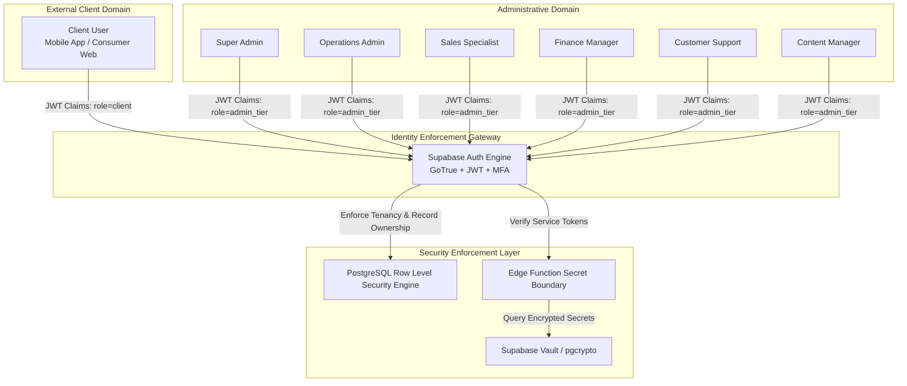
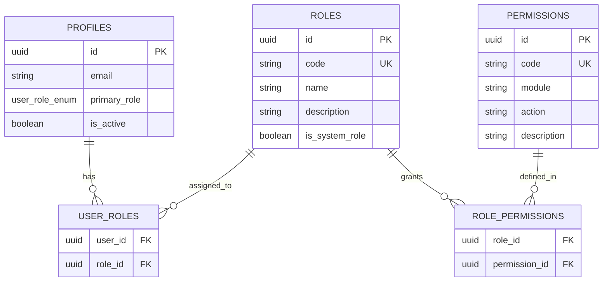
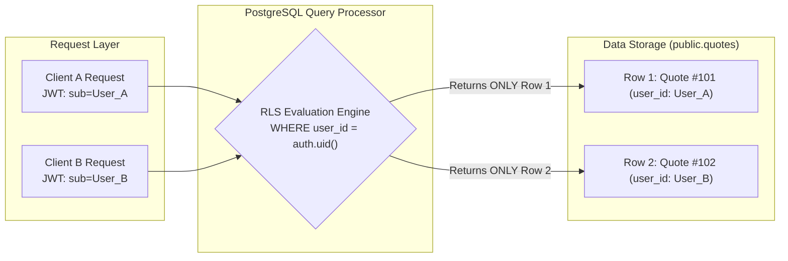
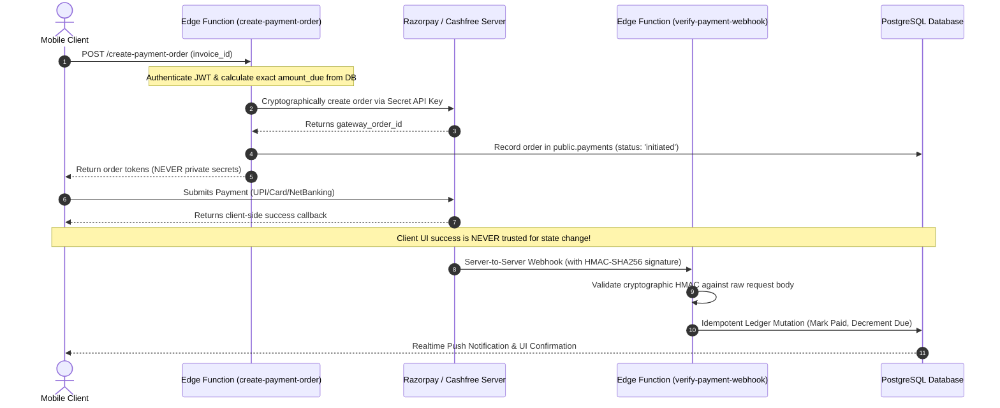
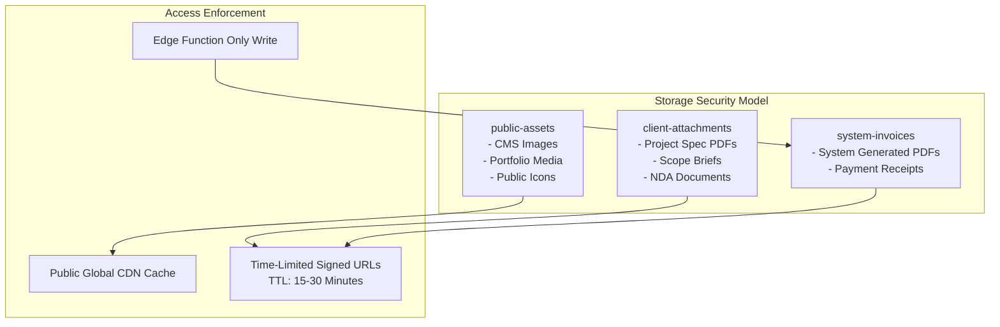
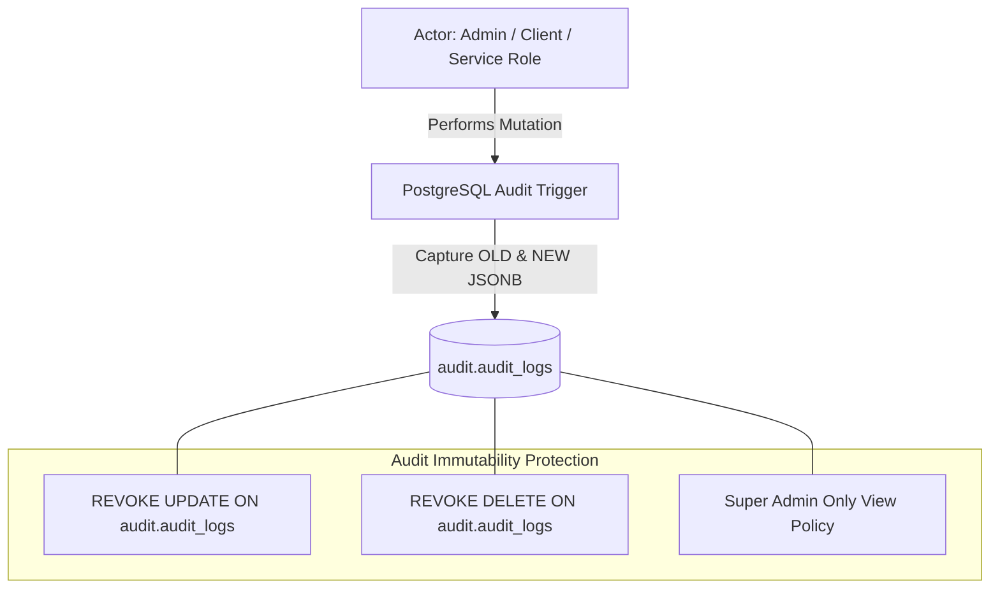
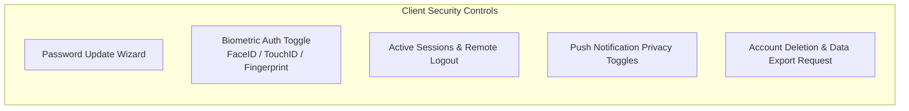
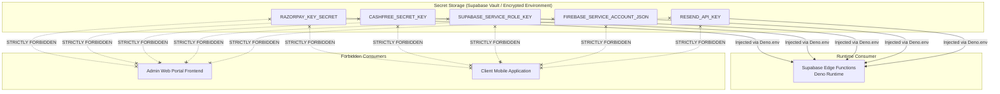
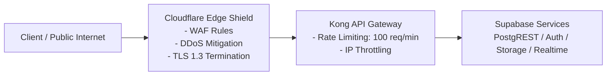

# HENU OS CLM — SECURITY & ACCESS CONTROL DOCUMENT
**Document Version:** 1.0.0  
**Status:** Approved Security Architecture  
**Target Platform:** Supabase-First Backend Ecosystem  
**Authoritative References:** [HENU_OS_CLM_PRD.md](file:///j:/CLM%20HENU%20A%26M/HENU_OS_CLM_PRD.md), [HENU_OS_CLM_TECHNICAL_ARCHITECTURE.md](file:///j:/CLM%20HENU%20A%26M/HENU_OS_CLM_TECHNICAL_ARCHITECTURE.md), and Google Stitch UI Implementation  

---

## TABLE OF CONTENTS
1. [Security Objectives & Threat Landscape](#1-security-objectives--threat-landscape)
2. [Identity & Access Model Overview](#2-identity--access-model-overview)
3. [Authentication Architecture & Lifecycle](#3-authentication-architecture--lifecycle)
4. [Role-Based Access Control (RBAC) Architecture](#4-role-based-access-control-rbac-architecture)
5. [Granular Permission Matrix](#5-granular-permission-matrix)
6. [Client Data Isolation & Multi-Tenant Boundaries (RLS)](#6-client-data-isolation--multi-tenant-boundaries-rls)
7. [Row Level Security (RLS) Implementation Specs](#7-row-level-security-rls-implementation-specs)
8. [Payment Gateway Security & Cryptographic Trust Model](#8-payment-gateway-security--cryptographic-trust-model)
9. [Storage & File Access Security](#9-storage--file-access-security)
10. [In-App Browser & WebView Sandboxing](#10-in-app-browser--webview-sandboxing)
11. [Audit Logging & Non-Repudiation Architecture](#11-audit-logging--non-repudiation-architecture)
12. [Comprehensive Threat & Defense Matrix](#12-comprehensive-threat--defense-matrix)
13. [Client-Side Security & Privacy Controls](#13-client-side-security--privacy-controls)
14. [Administrative Credential & Secret Management](#14-administrative-credential--secret-management)
15. [Network, Rate Limiting & Edge Shielding](#15-network-rate-limiting--edge-shielding)
16. [Security Rule Standard Specifications](#16-security-rule-standard-specifications)

---

# 1. SECURITY OBJECTIVES & THREAT LANDSCAPE

The **HENU OS Customer Lifecycle Management (CLM)** platform governs sensitive commercial negotiations, high-value bespoke project quotes, confidential enterprise assets, financial ledgers, and live payment transactions.

### Core Security Mandates
1. **Zero-Trust Client Boundary**: The client application (web or mobile) is inherently untrusted. All authorizations, business rules, price calculations, and status transitions are validated inside PostgreSQL and Supabase Edge Functions.
2. **Strict Multi-Client Isolation**: Client A must be cryptographically and logically barred from reading or mutating Client B's metadata, quotes, orders, invoices, payments, or private files.
3. **Least Privilege Administrative Access**: Operational and administrative accounts do not possess blanket superuser privileges. Access is strictly partitioned across granular functional roles (Sales, Finance, Support, Content).
4. **Non-Repudiation & Complete Auditability**: Every sensitive state change (quote approval, price edit, invoice voiding, refund, gateway credential update) produces an immutable audit record.
5. **Zero Exposure of Private Credentials**: Payment private keys (Razorpay / Cashfree secrets), webhook verification secrets, and database service keys are sealed in Supabase Vault / serverless runtime environments.

---

# 2. IDENTITY & ACCESS MODEL OVERVIEW

The security topology bifurcates users into two distinct operational classes: **Clients** and **Administrators**.



---

# 3. AUTHENTICATION ARCHITECTURE & LIFECYCLE

Authentication is managed via **Supabase Auth (GoTrue)** with custom claims and lifecycle hooks.

### 1. Account Creation & Registration
- **Self-Service Client Registration**: Clients provide email, password, first name, last name, and optional company name.
- **Auto-Provisioning Profile Trigger**: An `AFTER INSERT` trigger on `auth.users` automatically provisions a matching `public.profiles` record with default role `client` and status `is_active = true`.
- **Admin Provisioning**: Administrative accounts cannot be registered via public signup; they must be created via administrative invite or by a `super_admin` using `supabase.auth.admin.createUser()`.

```sql
-- Auto-provision profile trigger upon user creation
CREATE OR REPLACE FUNCTION public.handle_new_user_registration()
RETURNS TRIGGER
LANGUAGE plpgsql
SECURITY DEFINER
AS $$
BEGIN
  INSERT INTO public.profiles (
    id,
    first_name,
    last_name,
    company_name,
    phone,
    role,
    is_active
  )
  VALUES (
    NEW.id,
    COALESCE(NEW.raw_user_meta_data->>'first_name', 'New'),
    COALESCE(NEW.raw_user_meta_data->>'last_name', 'User'),
    NEW.raw_user_meta_data->>'company_name',
    NEW.phone,
    COALESCE((NEW.raw_app_meta_data->>'role')::public.user_role_enum, 'client'::public.user_role_enum),
    true
  );
  RETURN NEW;
END;
$$;

CREATE TRIGGER on_auth_user_created
AFTER INSERT ON auth.users
FOR EACH ROW EXECUTE FUNCTION public.handle_new_user_registration();
```

### 2. Password Policies & Hashing
- **Algorithm**: Argon2id / bcrypt with high work factor managed by GoTrue.
- **Complexity Mandate**: Minimum 8 characters, requiring at least 1 uppercase letter, 1 lowercase letter, 1 number, and 1 special character.
- **Brute-Force Lockout**: Supabase Auth enforces exponential backoff and IP rate limiting after 5 consecutive failed authentication attempts.

### 3. Session & Token Lifecycle
- **Access Tokens (JWT)**: Short-lived expiration (60 minutes). Contains `sub` (user UUID), `aud` (`authenticated`), and custom claims (`role`, `is_active`).
- **Refresh Tokens**: Long-lived (30 days), stored securely in device hardware keystore (iOS Keychain / Android EncryptedSharedPreferences via MMKV) on mobile and `HttpOnly`, `Secure`, `SameSite=Strict` cookies on web.
- **Token Rotation**: Supabase Auth utilizes single-use refresh token rotation; reusing an invalidated refresh token revokes the entire token family immediately.
- **Session Revocation**: `super_admin` or user can invoke global sign-out (`supabase.auth.admin.signOut(uid, 'global')`), immediately invalidating all refresh tokens.

### 4. Account Lifecycle States
| Account State | Database Field | Login Allowed | Token Refresh Allowed | API Requests Allowed |
| :--- | :--- | :--- | :--- | :--- |
| **Active** | `is_active = true, deleted_at IS NULL` | Yes | Yes | Yes (subject to RLS) |
| **Suspended / Disabled** | `is_active = false` | No (Error 403) | No (Blocked) | Blocked by RLS |
| **Soft-Deleted** | `deleted_at IS NOT NULL` | No (Error 404) | No (Purged) | Blocked by RLS |

---

# 4. ROLE-BASED ACCESS CONTROL (RBAC) ARCHITECTURE

HENU OS CLM implements a hybrid RBAC model: fixed baseline system roles combined with a dynamic, database-driven permissions table allowing future custom role creation.



### Initial Built-In Roles
1. **Super Admin**: Complete root access across all modules, schema configs, gateway keys, and administrative user management.
2. **Admin**: Operational leadership. Full read/write to Customers, Quotes, Services, CMS, Invoices. Cannot modify super-admin credentials or raw database settings.
3. **Sales Specialist**: Manage Leads, Customers, Quotes, and Proposals. Read-only to financial ledgers and CMS configuration.
4. **Finance Manager**: Full control over Invoices, Payments, Gateway Ledgers, Refunds, and Financial Telemetry. Read-only to CMS and Services.
5. **Customer Support**: Read access to customer profiles, quotes, and invoices. Write access to support tickets and client notifications.
6. **Content Manager**: Full control over CMS (Services, Add-ons, Portfolio, Offers, Quick Actions, FAQ, Legal Docs). No access to customer financial records or quotes.
7. **Client**: Restricted strictly to self-owned entities (own profile, quotes, orders, invoices, payments, attachments).

---

# 5. GRANULAR PERMISSION MATRIX

Permissions follow the standard normalized format: `<module>.<resource>.<action>`

| Permission Code | Super Admin | Admin | Sales | Finance | Support | Content Mgr | Client |
| :--- | :---: | :---: | :---: | :---: | :---: | :---: | :---: |
| `customers.profile.view_all` | ✅ | ✅ | ✅ | ✅ | ✅ | ❌ | ❌ |
| `customers.profile.view_own` | ✅ | ✅ | ✅ | ✅ | ✅ | ❌ | ✅ |
| `customers.profile.update_all` | ✅ | ✅ | ❌ | ❌ | ❌ | ❌ | ❌ |
| `customers.profile.update_own` | ✅ | ✅ | ✅ | ✅ | ✅ | ❌ | ✅ |
| `quotes.quote.view_all` | ✅ | ✅ | ✅ | ✅ | ✅ | ❌ | ❌ |
| `quotes.quote.view_own` | ✅ | ✅ | ✅ | ✅ | ✅ | ❌ | ✅ |
| `quotes.quote.create_own` | ✅ | ✅ | ✅ | ❌ | ❌ | ❌ | ✅ |
| `quotes.quote.update_status` | ✅ | ✅ | ✅ | ❌ | ❌ | ❌ | ❌ |
| `quotes.quote.modify_pricing`| ✅ | ✅ | ✅ | ❌ | ❌ | ❌ | ❌ |
| `invoices.invoice.view_all` | ✅ | ✅ | ❌ | ✅ | ✅ | ❌ | ❌ |
| `invoices.invoice.view_own` | ✅ | ✅ | ❌ | ✅ | ✅ | ❌ | ✅ |
| `invoices.invoice.create` | ✅ | ✅ | ❌ | ✅ | ❌ | ❌ | ❌ |
| `invoices.invoice.void` | ✅ | ✅ | ❌ | ✅ | ❌ | ❌ | ❌ |
| `payments.transaction.view_all`| ✅ | ✅ | ❌ | ✅ | ❌ | ❌ | ❌ |
| `payments.transaction.view_own`| ✅ | ✅ | ❌ | ✅ | ❌ | ❌ | ✅ |
| `payments.refund.issue` | ✅ | ❌ | ❌ | ✅ | ❌ | ❌ | ❌ |
| `catalog.service.manage` | ✅ | ✅ | ❌ | ❌ | ❌ | ✅ | ❌ |
| `catalog.offer.manage` | ✅ | ✅ | ❌ | ❌ | ❌ | ✅ | ❌ |
| `cms.content.manage` | ✅ | ✅ | ❌ | ❌ | ❌ | ✅ | ❌ |
| `system.settings.manage` | ✅ | ❌ | ❌ | ❌ | ❌ | ❌ | ❌ |
| `system.gateways.manage` | ✅ | ❌ | ❌ | ❌ | ❌ | ❌ | ❌ |
| `audit.logs.view` | ✅ | ❌ | ❌ | ❌ | ❌ | ❌ | ❌ |

---

# 6. CLIENT DATA ISOLATION & MULTI-TENANT BOUNDARIES (RLS)

To prevent Insecure Direct Object References (IDOR) and cross-client leakage, HENU OS CLM enforces database-level isolation.



### Security Boundary Rules
1. **Zero Client-Side Filtering Trust**: A mobile client executing `supabase.from('quotes').select('*')` receives **only** their own rows because PostgreSQL intercepts the query plan and injects `AND user_id = auth.uid()`.
2. **Immutable Ownership Columns**: Client requests attempting to insert or update `user_id` to another user's UUID are blocked by `WITH CHECK (auth.uid() = user_id)`.
3. **Foreign Key Cascade Protection**: Related tables (`quotes` -> `orders` -> `invoices` -> `payments`) maintain referential integrity with strict foreign keys to prevent orphaned records or unlinked access vectors.

---

# 7. ROW LEVEL SECURITY (RLS) IMPLEMENTATION SPECS

### Comprehensive SQL Security Policies

```sql
-- 1. Helper Function: Check Specific Permission
CREATE OR REPLACE FUNCTION public.has_permission(p_permission_code TEXT)
RETURNS BOOLEAN
LANGUAGE plpgsql
SECURITY DEFINER
STABLE
AS $$
BEGIN
  -- Super admin has all permissions implicitly
  IF EXISTS (
    SELECT 1 FROM public.profiles 
    WHERE id = auth.uid() AND role = 'super_admin' AND is_active = true
  ) THEN
    RETURN true;
  END IF;

  -- Check assigned role permissions
  RETURN EXISTS (
    SELECT 1 
    FROM public.profiles p
    JOIN public.user_roles ur ON ur.user_id = p.id
    JOIN public.role_permissions rp ON rp.role_id = ur.role_id
    JOIN public.permissions perm ON perm.id = rp.permission_id
    WHERE p.id = auth.uid()
      AND p.is_active = true
      AND perm.code = p_permission_code
  );
END;
$$;

-- 2. Customer Profiles RLS
ALTER TABLE public.profiles ENABLE ROW LEVEL SECURITY;

CREATE POLICY "profiles_select_policy" ON public.profiles
FOR SELECT USING (
  auth.uid() = id OR public.has_permission('customers.profile.view_all')
);

CREATE POLICY "profiles_update_policy" ON public.profiles
FOR UPDATE USING (
  auth.uid() = id OR public.has_permission('customers.profile.update_all')
)
WITH CHECK (
  -- Clients cannot elevate their own role
  (auth.uid() = id AND role = (SELECT role FROM public.profiles WHERE id = auth.uid()))
  OR public.has_permission('customers.profile.update_all')
);

-- 3. Quotes RLS
ALTER TABLE public.quotes ENABLE ROW LEVEL SECURITY;

CREATE POLICY "quotes_select_policy" ON public.quotes
FOR SELECT USING (
  auth.uid() = user_id OR public.has_permission('quotes.quote.view_all')
);

CREATE POLICY "quotes_insert_policy" ON public.quotes
FOR INSERT WITH CHECK (
  auth.uid() = user_id OR public.has_permission('quotes.quote.modify_pricing')
);

CREATE POLICY "quotes_update_policy" ON public.quotes
FOR UPDATE USING (
  public.has_permission('quotes.quote.update_status') OR
  (auth.uid() = user_id AND status = 'draft')
);

-- 4. Invoices RLS
ALTER TABLE public.invoices ENABLE ROW LEVEL SECURITY;

CREATE POLICY "invoices_select_policy" ON public.invoices
FOR SELECT USING (
  auth.uid() = user_id OR public.has_permission('invoices.invoice.view_all')
);

CREATE POLICY "invoices_admin_mutation_policy" ON public.invoices
FOR ALL USING (
  public.has_permission('invoices.invoice.create')
);

-- 5. Payments RLS
ALTER TABLE public.payments ENABLE ROW LEVEL SECURITY;

CREATE POLICY "payments_select_policy" ON public.payments
FOR SELECT USING (
  auth.uid() = user_id OR public.has_permission('payments.transaction.view_all')
);

-- Direct client inserts into payments are forbidden; payments are created via Edge Function
CREATE POLICY "payments_service_insert_policy" ON public.payments
FOR INSERT WITH CHECK (
  auth.role() = 'service_role' OR public.has_permission('payments.refund.issue')
);
```

---

# 8. PAYMENT GATEWAY SECURITY & CRYPTOGRAPHIC TRUST MODEL

Payment operations represent the highest security vulnerability area. HENU OS CLM implements a **zero-trust client payment model**.



### Security Safeguards Against Payment Tampering
1. **Amount Calculation Isolation**: Clients cannot submit arbitrary payment amounts. The Edge Function fetches the authoritative `amount_due` directly from `public.invoices`.
2. **Server-Side HMAC-SHA256 Signature Verification**: Every incoming webhook payload is checked against secret hash keys before processing.
3. **Idempotency Keys**: Every payment event uses a unique idempotency lock (`gateway_payment_id` unique constraint in `public.payments`) preventing double-credit or replay attacks.
4. **Refund Protection**: Refund operations require `payments.refund.issue` permission, trigger two-factor confirmation for admins, and can only be executed against previously settled transactions.

---

# 9. STORAGE & FILE ACCESS SECURITY

HENU OS CLM enforces strict storage partition boundaries across Supabase Storage buckets.



### Bucket Security Matrix
| Bucket Name | Access Type | Upload Permissions | Read Permissions | Max File Size | Allowed MIME Types |
| :--- | :--- | :--- | :--- | :--- | :--- |
| `public-assets` | Public | Content Managers (`cms.content.manage`) | Public (Anonymous) | 10 MB | `image/jpeg`, `image/png`, `image/webp`, `image/svg+xml` |
| `client-attachments` | Private | Owner Client (`auth.uid()`) | Owner Client + Authorized Admins | 25 MB | `application/pdf`, `image/png`, `image/jpeg`, `application/zip` |
| `system-invoices` | Restricted | Edge Function (`service_role`) | Owner Client + Finance Admins | 10 MB | `application/pdf` |
| `user-avatars` | Public | Owner User (`auth.uid()`) | Public | 2 MB | `image/jpeg`, `image/png`, `image/webp` |

### Storage Bucket RLS Policies (SQL)
```sql
-- Storage RLS: Restrict client attachments to owner directory
CREATE POLICY "attachments_owner_insert"
ON storage.objects FOR INSERT TO authenticated
WITH CHECK (
  bucket_id = 'client-attachments' AND
  (storage.foldername(name))[1] = auth.uid()::text
);

CREATE POLICY "attachments_owner_select"
ON storage.objects FOR SELECT TO authenticated
USING (
  bucket_id = 'client-attachments' AND
  (
    (storage.foldername(name))[1] = auth.uid()::text OR
    public.has_permission('quotes.quote.view_all')
  )
);
```

---

# 10. IN-APP BROWSER & WEBVIEW SANDBOXING

The HENU OS Browser on mobile hosts external payment gateways, documentation, and external portfolio links within an isolated sandbox.

### Sandbox Architecture & Constraints
1. **Domain Whitelisting**: Navigation requests are intercepted by `shouldOverrideUrlLoading` (Android) / `decidePolicyForNavigationAction` (iOS). Only explicitly permitted domains are rendered inside the WebView:
   - `*.razorpay.com`
   - `*.cashfree.com`
   - `*.henuos.com`
   - `*.supabase.co`
2. **Untrusted Link Handling**: Any navigation to an external, unwhitelisted domain triggers an explicit user confirmation dialog before launching the system default browser (Safari / Chrome).
3. **Session Storage Isolation**: In-app WebViews execute in an isolated data store (`WKWebsiteDataStore.nonPersistent()` / private browsing context) preventing third-party trackers or scripts from accessing mobile auth tokens.
4. **Deep-Link Interception**: Custom URL schemes (`henuos://payment-success`, `henuos://auth-callback`) are caught by native interceptors to securely dismiss the browser and trigger native UI transitions.

---

# 11. AUDIT LOGGING & NON-REPUDIATION ARCHITECTURE

The audit architecture provides an immutable, tamper-evident chronological ledger of all critical actions.



### Audited Actions & Data Structure
- **Events Tracked**: `AUTH_LOGIN`, `AUTH_LOGOUT`, `ROLE_MODIFIED`, `PERMISSION_CHANGED`, `QUOTE_STATUS_CHANGED`, `QUOTE_PRICE_MODIFIED`, `INVOICE_ISSUED`, `INVOICE_VOIDED`, `PAYMENT_CAPTURED`, `REFUND_ISSUED`, `GATEWAY_CONFIG_UPDATED`, `SERVICE_PRICE_MODIFIED`.
- **Audit Record Schema**:
```sql
CREATE TABLE public.audit_logs (
    id BIGSERIAL PRIMARY KEY,
    actor_id UUID REFERENCES public.profiles(id) ON DELETE SET NULL,
    actor_role TEXT NOT NULL,
    action TEXT NOT NULL,
    entity_table TEXT NOT NULL,
    entity_id TEXT NOT NULL,
    old_data JSONB,
    new_data JSONB,
    ip_address INET,
    user_agent TEXT,
    created_at TIMESTAMPTZ NOT NULL DEFAULT NOW()
);

-- Revoke mutation rights from ALL users including admin
REVOKE UPDATE, DELETE, TRUNCATE ON public.audit_logs FROM public, authenticated, anon;
```

---

# 12. COMPREHENSIVE THREAT & DEFENSE MATRIX

| # | Threat Vector | Description | Defense / Mitigation | Enforcement Layer | Responsible Component | Failure Behavior |
| :--- | :--- | :--- | :--- | :--- | :--- | :--- |
| **1** | **SQL Injection (SQLi)** | Malicious SQL syntax injected via form inputs or query params. | Parameterized queries via PostgREST and PL/pgSQL typed parameters. Zero string concatenation. | Database Engine | PostgreSQL / PostgREST | Query fails with syntax error; zero data exposure. |
| **2** | **Cross-Site Scripting (XSS)** | Injection of malicious JavaScript into CMS content or quote descriptions. | React auto-escaping, DOMPurify sanitization of markdown before render, Content Security Policy (CSP). | Frontend & API | Next.js Web / React Native | Script tags stripped; rendered as raw string. |
| **3** | **Insecure Direct Object Reference (IDOR)** | Client modifying URL/UUID to inspect another client's quote or invoice. | PostgreSQL Row Level Security enforcing `auth.uid() = user_id` on all queries. | Database Engine | PostgreSQL RLS | Query returns 0 rows (Empty Set / 404). |
| **4** | **Privilege Escalation** | Client attempting to promote self to `admin` by modifying profile payload. | RLS UPDATE policy disallows mutating `role` column unless caller possesses `customers.profile.update_all`. | Database Engine | PostgreSQL RLS Policy | Update rejected with `403 Forbidden`. |
| **5** | **Session Theft & Replay** | Interception of JWT access tokens over network. | Strict TLS 1.3 encryption, short-lived 60-min JWTs, single-use refresh token rotation, device Keychain storage. | Network & Auth | Kong Gateway / GoTrue | Reused refresh token revokes entire token family. |
| **6** | **Webhook Spoofing** | Attacker sending fake `payment.captured` webhooks to credit orders. | Cryptographic HMAC-SHA256 signature verification matching gateway secret. | Serverless Runtime | Edge Function | Request rejected with `401 Unauthorized`. |
| **7** | **Malicious File Upload** | Attacker uploading executable malware / PHP shell masked as PDF. | Strict MIME-type checking, file extension validation, sandboxed S3 bucket storage without execute permissions. | Storage Gateway | Supabase Storage RLS | Upload rejected with `400 Bad Request`. |
| **8** | **Payment Amount Tampering** | Attacker altering invoice amount payload in mobile checkout UI. | Amount dynamically fetched and signed server-side from `public.invoices`. Client amount ignored. | Serverless Runtime | Edge Function `create-payment-order` | Transaction creation aborted if mismatch detected. |
| **9** | **Brute-Force Login Attack** | Automated credential stuffing against client or admin login endpoints. | Exponential backoff, IP rate limiting (5 attempts/min), CAPTCHA integration on suspicious requests. | Auth Gateway | Supabase Auth (GoTrue) | Account temporarily locked with `429 Too Many Requests`. |
| **10**| **Denial of Service (DoS)** | Volumetric API spamming to overwhelm database resources. | Cloudflare Edge DDoS mitigation + Kong API Gateway rate limiters (100 req/min per IP). | Network Perimeter | Cloudflare / Kong Gateway | IP throttled with `429 Rate Limit Exceeded`. |
| **11**| **Unauthorized Storage Read** | Attacker attempting to read private invoice PDFs via direct URL. | Private storage buckets requiring time-limited pre-signed URLs with RLS ownership checks. | Storage Engine | Supabase Storage | Request rejected with `403 Access Denied`. |

---

# 13. CLIENT-SIDE SECURITY & PRIVACY CONTROLS

The HENU OS Mobile Application provides robust user privacy and credential management controls within the **Settings & Preferences** hub.



### Functional Specifications
1. **Biometric Unlock**: Secure biometric authentication (Face ID, Touch ID, Android BiometricPrompt) protecting app launch and high-value actions (viewing invoices, executing payments).
2. **Session Manager**: View list of active devices, IP locations, and last-active timestamps with "Log Out All Other Sessions" capability.
3. **Notification Privacy**: Toggleable notification categories (Marketing, Quotes, Billing, System Alerts) allowing users to silence sensitive billing notifications from lock screens.
4. **Account Deactivation & GDPR/DPDP Erasure**: Self-service account deletion request pipeline triggering administrative review, data anonymization, and soft-deletion.

---

# 14. ADMINISTRATIVE CREDENTIAL & SECRET MANAGEMENT

Administrative access to external third-party services and cryptographic keys adheres to strict isolation rules:



- **Environment Separation**: Distinct secret keys for `development`, `staging`, and `production`.
- **Zero Hardcoding**: All secrets are supplied via environment variables in Supabase Cloud settings and CI/CD secrets.
- **Key Rotation Protocol**: Payment and webhook secrets support zero-downtime dual-key rotation.

---

# 15. NETWORK, RATE LIMITING & EDGE SHIELDING



- **Transport Security**: Mandatory TLS 1.3 encryption across all REST, WebSocket, and Edge Function endpoints with HSTS (HTTP Strict Transport Security) enabled.
- **CORS Policies**: Admin Web Portal CORS restricted strictly to approved production domain (`https://admin.henuos.com`). Mobile clients communicate via native API requests bypassing browser CORS.
- **Rate Limiting Policies**:
  - `auth/v1/*`: 5 attempts per minute per IP.
  - `rest/v1/*`: 100 requests per minute per authenticated user.
  - `functions/v1/*`: 30 requests per minute per IP.

---

# 16. SECURITY RULE STANDARD SPECIFICATIONS

Every security enforcement rule across the HENU OS CLM codebase must conform to the following architectural standard:

### Rule Specification Template

#### [RULE-01] Client Quote Isolation
- **Threat**: Client A accessing or tampering with Client B's quote proposals (IDOR / Data Leakage).
- **Protection**: Strict ownership filtering based on authenticated user ID (`auth.uid()`).
- **Enforcement Layer**: PostgreSQL Database Engine via Row Level Security (RLS).
- **Responsible Component**: `public.quotes` RLS Policy `quotes_select_policy` and `quotes_insert_policy`.
- **Failure Behavior**: Query returns 0 rows (empty array) on `SELECT`; throws `403 Forbidden` on unauthorized `INSERT`/`UPDATE`.

#### [RULE-02] Payment Webhook Verification
- **Threat**: Forged webhook requests simulating successful payments to credit customer accounts fraudulently.
- **Protection**: Cryptographic HMAC-SHA256 signature verification matching gateway secret key.
- **Enforcement Layer**: Supabase Edge Function runtime environment.
- **Responsible Component**: `verify-payment-webhook` Edge Function.
- **Failure Behavior**: Returns HTTP `401 Unauthorized` and aborts database transaction; records event in security alerts.

#### [RULE-03] Administrative Privilege Boundary
- **Threat**: Low-privilege support or content staff modifying quote margins or issuing unauthorized refunds.
- **Protection**: Granular database permission validation (`has_permission('payments.refund.issue')`).
- **Enforcement Layer**: PostgreSQL Stored Procedure / Edge Function Security Definer.
- **Responsible Component**: `public.has_permission()` and Table RLS.
- **Failure Behavior**: Throws `403 Permission Denied` with audit log capture of unauthorized attempt.

#### [RULE-04] Secure File Delivery
- **Threat**: Unauthorized public indexing or retrieval of proprietary project specification briefs and invoice PDFs.
- **Protection**: Private bucket storage with 15-minute time-to-live (TTL) pre-signed download URLs.
- **Enforcement Layer**: Supabase Storage Engine + S3 Policy.
- **Responsible Component**: `storage.objects` RLS Policy for `client-attachments` and `system-invoices`.
- **Failure Behavior**: Direct URL access returns `403 Access Denied`. Expired signed URLs return `400 Token Expired`.

---

### SECURITY ARCHITECTURAL APPROVAL
- **Status:** Complete, Comprehensive & Authoritative
- **Target Backend:** Supabase Managed Cloud Platform
- **Enforcement Mode:** Database RLS + Serverless Edge Crypto Verification
- **Design Alignment:** Strictly conforms to Google Stitch UI, PRD, and Technical Architecture.
