# HENU OS CLM — TECHNICAL ARCHITECTURE DOCUMENT
**Document Version:** 1.0.0  
**Status:** Approved Technical Architecture  
**Target Platform:** Supabase-First Backend Ecosystem  
**Clients:** Admin Web Portal (Control Plane) & Client Mobile Application (iOS / Android)  
**Authoritative References:** [HENU_OS_CLM_PRD.md](file:///j:/CLM%20HENU%20A%26M/HENU_OS_CLM_PRD.md) and Google Stitch UI Implementation  

---

## TABLE OF CONTENTS
1. [Architecture Overview](#1-architecture-overview)
2. [System Context & Ecosystem Topology](#2-system-context--ecosystem-topology)
3. [Component Architecture](#3-component-architecture)
4. [Application Architecture](#4-application-architecture)
5. [Admin Web Portal Architecture](#5-admin-web-portal-architecture)
6. [Client Mobile Application Architecture](#6-client-mobile-application-architecture)
7. [Supabase Architecture Deep-Dive](#7-supabase-architecture-deep-dive)
8. [Authentication Architecture](#8-authentication-architecture)
9. [Authorization & Access Control Architecture (RBAC + RLS)](#9-authorization--access-control-architecture-rbac--rls)
10. [Database Architecture (PostgreSQL Schema, Enums, DDL, Constraints)](#10-database-architecture)
11. [Storage Architecture](#11-storage-architecture)
12. [Realtime Synchronization Architecture](#12-realtime-synchronization-architecture)
13. [Webhook Architecture](#13-webhook-architecture)
14. [Payment Gateway Architecture (Razorpay & Cashfree)](#14-payment-gateway-architecture-razorpay--cashfree)
15. [Notification Architecture (Push, In-App, Email, SMS/WhatsApp)](#15-notification-architecture)
16. [File & Media Processing Architecture](#16-file--media-processing-architecture)
17. [In-App Browser Architecture (HENU OS Browser)](#17-in-app-browser-architecture-henu-os-browser)
18. [Content Management System (CMS) Architecture](#18-content-management-system-cms-architecture)
19. [Search Architecture (PostgreSQL Full-Text Search)](#19-search-architecture)
20. [Analytics & Telemetry Architecture](#20-analytics--telemetry-architecture)
21. [Audit Logging Architecture](#21-audit-logging-architecture)
22. [Error Handling & Resilience Architecture](#22-error-handling--resilience-architecture)
23. [Logging & Observability Architecture](#23-logging--observability-architecture)
24. [Environment Configuration](#24-environment-configuration)
25. [Secrets Management & Key Isolation](#25-secrets-management--key-isolation)
26. [Deployment & CI/CD Architecture](#26-deployment--cicd-architecture)
27. [Backup, Archival & Point-In-Time Recovery](#27-backup-archival--point-in-time-recovery)
28. [Monitoring & Alerting](#28-monitoring--alerting)
29. [Performance Optimization Architecture](#29-performance-optimization-architecture)
30. [Scalability & Concurrency Model](#30-scalability--concurrency-model)
31. [Disaster Recovery & Business Continuity](#31-disaster-recovery--business-continuity)
32. [Third-Party Integration Architecture](#32-third-party-integration-architecture)
33. [Future Extension Strategy](#33-future-extension-strategy)

---

# 1. ARCHITECTURE OVERVIEW

The **HENU OS Customer Lifecycle Management (CLM)** platform is engineered around a **Supabase-first, cloud-native, real-time reactive architecture**. The platform eliminates traditional intermediate web/application server monoliths in favor of managed PostgreSQL database primitives, Row Level Security (RLS), Supabase Edge Functions (Deno runtime), Realtime Pub/Sub websockets, and object storage.

### Core Architectural Axioms
1. **Zero Intermediate Monolith**: Business logic, query filtering, and data tenancy are enforced directly within PostgreSQL via Row Level Security (RLS), stored procedures (PL/pgSQL), and database constraints.
2. **Deterministic Control Plane & Consumer Plane**: 
   - **Admin Web Portal**: Acts as the authoritative operational and content control plane. Mutations in the Admin Portal trigger PostgreSQL state changes.
   - **Client Mobile App**: Acts as a reactive, cache-backed consumer and interaction interface. It subscribes to Supabase Realtime broadcast/postgres_changes channels and reflects updates instantaneously.
3. **Protected Sensitive Operations**: Privileged workflows (e.g., payment order creation, webhook signature validation, push notification broadcasting, mass status migrations) execute exclusively inside isolated **Supabase Edge Functions** utilizing `service_role` keys with cryptographic verification.
4. **Offline-First Resilience**: Mobile clients maintain local SQLite/WatermelonDB/TanStack query caches to provide uninterrupted user experiences under degraded network conditions, synchronizing bidirectionally upon reconnection.

```mermaid
graph TD
    subgraph "Clients Layer"
        ADMIN[Admin Web Portal<br/>Next.js / Vite SPA<br/>(Control Plane)]
        MOBILE[Client Mobile App<br/>React Native / Flutter<br/>(iOS & Android)]
    end

    subgraph "Supabase Platform Boundary"
        KONG[API Gateway / Kong]
        AUTH[Supabase Auth<br/>(JWT, OAuth, OTP)]
        REALTIME[Supabase Realtime<br/>(Websockets / Postgres CDC)]
        STORAGE[Supabase Storage<br/>(S3-Compatible)]
        EDGE[Supabase Edge Functions<br/>(Deno Serverless)]
        
        subgraph "Database Layer (PostgreSQL 15+)"
            SUPERVISOR[Supavisor Connection Pool]
            PG[(PostgreSQL Engine)]
            RLS[Row Level Security Engine]
            VAULT[Supabase Vault / pgcrypto]
            CDC[Logical Replication / pgoutput]
        end
    end

    subgraph "External Integrations"
        RZP[Razorpay Payment API]
        CASHFREE[Cashfree Payment API]
        FCM[Firebase Cloud Messaging / APNs]
        RESEND[Resend / SendGrid Email API]
        TWILIO[Twilio / SMS / WhatsApp]
    end

    ADMIN -->|REST / PostgREST| KONG
    ADMIN -->|Websocket / Realtime| REALTIME
    MOBILE -->|REST / PostgREST| KONG
    MOBILE -->|Websocket / Realtime| REALTIME

    KONG --> AUTH
    KONG --> STORAGE
    KONG --> EDGE
    KONG --> SUPERVISOR

    SUPERVISOR --> PG
    PG --> RLS
    PG --> CDC
    CDC --> REALTIME

    EDGE -->|Service Role DB Access| SUPERVISOR
    EDGE -->|Issue Orders / Verify| RZP
    EDGE -->|Issue Orders / Verify| CASHFREE
    EDGE -->|Dispatch Push Notifications| FCM
    EDGE -->|Dispatch Transactional Mail| RESEND
    EDGE -->|Dispatch OTPs / SMS| TWILIO

    RZP -.->|Webhooks (HMAC-SHA256)| EDGE
    CASHFREE -.->|Webhooks (Signature)| EDGE
```

---

# 2. SYSTEM CONTEXT & ECOSYSTEM TOPOLOGY

HENU OS CLM connects internal company administrators, operators, and executives with external enterprise clients, creative agencies, and consumers.

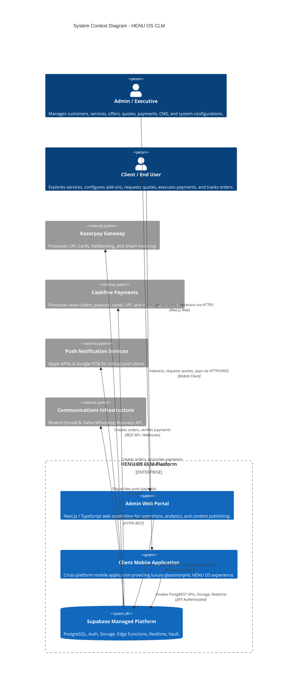

---

# 3. COMPONENT ARCHITECTURE

The technical boundary is partitioned into distinct, decoupled subsystems:

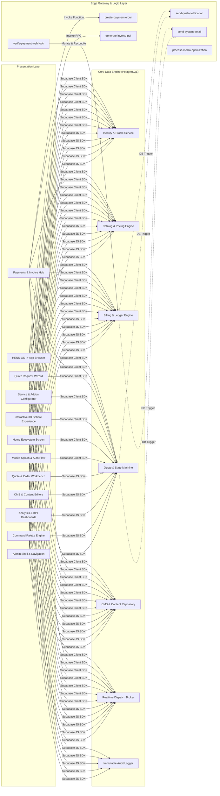

---

# 4. APPLICATION ARCHITECTURE

The system enforces a strict unidirectional data flow and state management paradigm:
- **Admin Portal**: Driven by server-side data hydration (SSR/SSG where appropriate) with React Query (TanStack Query) caching and optimistic UI updates for real-time responsiveness.
- **Client Mobile App**: Driven by persistent local query caches with optimistic mutations and subscription handlers that pipe incoming Supabase Realtime diffs directly into the UI state store.

---

# 5. ADMIN ARCHITECTURE

### Technology Specification
- **Framework**: Next.js 14+ (App Router) or Vite React 18+ SPA with TypeScript 5.x.
- **Design System**: Strict reproduction of Stitch UI Admin Design System — Slate 900/950 dark background, Cyan-500 accents, Glassmorphic panels (`backdrop-blur-xl`, `border-slate-800`), Inter typography, and TailwindCSS / CSS variables.
- **State Management**: TanStack Query (React Query) for server state caching + Zustand for ephemeral client UI state (drawer open/close, command palette visibility, multi-select tables).
- **Table & Grid Engine**: TanStack Table v8 for virtualized rendering, column filtering, server-side sorting, pagination, and bulk selection.
- **Form Architecture**: React Hook Form with Zod schema validation matching PostgreSQL types.
- **Visualization**: Lucide React icons, Recharts / Chart.js for revenue, quote status, conversion, and performance graphs.

### Key Admin Modules & Responsibilities
1. **Dashboard Workbench**: Aggregated KPI telemetry (Active Clients, Monthly Revenue, Pending Quotes, Conversion Rate), interactive revenue curves, dynamic quote distribution charts, and live operational activity feed.
2. **Command Palette (`Cmd+K` / `Ctrl+K`)**: Fast search across Customers, Quotes, Invoices, Services, Portfolio items, and system quick actions with keyboard shortcuts.
3. **Customer Lifecycle Hub**: Master-detail views, VIP tagging, status toggling, spending analytics, and quote history.
4. **Catalog & CMS Management**: CRUD interfaces for Services, Add-ons, Portfolio showcases, Products, Special Offers, Quick Actions, and Legal/Company pages.
5. **Quote & Order Management**: Real-time review, margin calculations, status transition buttons (`Approved`, `In Review`, `Rejected`, `Converted to Order`), and attachment viewer.
6. **Payment & Gateway Control Plane**: Real-time transaction ledger, gateway configuration toggles (Razorpay vs Cashfree), manual webhook re-trigger, and refund issuance.

---

# 6. MOBILE ARCHITECTURE

### Technology Specification
- **Framework**: React Native 0.74+ (with Fabric Architecture & TurboModules) / Expo SDK 51+ or Flutter 3.22+.
- **Design System**: Pixel-perfect implementation of the Stitch Mobile App Design System:
  - Deep OLED pitch-black/midnight-slate backdrops (`#0B0F17`, `#05080E`).
  - Neon Cyan (`#06B6D4`, `#22D3EE`) & Electric Blue (`#3B82F6`) accents.
  - Multi-layered glassmorphic cards (`rgba(15, 23, 42, 0.65)`, `border: rgba(56, 189, 248, 0.15)`).
  - High-performance 3D canvas / interactive particle sphere (Three.js / React Three Fiber / Skia Shaders).
- **Navigation Engine**: React Navigation 6+ (Native Stack + Custom Glass Bottom Tabs with Animated Micro-Interactions).
- **State & Cache**: TanStack Query + Zustand with MMKV (ultra-fast encrypted key-value store) for persistence.
- **Offline Persistence**: SQLite / WatermelonDB sync layer for offline catalog viewing and quote drafting.

### Key Mobile Screens & Responsibilities
1. **Launch Experience**: Splash Screen with glowing brand mark, biometric authentication prompt, and smooth transition to Auth/Home.
2. **Authentication Flow**: Login, Registration, OTP verification, Password Reset, and Terms acceptance.
3. **Home Ecosystem Screen**:
   - Hero Section with interactive 3D particle sphere responding to gyroscope and drag gestures.
   - Dynamic Quick Actions grid (driven by Admin CMS in real time).
   - Featured Services carousel & Active Offers banner.
   - Live Quote & Project Status tracking widget.
4. **Service & Add-on Configurator**: Deep catalog navigation, tiered package selector, customizable add-ons with dynamic price calculation.
5. **Quote Request Wizard**: Multi-step interactive flow (Project Details, Scope, File Attachments, Timeline, Budget) with draft preservation.
6. **Payment & Billing Hub**: Invoice summary, gateway selection (Razorpay / Cashfree), native checkout modal, and receipt downloader.
7. **HENU OS In-App Browser**: Sandboxed WebKit/Chromium webview with security barriers, payment interceptors, and external escape controls.
8. **Profile & Security Settings**: Account metadata, push notification toggles, biometric preferences, dark mode controls, and session revocation.

---

# 7. SUPABASE ARCHITECTURE DEEP-DIVE

Supabase constitutes the primary backend platform. The platform utilizes the following managed building blocks:

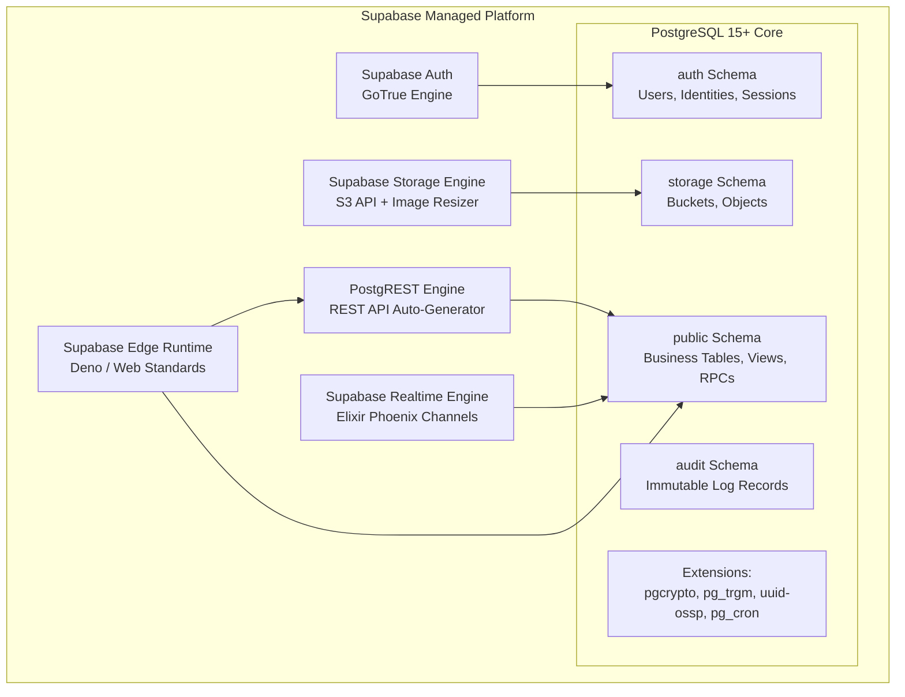

---

# 8. AUTHENTICATION ARCHITECTURE

Authentication is managed via **Supabase Auth (GoTrue)** with custom claims injected into signed JWT tokens.

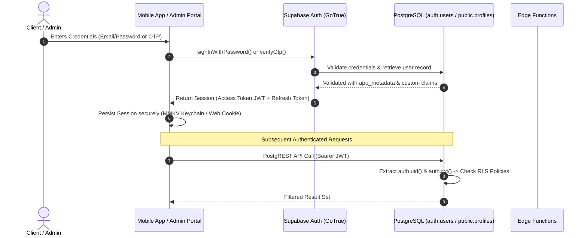

### JWT Claims Payload Structure
```json
{
  "iss": "https://<project-ref>.supabase.co/auth/v1",
  "sub": "b2c5893a-8488-4c74-9f20-8e1215b2e31a",
  "aud": "authenticated",
  "exp": 1790291400,
  "iat": 1790287800,
  "email": "alexander.wright@apexglobal.com",
  "phone": "+15550192834",
  "app_metadata": {
    "provider": "email",
    "providers": ["email"]
  },
  "user_metadata": {
    "first_name": "Alexander",
    "last_name": "Wright",
    "company_name": "Apex Global Technologies",
    "role": "client",
    "vip_tier": "Enterprise"
  },
  "role": "authenticated",
  "user_role": "client"
}
```

---

# 9. AUTHORIZATION & ACCESS CONTROL ARCHITECTURE (RBAC + RLS)

HENU OS CLM enforces a strict **Role-Based Access Control (RBAC)** model layered directly on PostgreSQL **Row Level Security (RLS)**.

### Defined Role Matrix
| Role | Access Level | Description |
| :--- | :--- | :--- |
| `super_admin` | Unrestricted | Full read/write access to all tables, system configurations, and payment secrets. |
| `admin` | Business Control | Full read/write to Customers, Quotes, Services, CMS, Invoices. No direct DB schema alteration. |
| `finance_manager` | Financial Control | Read/write to Invoices, Payments, Refunds, Financial Telemetry. Read-only to CMS. |
| `support_agent` | Customer Support | Read access to Customers, Quotes, Invoices. Write access to Support Tickets and Communications. |
| `client` | Customer Isolated | Read access to public CMS, Services, Portfolio. Isolated read/write to own Quotes, Orders, Invoices. |

### RLS Helper Functions in PostgreSQL
```sql
-- Helper function to check if the caller is an active administrator
CREATE OR REPLACE FUNCTION public.is_admin()
RETURNS BOOLEAN
LANGUAGE sql
SECURITY DEFINER
STABLE
AS $$
  SELECT EXISTS (
    SELECT 1 FROM public.profiles
    WHERE id = auth.uid()
    AND role IN ('super_admin', 'admin')
    AND is_active = true
  );
$$;

-- Helper function to check if the caller owns the entity
CREATE OR REPLACE FUNCTION public.is_owner(record_user_id UUID)
RETURNS BOOLEAN
LANGUAGE sql
SECURITY DEFINER
STABLE
AS $$
  SELECT auth.uid() = record_user_id;
$$;
```

---

# 10. DATABASE ARCHITECTURE

### Complete Relational Schema (PostgreSQL DDL)

```sql
-- Enable necessary extensions
CREATE EXTENSION IF NOT EXISTS "uuid-ossp";
CREATE EXTENSION IF NOT EXISTS "pgcrypto";
CREATE EXTENSION IF NOT EXISTS "pg_trgm";

-- Create Enum Types
CREATE TYPE user_role_enum AS ENUM ('super_admin', 'admin', 'finance_manager', 'support_agent', 'client');
CREATE TYPE quote_status_enum AS ENUM ('draft', 'submitted', 'in_review', 'approved', 'rejected', 'converted_to_order');
CREATE TYPE order_status_enum AS ENUM ('pending_deposit', 'in_progress', 'review_pending', 'completed', 'cancelled');
CREATE TYPE invoice_status_enum AS ENUM ('draft', 'issued', 'partially_paid', 'paid', 'overdue', 'voided', 'refunded');
CREATE TYPE payment_gateway_enum AS ENUM ('razorpay', 'cashfree', 'bank_transfer', 'manual');
CREATE TYPE payment_status_enum AS ENUM ('initiated', 'processing', 'successful', 'failed', 'refunded');
CREATE TYPE content_status_enum AS ENUM ('draft', 'published', 'archived');

-- 1. Profiles Table (Extends auth.users)
CREATE TABLE public.profiles (
    id UUID PRIMARY KEY REFERENCES auth.users(id) ON DELETE CASCADE,
    first_name TEXT NOT NULL,
    last_name TEXT NOT NULL,
    company_name TEXT,
    phone TEXT,
    avatar_url TEXT,
    role user_role_enum NOT NULL DEFAULT 'client',
    vip_tier TEXT DEFAULT 'Standard',
    is_active BOOLEAN NOT NULL DEFAULT true,
    metadata JSONB DEFAULT '{}'::jsonb,
    created_at TIMESTAMPTZ NOT NULL DEFAULT NOW(),
    updated_at TIMESTAMPTZ NOT NULL DEFAULT NOW()
);

-- 2. Services Master Table
CREATE TABLE public.services (
    id UUID PRIMARY KEY DEFAULT gen_random_uuid(),
    slug TEXT UNIQUE NOT NULL,
    title TEXT NOT NULL,
    tagline TEXT,
    description TEXT NOT NULL,
    category TEXT NOT NULL,
    icon_name TEXT NOT NULL,
    thumbnail_url TEXT,
    base_price NUMERIC(12, 2) NOT NULL DEFAULT 0.00,
    currency VARCHAR(3) NOT NULL DEFAULT 'USD',
    turnaround_time TEXT,
    is_featured BOOLEAN NOT NULL DEFAULT false,
    display_order INT NOT NULL DEFAULT 0,
    status content_status_enum NOT NULL DEFAULT 'published',
    metadata JSONB DEFAULT '{}'::jsonb,
    created_at TIMESTAMPTZ NOT NULL DEFAULT NOW(),
    updated_at TIMESTAMPTZ NOT NULL DEFAULT NOW()
);

-- 3. Service Add-ons Table
CREATE TABLE public.service_addons (
    id UUID PRIMARY KEY DEFAULT gen_random_uuid(),
    service_id UUID REFERENCES public.services(id) ON DELETE CASCADE,
    title TEXT NOT NULL,
    description TEXT,
    price NUMERIC(12, 2) NOT NULL DEFAULT 0.00,
    currency VARCHAR(3) NOT NULL DEFAULT 'USD',
    is_mandatory BOOLEAN NOT NULL DEFAULT false,
    display_order INT NOT NULL DEFAULT 0,
    status content_status_enum NOT NULL DEFAULT 'published',
    created_at TIMESTAMPTZ NOT NULL DEFAULT NOW(),
    updated_at TIMESTAMPTZ NOT NULL DEFAULT NOW()
);

-- 4. Portfolio Showcase Table
CREATE TABLE public.portfolio_items (
    id UUID PRIMARY KEY DEFAULT gen_random_uuid(),
    slug TEXT UNIQUE NOT NULL,
    title TEXT NOT NULL,
    client_name TEXT NOT NULL,
    category TEXT NOT NULL,
    summary TEXT NOT NULL,
    case_study_markdown TEXT,
    featured_image_url TEXT NOT NULL,
    gallery_urls TEXT[] DEFAULT '{}',
    deliverables TEXT[] DEFAULT '{}',
    is_featured BOOLEAN NOT NULL DEFAULT false,
    display_order INT NOT NULL DEFAULT 0,
    status content_status_enum NOT NULL DEFAULT 'published',
    created_at TIMESTAMPTZ NOT NULL DEFAULT NOW(),
    updated_at TIMESTAMPTZ NOT NULL DEFAULT NOW()
);

-- 5. Special Offers & Banners Table
CREATE TABLE public.offers (
    id UUID PRIMARY KEY DEFAULT gen_random_uuid(),
    code TEXT UNIQUE NOT NULL,
    title TEXT NOT NULL,
    subtitle TEXT,
    discount_type VARCHAR(20) NOT NULL CHECK (discount_type IN ('percentage', 'fixed_amount')),
    discount_value NUMERIC(10, 2) NOT NULL,
    banner_image_url TEXT,
    accent_color TEXT DEFAULT '#06B6D4',
    valid_from TIMESTAMPTZ NOT NULL,
    valid_until TIMESTAMPTZ NOT NULL,
    is_active BOOLEAN NOT NULL DEFAULT true,
    created_at TIMESTAMPTZ NOT NULL DEFAULT NOW(),
    updated_at TIMESTAMPTZ NOT NULL DEFAULT NOW()
);

-- 6. Quotes Master Table
CREATE TABLE public.quotes (
    id UUID PRIMARY KEY DEFAULT gen_random_uuid(),
    quote_number TEXT UNIQUE NOT NULL,
    user_id UUID NOT NULL REFERENCES public.profiles(id) ON DELETE RESTRICT,
    service_id UUID REFERENCES public.services(id) ON DELETE SET NULL,
    title TEXT NOT NULL,
    project_scope TEXT NOT NULL,
    selected_addons JSONB DEFAULT '[]'::jsonb,
    estimated_amount NUMERIC(12, 2) NOT NULL DEFAULT 0.00,
    final_amount NUMERIC(12, 2),
    currency VARCHAR(3) NOT NULL DEFAULT 'USD',
    status quote_status_enum NOT NULL DEFAULT 'submitted',
    rejection_reason TEXT,
    admin_notes TEXT,
    attachments JSONB DEFAULT '[]'::jsonb,
    target_start_date DATE,
    target_delivery_date DATE,
    created_at TIMESTAMPTZ NOT NULL DEFAULT NOW(),
    updated_at TIMESTAMPTZ NOT NULL DEFAULT NOW()
);

-- 7. Orders Master Table
CREATE TABLE public.orders (
    id UUID PRIMARY KEY DEFAULT gen_random_uuid(),
    order_number TEXT UNIQUE NOT NULL,
    quote_id UUID UNIQUE REFERENCES public.quotes(id) ON DELETE RESTRICT,
    user_id UUID NOT NULL REFERENCES public.profiles(id) ON DELETE RESTRICT,
    title TEXT NOT NULL,
    total_amount NUMERIC(12, 2) NOT NULL,
    currency VARCHAR(3) NOT NULL DEFAULT 'USD',
    status order_status_enum NOT NULL DEFAULT 'pending_deposit',
    progress_percentage INT NOT NULL DEFAULT 0 CHECK (progress_percentage BETWEEN 0 AND 100),
    started_at TIMESTAMPTZ,
    completed_at TIMESTAMPTZ,
    metadata JSONB DEFAULT '{}'::jsonb,
    created_at TIMESTAMPTZ NOT NULL DEFAULT NOW(),
    updated_at TIMESTAMPTZ NOT NULL DEFAULT NOW()
);

-- 8. Invoices Table
CREATE TABLE public.invoices (
    id UUID PRIMARY KEY DEFAULT gen_random_uuid(),
    invoice_number TEXT UNIQUE NOT NULL,
    order_id UUID REFERENCES public.orders(id) ON DELETE SET NULL,
    quote_id UUID REFERENCES public.quotes(id) ON DELETE SET NULL,
    user_id UUID NOT NULL REFERENCES public.profiles(id) ON DELETE RESTRICT,
    subtotal NUMERIC(12, 2) NOT NULL,
    tax_amount NUMERIC(12, 2) NOT NULL DEFAULT 0.00,
    discount_amount NUMERIC(12, 2) NOT NULL DEFAULT 0.00,
    total_amount NUMERIC(12, 2) NOT NULL,
    amount_paid NUMERIC(12, 2) NOT NULL DEFAULT 0.00,
    amount_due NUMERIC(12, 2) NOT NULL,
    currency VARCHAR(3) NOT NULL DEFAULT 'USD',
    status invoice_status_enum NOT NULL DEFAULT 'issued',
    due_date DATE NOT NULL,
    pdf_storage_path TEXT,
    line_items JSONB NOT NULL DEFAULT '[]'::jsonb,
    created_at TIMESTAMPTZ NOT NULL DEFAULT NOW(),
    updated_at TIMESTAMPTZ NOT NULL DEFAULT NOW()
);

-- 9. Payments Ledger Table
CREATE TABLE public.payments (
    id UUID PRIMARY KEY DEFAULT gen_random_uuid(),
    payment_reference TEXT UNIQUE NOT NULL,
    invoice_id UUID NOT NULL REFERENCES public.invoices(id) ON DELETE RESTRICT,
    user_id UUID NOT NULL REFERENCES public.profiles(id) ON DELETE RESTRICT,
    amount NUMERIC(12, 2) NOT NULL,
    currency VARCHAR(3) NOT NULL DEFAULT 'USD',
    gateway payment_gateway_enum NOT NULL,
    gateway_order_id TEXT,
    gateway_payment_id TEXT,
    gateway_signature TEXT,
    status payment_status_enum NOT NULL DEFAULT 'initiated',
    raw_response JSONB DEFAULT '{}'::jsonb,
    failure_reason TEXT,
    created_at TIMESTAMPTZ NOT NULL DEFAULT NOW(),
    updated_at TIMESTAMPTZ NOT NULL DEFAULT NOW()
);

-- 10. Notifications Table
CREATE TABLE public.notifications (
    id UUID PRIMARY KEY DEFAULT gen_random_uuid(),
    user_id UUID NOT NULL REFERENCES public.profiles(id) ON DELETE CASCADE,
    title TEXT NOT NULL,
    body TEXT NOT NULL,
    category TEXT NOT NULL DEFAULT 'system',
    action_url TEXT,
    is_read BOOLEAN NOT NULL DEFAULT false,
    metadata JSONB DEFAULT '{}'::jsonb,
    created_at TIMESTAMPTZ NOT NULL DEFAULT NOW()
);

-- 11. CMS Home Sections & Quick Actions
CREATE TABLE public.cms_quick_actions (
    id UUID PRIMARY KEY DEFAULT gen_random_uuid(),
    title TEXT NOT NULL,
    subtitle TEXT,
    icon_name TEXT NOT NULL,
    action_type VARCHAR(50) NOT NULL,
    target_route TEXT NOT NULL,
    badge_text TEXT,
    display_order INT NOT NULL DEFAULT 0,
    is_active BOOLEAN NOT NULL DEFAULT true,
    created_at TIMESTAMPTZ NOT NULL DEFAULT NOW()
);

-- 12. Immutable Audit Logs Table
CREATE TABLE public.audit_logs (
    id BIGSERIAL PRIMARY KEY,
    actor_id UUID REFERENCES public.profiles(id) ON DELETE SET NULL,
    actor_role TEXT NOT NULL,
    action TEXT NOT NULL,
    entity_table TEXT NOT NULL,
    entity_id TEXT NOT NULL,
    old_data JSONB,
    new_data JSONB,
    ip_address INET,
    user_agent TEXT,
    created_at TIMESTAMPTZ NOT NULL DEFAULT NOW()
);

-- Indexes for Ultra-High Performance
CREATE INDEX idx_profiles_role ON public.profiles(role);
CREATE INDEX idx_quotes_user_id ON public.quotes(user_id);
CREATE INDEX idx_quotes_status ON public.quotes(status);
CREATE INDEX idx_orders_user_id ON public.orders(user_id);
CREATE INDEX idx_invoices_user_id ON public.invoices(user_id);
CREATE INDEX idx_invoices_status ON public.invoices(status);
CREATE INDEX idx_payments_invoice_id ON public.payments(invoice_id);
CREATE INDEX idx_payments_gateway_order_id ON public.payments(gateway_order_id);
CREATE INDEX idx_notifications_user_id_read ON public.notifications(user_id, is_read);
CREATE INDEX idx_audit_logs_table_id ON public.audit_logs(entity_table, entity_id);
CREATE INDEX idx_audit_logs_created_at ON public.audit_logs(created_at DESC);
CREATE INDEX idx_services_trgm ON public.services USING gin (title gin_trgm_ops, description gin_trgm_ops);
```

### Row Level Security (RLS) Policy Definitions

```sql
-- Enable RLS on all core tables
ALTER TABLE public.profiles ENABLE ROW LEVEL SECURITY;
ALTER TABLE public.services ENABLE ROW LEVEL SECURITY;
ALTER TABLE public.service_addons ENABLE ROW LEVEL SECURITY;
ALTER TABLE public.portfolio_items ENABLE ROW LEVEL SECURITY;
ALTER TABLE public.offers ENABLE ROW LEVEL SECURITY;
ALTER TABLE public.quotes ENABLE ROW LEVEL SECURITY;
ALTER TABLE public.orders ENABLE ROW LEVEL SECURITY;
ALTER TABLE public.invoices ENABLE ROW LEVEL SECURITY;
ALTER TABLE public.payments ENABLE ROW LEVEL SECURITY;
ALTER TABLE public.notifications ENABLE ROW LEVEL SECURITY;
ALTER TABLE public.cms_quick_actions ENABLE ROW LEVEL SECURITY;
ALTER TABLE public.audit_logs ENABLE ROW LEVEL SECURITY;

-- 1. Profiles Policies
CREATE POLICY "Users can read own profile; Admins can read all"
ON public.profiles FOR SELECT
USING (auth.uid() = id OR public.is_admin());

CREATE POLICY "Users can update own profile; Admins can update all"
ON public.profiles FOR UPDATE
USING (auth.uid() = id OR public.is_admin());

-- 2. Services & Add-ons (Public Read, Admin Write)
CREATE POLICY "Public can view published services"
ON public.services FOR SELECT
USING (status = 'published' OR public.is_admin());

CREATE POLICY "Admins can manage services"
ON public.services FOR ALL
USING (public.is_admin());

CREATE POLICY "Public can view published addons"
ON public.service_addons FOR SELECT
USING (status = 'published' OR public.is_admin());

CREATE POLICY "Admins can manage addons"
ON public.service_addons FOR ALL
USING (public.is_admin());

-- 3. Quotes Policies
CREATE POLICY "Clients can view their own quotes; Admins view all"
ON public.quotes FOR SELECT
USING (auth.uid() = user_id OR public.is_admin());

CREATE POLICY "Clients can insert own quotes"
ON public.quotes FOR INSERT
WITH CHECK (auth.uid() = user_id);

CREATE POLICY "Admins can update any quote"
ON public.quotes FOR UPDATE
USING (public.is_admin());

-- 4. Invoices & Payments Policies
CREATE POLICY "Clients can view own invoices; Admins view all"
ON public.invoices FOR SELECT
USING (auth.uid() = user_id OR public.is_admin());

CREATE POLICY "Clients can view own payments; Admins view all"
ON public.payments FOR SELECT
USING (auth.uid() = user_id OR public.is_admin());

-- 5. Notifications Policies
CREATE POLICY "Clients view own notifications"
ON public.notifications FOR SELECT
USING (auth.uid() = user_id OR public.is_admin());

CREATE POLICY "Clients update own notification read status"
ON public.notifications FOR UPDATE
USING (auth.uid() = user_id);

-- 6. Audit Logs Policy
CREATE POLICY "Only Super Admins can inspect audit logs"
ON public.audit_logs FOR SELECT
USING (
  EXISTS (
    SELECT 1 FROM public.profiles 
    WHERE id = auth.uid() AND role = 'super_admin'
  )
);
```

---

# 11. STORAGE ARCHITECTURE

Supabase Storage (backed by S3) manages media, avatars, attachments, and PDF invoices.

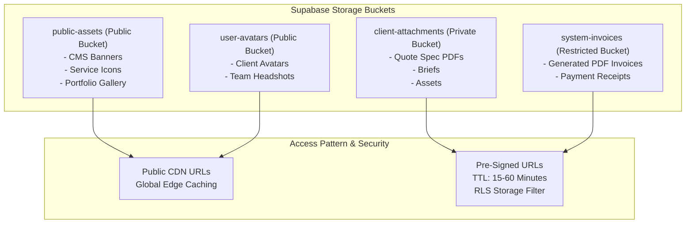

### Storage Bucket Policies (SQL)
```sql
-- Storage Policies for client-attachments
CREATE POLICY "Clients can upload their own quote attachments"
ON storage.objects FOR INSERT
TO authenticated
WITH CHECK (
  bucket_id = 'client-attachments' AND
  (storage.foldername(name))[1] = auth.uid()::text
);

CREATE POLICY "Clients can read their own attachments; Admins read all"
ON storage.objects FOR SELECT
TO authenticated
USING (
  bucket_id = 'client-attachments' AND
  ((storage.foldername(name))[1] = auth.uid()::text OR public.is_admin())
);
```

---

# 12. REALTIME SYNCHRONIZATION ARCHITECTURE

The platform implements an instantaneous synchronization model connecting Admin operations to mobile clients.

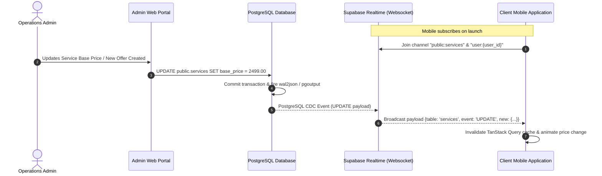

### Comprehensive Realtime Event Matrix

| Feature Area | Source Entity / Event | Realtime Channel | Target Subscriber | Payload Summary | Client Behavior | Failure / Offline Behavior | Retry Strategy |
| :--- | :--- | :--- | :--- | :--- | :--- | :--- | :--- |
| **Catalog Services** | `services` (INSERT/UPDATE/DELETE) | `public:catalog` | All Mobile Clients | Full service object + changed columns | Updates service list & detail screens immediately. | Retains cached state from MMKV/SQLite. | Re-fetches delta on network reconnect. |
| **Service Add-ons** | `service_addons` (ALL) | `public:catalog` | Active Configurator Screens | Add-on entity + pricing | Dynamic price recalculation in active wizard. | Falls back to cached pricing. | Sync on view mount. |
| **Offers & Banners** | `offers` (ALL) | `public:offers` | All Mobile Clients | Promo code, discount value, banner URL | Hero banner & offer badges refresh live. | Shows previous banners. | Periodic background refresh. |
| **Portfolio Showcase**| `portfolio_items` (ALL) | `public:portfolio` | Mobile Portfolio Viewers | Showcase metadata, gallery image URLs | Grid re-orders, new projects populate. | Displays stale cache. | Stale-while-revalidate. |
| **Quick Actions** | `cms_quick_actions` (ALL) | `public:cms` | Mobile Home Screen | Action button title, route, badge | Home grid updates order and badges. | Renders local default actions. | Refresh on app focus. |
| **Quote Status** | `quotes` (UPDATE status/amount) | `user:{user_id}:quotes` | Target Client Mobile | `{quote_id, status, final_amount}` | Status badge shifts (e.g., to "Approved"); push modal triggers. | Syncs when user opens Quotes tab. | WebSocket auto-reconnect with exponential backoff. |
| **Order Progress** | `orders` (UPDATE progress/status) | `user:{user_id}:orders` | Target Client Mobile | `{order_id, progress_percentage, status}` | Live progress bar animates forward. | Syncs on screen open. | Polling fallback if WS severed. |
| **Invoice Issuance** | `invoices` (INSERT/UPDATE) | `user:{user_id}:invoices`| Target Client Mobile | `{invoice_id, amount_due, status}` | Billing badge increments; triggers payment prompt. | Refreshed upon visiting Payments hub. | Auto-retry WS join. |
| **Payment Success** | `payments` (UPDATE status) | `user:{user_id}:payments`| Active Mobile Checkout | `{payment_id, status: 'successful'}` | Closes payment gateway webview; shows confetti & receipt. | Webhook server reconciles in DB; fallback polling. | Edge Function verification poll. |
| **Notifications** | `notifications` (INSERT) | `user:{user_id}:alerts` | Target Client Mobile | `{id, title, body, action_url}` | In-app toast banner slides down; badge increments. | Stored in DB; retrieved on next load. | Standard WS heartbeat. |

---

# 13. WEBHOOK ARCHITECTURE

HENU OS CLM utilizes webhook ingress and egress pathways managed strictly via Supabase Edge Functions.

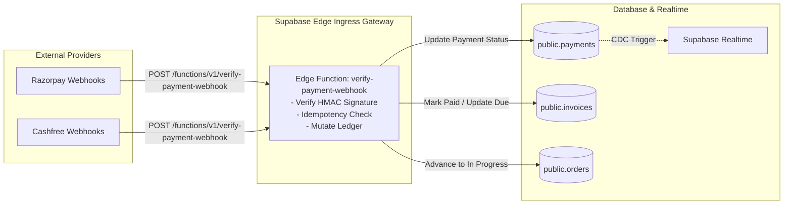

### Ingress Webhook Verification Pattern (Deno Edge Function)
```typescript
import { serve } from "https://deno.land/std@0.168.0/http/server.ts";
import { createHmac } from "https://deno.land/std@0.168.0/crypto/mod.ts";
import { createClient } from "https://esm.sh/@supabase/supabase-js@2.43.0";

const RZ_SECRET = Deno.env.get("RAZORPAY_WEBHOOK_SECRET")!;
const SUPABASE_URL = Deno.env.get("SUPABASE_URL")!;
const SUPABASE_SERVICE_ROLE_KEY = Deno.env.get("SUPABASE_SERVICE_ROLE_KEY")!;

serve(async (req) => {
  const signature = req.headers.get("x-razorpay-signature");
  const rawBody = await req.text();

  // 1. Verify HMAC-SHA256 Signature
  const expectedSignature = createHmac("sha256", RZ_SECRET)
    .update(rawBody)
    .toString();

  if (signature !== expectedSignature) {
    return new Response(JSON.stringify({ error: "Invalid signature" }), { status: 401 });
  }

  const payload = JSON.parse(rawBody);
  const supabase = createClient(SUPABASE_URL, SUPABASE_SERVICE_ROLE_KEY);

  // 2. Handle Payment Event Idempotently
  if (payload.event === "payment.captured") {
    const paymentEntity = payload.payload.payment.entity;
    const orderId = paymentEntity.order_id;
    const paymentId = paymentEntity.id;

    // Call idempotent stored procedure
    const { data, error } = await supabase.rpc("handle_payment_capture_webhook", {
      p_gateway_order_id: orderId,
      p_gateway_payment_id: paymentId,
      p_raw_response: payload
    });

    if (error) {
      return new Response(JSON.stringify({ error: error.message }), { status: 500 });
    }
  }

  return new Response(JSON.stringify({ status: "success" }), { status: 200 });
});
```

---

# 14. PAYMENT GATEWAY ARCHITECTURE (RAZORPAY & CASHFREE)

HENU OS CLM supports dual-gateway routing (Razorpay and Cashfree) with client isolation. Private keys and webhook secrets reside strictly within Supabase Vault / Edge Function secrets.

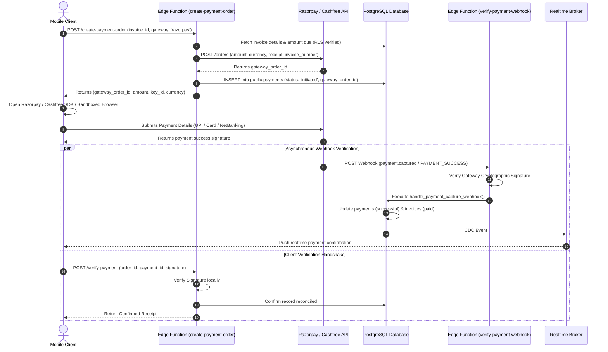

---

# 15. NOTIFICATION ARCHITECTURE

The notification system coordinates push alerts, in-app notifications, transactional emails, and SMS alerts.

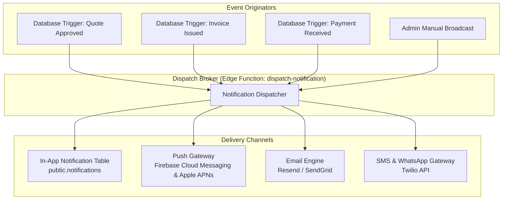

---

# 16. FILE & MEDIA PROCESSING ARCHITECTURE

Media handling follows a pipeline designed for luxury visual rendering without performance degradation:
1. **Client Pre-Validation**: Files checked for MIME type (`image/png`, `image/webp`, `application/pdf`) and size limits (< 25MB for specs, < 5MB for avatars).
2. **Direct Storage Upload**: Uploaded directly to Supabase Storage via signed upload tokens.
3. **Edge Optimization**: Image URLs use Supabase Image Transformation CDN (`/render/image/public/...`) for on-the-fly resizing, WebP conversion, and device pixel ratio (DPR) matching.
4. **Secure Invoicing**: Invoice PDFs are generated in an Edge Function (using Puppeteer/PDFKit) and stored in `system-invoices` bucket with signed URL retrieval.

---

# 17. IN-APP BROWSER ARCHITECTURE (HENU OS BROWSER)

The HENU OS Browser provides an in-app web experience for payment checkout, external partner links, legal documents, and external portfolio showcases.

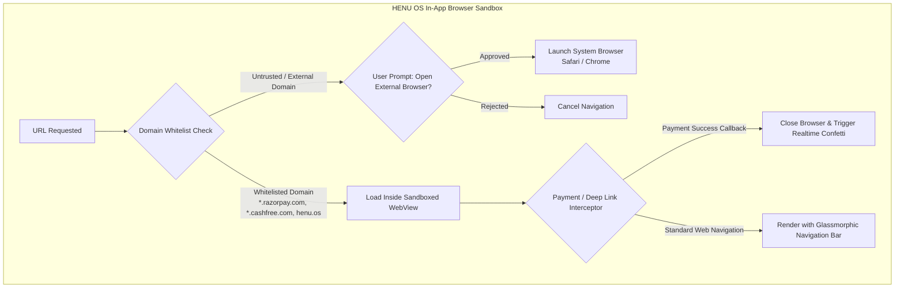

### Security Safeguards
- **Domain Whitelisting**: Strict regex verification against approved payment gateways and company domains.
- **Cookie & Session Isolation**: Sandboxed session storage preventing third-party script access to app authentication tokens.
- **Hardware Back / Forward Controls**: Custom glassmorphic HUD with secure refresh, SSL lock indicator, and escape-to-browser button.

---

# 18. CONTENT MANAGEMENT SYSTEM (CMS) ARCHITECTURE

The CMS enables administrators to manage mobile app content in real time without publishing app store updates.

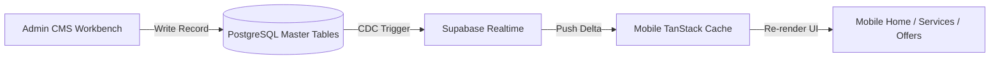

### Managed CMS Entities
1. **Services & Categories**: Hierarchical categories, base prices, turnarounds, markdown descriptions.
2. **Add-on Packages**: Toggleable options, dependencies, pricing increments.
3. **Hero Quick Actions**: Dynamic button matrix on mobile home screen (icon, title, route, badge).
4. **Special Offers & Promos**: Start/end timestamps, discount algorithms, visual banner themes.
5. **Portfolio Showcase**: Interactive case studies, deliverables tags, high-resolution galleries.
6. **Company Information & Legal Pages**: Terms of Service, Privacy Policies, Compliance certificates.

---

# 19. SEARCH ARCHITECTURE

HENU OS CLM leverages native **PostgreSQL Full-Text Search (FTS)** with `tsvector`, `tsquery`, and `pg_trgm` (trigram) fuzzy matching, eliminating the operational overhead of third-party search clusters.

```sql
-- Generated search vector on services
ALTER TABLE public.services ADD COLUMN search_vector tsvector
GENERATED ALWAYS AS (
  setweight(to_tsvector('english', coalesce(title, '')), 'A') ||
  setweight(to_tsvector('english', coalesce(tagline, '')), 'B') ||
  setweight(to_tsvector('english', coalesce(description, '')), 'C')
) STORED;

CREATE INDEX idx_services_search ON public.services USING gin(search_vector);

-- Search RPC Function
CREATE OR REPLACE FUNCTION public.search_services(search_term TEXT)
RETURNS SETOF public.services
LANGUAGE sql
STABLE
AS $$
  SELECT *
  FROM public.services
  WHERE search_vector @@ plainto_tsquery('english', search_term)
     OR title ILIKE '%' || search_term || '%'
  ORDER BY ts_rank(search_vector, plainto_tsquery('english', search_term)) DESC;
$$;
```

---

# 20. ANALYTICS & TELEMETRY ARCHITECTURE

Analytics telemetry is processed asynchronously to ensure high-performance user transactions.

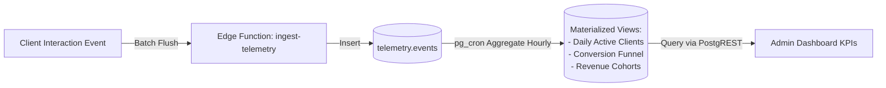

---

# 21. AUDIT LOGGING ARCHITECTURE

All mutations on sensitive tables (`quotes`, `orders`, `invoices`, `payments`, `profiles`) are captured via PostgreSQL Change Data Capture triggers into an append-only, immutable audit table.

```sql
CREATE OR REPLACE FUNCTION public.audit_log_trigger_handler()
RETURNS TRIGGER
LANGUAGE plpgsql
SECURITY DEFINER
AS $$
BEGIN
  INSERT INTO public.audit_logs (
    actor_id,
    actor_role,
    action,
    entity_table,
    entity_id,
    old_data,
    new_data
  )
  VALUES (
    auth.uid(),
    coalesce(auth.jwt()->>'user_role', 'service_role'),
    TG_OP,
    TG_TABLE_NAME,
    coalesce(NEW.id, OLD.id)::text,
    CASE WHEN TG_OP IN ('UPDATE', 'DELETE') THEN to_jsonb(OLD) ELSE NULL END,
    CASE WHEN TG_OP IN ('INSERT', 'UPDATE') THEN to_jsonb(NEW) ELSE NULL END
  );
  RETURN NEW;
END;
$$;

CREATE TRIGGER audit_quotes_trigger
AFTER INSERT OR UPDATE OR DELETE ON public.quotes
FOR EACH ROW EXECUTE FUNCTION public.audit_log_trigger_handler();

CREATE TRIGGER audit_invoices_trigger
AFTER INSERT OR UPDATE OR DELETE ON public.invoices
FOR EACH ROW EXECUTE FUNCTION public.audit_log_trigger_handler();
```

---

# 22. ERROR HANDLING & RESILIENCE ARCHITECTURE

The platform implements unified error handling across both clients and backend functions.

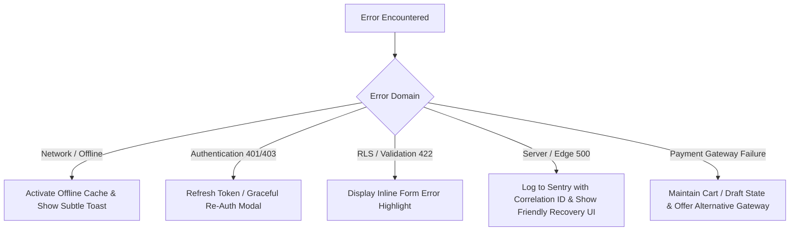

---

# 23. LOGGING & OBSERVABILITY ARCHITECTURE

- **Edge & Database Logging**: Edge functions and PostgreSQL log drains feed into **Supabase Logflare** and **Sentry**.
- **Correlation IDs**: All requests generate an `X-Correlation-Id` header passed through the API gateway, Edge Functions, and database audit logs.
- **Log Levels**: Standardized JSON log format (`DEBUG`, `INFO`, `WARN`, `ERROR`, `FATAL`).

---

# 24. ENVIRONMENT CONFIGURATION

The platform isolates environments across three tiers:
1. **Development (`dev`)**: Local Supabase CLI instance running on Docker + Local Web/Mobile hot reload.
2. **Staging (`staging`)**: Dedicated Supabase cloud project for QA, automated CI tests, and test payment gateway keys.
3. **Production (`prod`)**: High-availability Supabase enterprise cluster, production payment webhooks, and live CDN distribution.

---

# 25. SECRETS MANAGEMENT & KEY ISOLATION

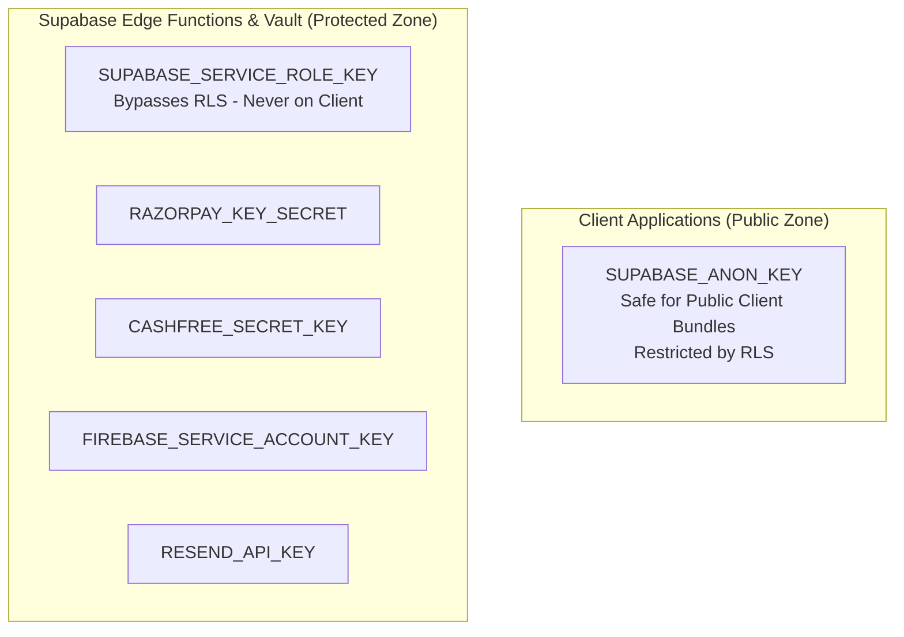

---

# 26. DEPLOYMENT & CI/CD ARCHITECTURE

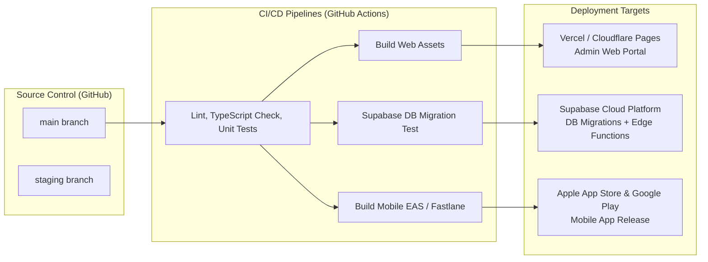

---

# 27. BACKUP, ARCHIVAL & POINT-IN-TIME RECOVERY

- **Continuous WAL Archiving**: Write-Ahead Logging (WAL) enabled with 7-day Point-in-Time Recovery (PITR).
- **Daily Full Backups**: Automated nightly `pg_dump` snapshots encrypted and archived in an offsite S3 cold storage tier.
- **Storage Redundancy**: Multi-AZ storage replication for client attachments and invoices.

---

# 28. MONITORING & ALERTING

- **Uptime Monitoring**: External synthetic probes monitoring PostgREST endpoint health (`/rest/v1/`), Storage, and Auth every 60 seconds.
- **Performance Metrics**: Connection pool saturation, query latency percentiles (p50, p95, p99), Edge Function execution duration.
- **Alert Escalation**: Slack/PagerDuty webhooks triggered when API error rate exceeds 1% or database connection pool exceeds 85% capacity.

---

# 29. PERFORMANCE OPTIMIZATION ARCHITECTURE

1. **Connection Pooling**: Supavisor pooler configured in Transaction Mode to support thousands of concurrent mobile clients.
2. **Query Optimization**: Every foreign key and query predicate indexed with B-Tree or GIN indices.
3. **Cache Invalidation Strategy**: Mobile app leverages TanStack Query `staleTime: 5 * 60 * 1000` with instant Realtime invalidation triggers.
4. **Asset Compression**: Automatic WebP image transformation and Brotli/Gzip HTTP payload compression.

---

# 30. SCALABILITY & CONCURRENCY MODEL

- **Database Concurrency**: Optimistic concurrency control via PostgreSQL `xmin` row versioning on quotes and invoices.
- **Edge Function Elasticity**: Serverless edge runtime auto-scales horizontally across distributed cloud regions.
- **Realtime Scalability**: Phoenix Channel pub/sub architecture supporting up to 100,000 concurrent websocket connections.

---

# 31. DISASTER RECOVERY & BUSINESS CONTINUITY

| Metric | Target | Strategy |
| :--- | :--- | :--- |
| **Recovery Point Objective (RPO)** | < 5 Minutes | Continuous WAL streaming & multi-AZ replication. |
| **Recovery Time Objective (RTO)** | < 30 Minutes | Infrastructure as Code (Terraform / Supabase CLI) automated redeployment. |

---

# 32. THIRD-PARTY INTEGRATION ARCHITECTURE

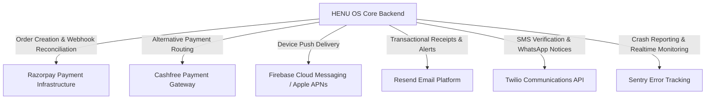

---

# 33. FUTURE EXTENSION STRATEGY

1. **Multi-Tenant White-Labeling**: Architectural separation of `organization_id` partitions to allow HENU OS CLM to operate across distinct corporate subsidiaries.
2. **AI Quoting Engine**: Integration of LLM agents via Supabase `pgvector` to automatically analyze client project briefs and generate draft quotes with confidence scoring.
3. **Automated Milestone Escrow**: Smart contract or scheduled escrow releases upon client digital signature verification of deliverables.

---

### ARCHITECTURAL APPROVAL
- **Status:** Complete, Comprehensive & Authoritative
- **Target Backend:** Supabase Managed Cloud
- **Frontend Clients:** Admin Web Portal & Client Mobile App
- **Design Alignment:** Strictly conforms to Google Stitch UI and HENU OS CLM PRD.
