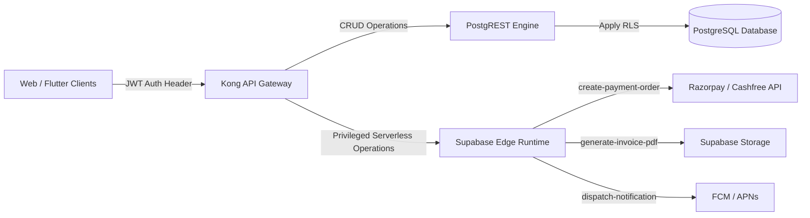

# HENU OS CLM — API & DATA LAYER ARCHITECTURE

**Document Version:** 1.0.0  
**Phase:** Phase 1 — Project Foundation & Master Architecture  
**Authoritative References:** [HENU_OS_CLM_TECHNICAL_ARCHITECTURE.md](file:///j:/CLM%20HENU%20A%26M/HENU_OS_CLM_TECHNICAL_ARCHITECTURE.md), [HENU_OS_CLM_DATABASE_REALTIME_WEBHOOKS.md](file:///j:/CLM%20HENU%20A%26M/HENU_OS_CLM_DATABASE_REALTIME_WEBHOOKS.md)

---

## 1. API SURFACE OVERVIEW

HENU OS CLM utilizes a dual API surface:
1. **PostgREST HTTP REST API (`/rest/v1/*`)**: Exposes database entities directly with automatic OpenAPI documentation, filtered by PostgreSQL Row Level Security.
2. **Supabase Edge Functions (`/functions/v1/*`)**: Serverless endpoints for privileged operations, cryptographic payment verification, invoice PDF generation, and push notification dispatch.



---

## 2. STANDARD RESPONSE & ERROR ENVELOPE

All Edge Function responses and client API wrappers adhere to a uniform response envelope:

### Success Response Envelope
```json
{
  "success": true,
  "data": {
    "quote_id": "b2c5893a-8488-4c74-9f20-8e1215b2e31a",
    "quote_number": "HENU-QT-2026-000142",
    "status": "approved",
    "total_amount": 4999.00,
    "currency": "USD"
  },
  "metadata": {
    "request_id": "req_01j8m4n9b2c5893a84884c74",
    "timestamp": "2026-09-24T05:10:00Z"
  }
}
```

### Error Response Envelope
```json
{
  "success": false,
  "error": {
    "code": "INVALID_STATE_TRANSITION",
    "message": "Cannot convert quote to order while in rejected status",
    "details": {
      "current_status": "rejected",
      "attempted_status": "converted_to_order"
    },
    "request_id": "req_01j8m4n9b2c5893a84884c74",
    "timestamp": "2026-09-24T05:10:00Z"
  }
}
```

---

## 3. PAGINATION, FILTERING & SORTING STANDARDS

All list endpoints follow PostgREST standards:
- **Pagination**: `limit=20&offset=0` with `Prefer: count=exact` header for total count.
- **Sorting**: `order=created_at.desc` or `order=total_amount.asc.nullslast`.
- **Filtering**:
  - Exact match: `status=eq.approved`
  - Text search: `title=ilike.*enterprise*`
  - In list: `status=in.(submitted,in_review)`
  - Range: `created_at=gte.2026-01-01T00:00:00Z`

---

## 4. EDGE FUNCTION API CATALOG

| Function Name | Method | Route | Description | Auth Required |
| :--- | :--- | :--- | :--- | :--- |
| `create-payment-order` | `POST` | `/functions/v1/create-payment-order` | Creates Razorpay/Cashfree order token with DB locked amount. | Bearer JWT (Client) |
| `verify-payment-webhook`| `POST`| `/functions/v1/verify-payment-webhook`| Validates gateway HMAC signature and settles ledger. | Public (HMAC Verified) |
| `generate-invoice-pdf` | `POST` | `/functions/v1/generate-invoice-pdf` | Generates official PDF and returns signed URL. | Bearer JWT (Owner/Finance) |
| `dispatch-notification`| `POST` | `/functions/v1/dispatch-notification`| Sends push alert via Firebase / APNs. | Service Role Only |
| `ingest-telemetry` | `POST` | `/functions/v1/ingest-telemetry` | Asynchronously batches client interaction telemetry. | Bearer JWT (Client) |

---

### API ARCHITECTURE APPROVAL
- **Status:** Approved for Phase 1 Master Architecture.
