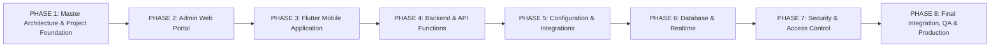

# HENU OS CLM — IMPLEMENTATION PHASES & DELIVERY ROADMAP

**Document Version:** 1.0.0  
**Phase:** Phase 1 — Project Foundation & Master Architecture  
**Authoritative References:** [HENU_OS_CLM_PRD.md](file:///j:/CLM%20HENU%20A%26M/HENU_OS_CLM_PRD.md), [HENU_OS_CLM_FEATURE_TICKETS.md](file:///j:/CLM%20HENU%20A%26M/HENU_OS_CLM_FEATURE_TICKETS.md)

---

## 1. SEQUENTIAL DELIVERY ROADMAP OVERVIEW

To maintain architecture integrity, eliminate regression risks, and preserve approved Stitch designs, the project executes across 8 distinct phases:

---

## 2. PHASE-BY-PHASE SPECIFICATIONS

---

### PHASE 1 — Master Architecture & Project Foundation
- **Objective**: Establish the complete repository foundation, master architecture documentation, directory boundaries, and development standards without premature code implementation.
- **Dependencies**: None.
- **Inputs**: All 6 approved specification documents + Stitch UI design folders.
- **Expected Outputs**: Comprehensive documentation suite under `docs/`, sanitized `.env.example`, monorepo folder scaffolding, and initial Git setup.
- **Files / Folders Affected**: `docs/*`, `.env.example`, `README.md`, `apps/*`, `backend/*`, `database/*`, `packages/*`, `scripts/*`.
- **What Must NOT Be Changed**: Existing Stitch UI designs (`stich_henu_os_clm_portal`, `stitch_henu_os_clm_mobile_app_design_system`) and approved specification documents.
- **Acceptance Criteria**: All 8 Phase 1 documentation deliverables approved and committed.

---

### PHASE 2 — Admin Web Portal
- **Objective**: Build the complete, pixel-perfect Next.js 14 Admin Web Portal conforming strictly to the Stitch Admin Design System.
- **Dependencies**: Phase 1 Foundation.
- **Inputs**: `stich_henu_os_clm_portal/`, `HENU_OS_CLM_FRONTEND_SPECIFICATION.md`, `packages/shared/`.
- **Expected Outputs**: 22 functional Admin screens (Dashboard, Customers, Quotes Workbench, Orders, Invoices, Payments Ledger, CMS Manager, Settings, Command Palette).
- **Files / Folders Affected**: `apps/admin-web/*`.
- **What Must NOT Be Changed**: Backend business rules or database schema definitions.
- **Acceptance Criteria**: 100% visual match with Stitch Admin UI; virtualized table rendering; responsive across desktop and tablet viewports.

---

### PHASE 3 — Flutter / Dart Mobile Application
- **Objective**: Build the cross-platform Flutter client application (iOS & Android) with luxury glassmorphism, 3D particle sphere, multi-step quote wizard, and billing hub.
- **Dependencies**: Phase 1 Foundation & Phase 2 Admin Data Models.
- **Inputs**: `stitch_henu_os_clm_mobile_app_design_system/`, `HENU_OS_CLM_FRONTEND_SPECIFICATION.md`, `docs/MOBILE_ARCHITECTURE.md`.
- **Expected Outputs**: Complete Flutter client codebase with BLoC state management, 3D ambient shader widgets, quote request wizard, and HENU OS In-App Browser sandbox.
- **Files / Folders Affected**: `apps/mobile/*`.
- **What Must NOT Be Changed**: Design tokens, color palettes, or Admin Web Portal code.
- **Acceptance Criteria**: 60 FPS smooth rendering on iOS/Android; offline quote draft caching; pixel-perfect match with Stitch mobile screens.

---

### PHASE 4 — Backend & API
- **Objective**: Implement Supabase Edge Functions (Deno runtime) for privileged serverless operations, payment order creation, and PDF tax invoice generation.
- **Dependencies**: Phase 1 & Phase 2.
- **Inputs**: `docs/API_ARCHITECTURE.md`, `HENU_OS_CLM_TECHNICAL_ARCHITECTURE.md`.
- **Expected Outputs**: Deno Edge Functions (`create-payment-order`, `verify-payment-webhook`, `generate-invoice-pdf`, `dispatch-notification`, `ingest-telemetry`).
- **Files / Folders Affected**: `backend/functions/*`.
- **What Must NOT Be Changed**: Client UI code.
- **Acceptance Criteria**: Uniform JSON error envelopes; server-side amount locking; zero private secrets exposed to clients.

---

### PHASE 5 — Configuration & Integrations
- **Objective**: Configure external third-party integration pipelines for Razorpay, Cashfree, Firebase Cloud Messaging (FCM), APNs, and Resend email infrastructure.
- **Dependencies**: Phase 4 Backend.
- **Inputs**: `docs/ENVIRONMENT_CONFIGURATION.md`, `HENU_OS_CLM_SECURITY_ACCESS.md`.
- **Expected Outputs**: Verified integration connectors and environment variable bindings across development, staging, and production tiers.
- **Files / Folders Affected**: `backend/functions/*`, `.env.example`, Supabase Vault configs.
- **What Must NOT Be Changed**: Core database schema or frontend layouts.
- **Acceptance Criteria**: Payment sandbox testing passing with simulated webhooks; push notifications delivered to test devices.

---

### PHASE 6 — Database & Realtime
- **Objective**: Implement and execute the 22 sequential PostgreSQL migration scripts in Supabase, establishing all 34 normalized tables, constraints, sequences, triggers, and Realtime CDC publications.
- **Dependencies**: Phase 1 & Phase 4.
- **Inputs**: `HENU_OS_CLM_DATABASE_REALTIME_WEBHOOKS.md`.
- **Expected Outputs**: Versioned migration scripts under `database/migrations/`, automated seed fixtures, and active `supabase_realtime` publications.
- **Files / Folders Affected**: `database/migrations/*`, `database/seeds/*`.
- **What Must NOT Be Changed**: Monorepo directory structure.
- **Acceptance Criteria**: Clean execution of `supabase db reset`; sequential IDs generated; Realtime WebSocket events broadcast upon table mutations.

---

### PHASE 7 — Security & Access Control
- **Objective**: Enforce PostgreSQL Row Level Security (RLS) policies, dynamic RBAC permission checks, storage bucket privacy rules, and immutable audit logging triggers.
- **Dependencies**: Phase 6 Database.
- **Inputs**: `HENU_OS_CLM_SECURITY_ACCESS.md`.
- **Expected Outputs**: RLS policies active on all 34 tables; `public.has_permission()` RPC functional; `public.audit_logs` capturing mutations.
- **Files / Folders Affected**: `database/migrations/18_audit_logging.sql`, `database/migrations/19_rls_security_policies.sql`.
- **What Must NOT Be Changed**: Existing table schemas or foreign keys.
- **Acceptance Criteria**: Multi-tenant isolation verified; Client A cannot access Client B records; Super Admin audit inspector functional.

---

### PHASE 8 — Final Integration, Testing & Production Readiness
- **Objective**: Execute end-to-end integration test suites across Web and Mobile, conduct security penetration scans, configure automated CI/CD pipelines, and finalize production deployment.
- **Dependencies**: All preceding phases (Phases 1-7).
- **Inputs**: `docs/TESTING_ARCHITECTURE.md`, `docs/DEPLOYMENT_ARCHITECTURE.md`.
- **Expected Outputs**: Passing Playwright web E2E tests, passing Flutter integration tests, green GitHub Actions CI/CD workflows, production release on Vercel and App Stores.
- **Files / Folders Affected**: `.github/workflows/*`, `tests/*`.
- **What Must NOT Be Changed**: Core business logic or approved visual designs.
- **Acceptance Criteria**: Full commercial journey (Quote -> Approval -> Order -> Payment -> Invoicing) passes automated E2E testing with zero regressions.

---

### ROADMAP APPROVAL
- **Status:** Approved Implementation Roadmap for HENU OS CLM.
