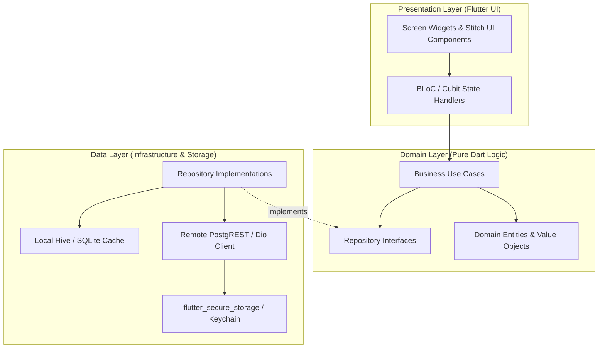

# HENU OS CLM — FLUTTER MOBILE APPLICATION ARCHITECTURE

**Document Version:** 1.0.0  
**Phase:** Phase 1 — Project Foundation & Master Architecture  
**Target Platform:** Flutter 3.22+ / Dart 3.4+ (iOS 15+ & Android API Level 26+)  
**Authoritative References:** [HENU_OS_CLM_FRONTEND_SPECIFICATION.md](file:///j:/CLM%20HENU%20A%26M/HENU_OS_CLM_FRONTEND_SPECIFICATION.md), [HENU_OS_CLM_SECURITY_ACCESS.md](file:///j:/CLM%20HENU%20A%26M/HENU_OS_CLM_SECURITY_ACCESS.md)

---

## 1. MOBILE LAYERED ARCHITECTURE (CLEAN ARCHITECTURE)

The Flutter application architecture enforces a clean, modular separation of concerns:



---

## 2. KEY TECHNICAL STACK & LIBRARIES

- **Framework**: Flutter 3.22+ with Dart 3.4+ (Impeller Rendering Engine enabled on iOS/Android).
- **State Management**: `flutter_bloc` v8.1+ / `bloc` (Predictable event-driven state machine).
- **Networking**: `dio` v5.4+ with custom token refresh interceptors and SSL pinning.
- **Supabase SDK**: `supabase_flutter` v2.5+ (For Auth, Storage, and Realtime WebSocket subscriptions).
- **Secure Persistence**: `flutter_secure_storage` (Hardware keystore / Keychain) + `hive_flutter` for offline caching.
- **Navigation & Routing**: `go_router` v14+ (Declarative routing with deep link parsing).
- **3D & Graphics**: `flutter_shaders` (Fragment shaders for ambient particle glow) + `model_viewer_plus` (Ethereal dragon 3D model).
- **In-App Browser**: `flutter_inappwebview` v6+ (With domain whitelisting and payment callback bridges).

---

## 3. FEATURE SLICES & DIRECTORY BOUNDARIES

```text
apps/mobile/lib/
├── core/
│   ├── network/              # Dio HTTP Client, Interceptors, Supabase Client
│   ├── security/             # Biometric Helper, Secure Token Store, SSL Pinning
│   ├── theme/                # HenuColors, HenuTypography, HenuGradients, HenuStyles
│   ├── utils/                # CurrencyFormatter, DateUtils, ErrorHandler
│   └── widgets/              # HenuButton, HenuInput, HenuCard, HenuBadge, GlassPanel
│
├── features/
│   ├── auth/                 # Splash, Login, Register, Forgot Password, Biometrics
│   ├── home/                 # Home Ecosystem, 3D Particle Widget, Quick Actions Grid
│   ├── catalog/              # Service Categories, Detail View, Add-on Accumulator
│   ├── quotes/               # Multi-step Quote Request Wizard, Interactive Proposal Review
│   ├── billing/              # Invoice Summary, Line Items, Native/Razorpay/Cashfree Checkout
│   ├── browser/              # HENU OS In-App Browser Sandbox with Security Interceptors
│   ├── support/              # Realtime Support Chat & Ticket Status
│   └── profile/              # User Profile, Security Settings, Notification Preferences
│
└── main.dart                 # Dependency Injection & Global Error Handling Entry Point
```

---

## 4. OFFLINE & CACHING STRATEGY

1. **Catalog & CMS Caching**: Service catalog items, add-ons, and Quick Actions are cached locally in Hive storage (`box('catalog')`) with a 24-hour TTL.
2. **Quote Draft Preservation**: If network connectivity is lost during the 4-step quote wizard, form state is auto-persisted to local storage and restored upon next launch.
3. **Optimistic UI Updates**: Realtime WebSocket subscriptions directly mutate the local BLoC state, updating progress bars and badges without requiring a full API refetch.

---

### MOBILE ARCHITECTURE APPROVAL
- **Status:** Approved for Phase 1 Master Architecture.
