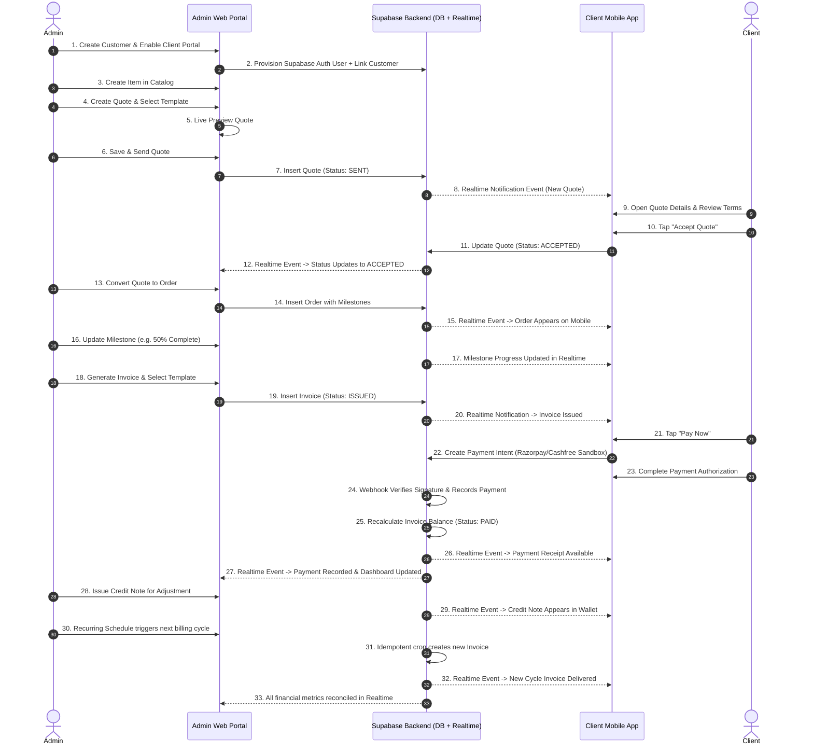

# HENU OS CLM — PHASE 8 REALTIME BUSINESS WORKFLOW SPECIFICATION

## 1. Overview
The HENU OS CLM platform maintains seamless real-time synchronization between the Admin Web portal and Client Mobile application through Supabase Realtime channels.

---

## 2. 33-Step End-to-End Realtime Business Workflow

---

## 3. Subscription Management Rules
- **No Polling**: `setInterval()` and page refresh loops are prohibited.
- **Centralized Channels**: Logical channel manager per entity (`quotes`, `orders`, `invoices`, `payments`, `templates`).
- **Foreground / Reconnection**: Client Mobile auto-reconnects and resynchronizes state upon app resume without full-page reloads.
