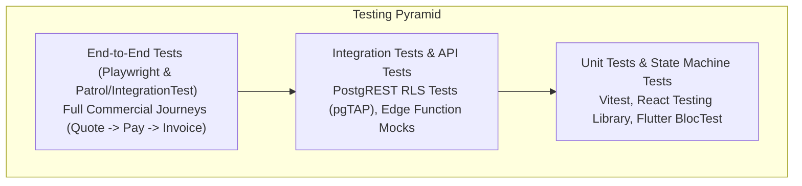

# HENU OS CLM — TESTING ARCHITECTURE & QUALITY ASSURANCE

**Document Version:** 1.0.0  
**Phase:** Phase 1 — Project Foundation & Master Architecture  
**Authoritative References:** [HENU_OS_CLM_FEATURE_TICKETS.md](file:///j:/CLM%20HENU%20A%26M/HENU_OS_CLM_FEATURE_TICKETS.md), [HENU_OS_CLM_SECURITY_ACCESS.md](file:///j:/CLM%20HENU%20A%26M/HENU_OS_CLM_SECURITY_ACCESS.md)

---

## 1. TESTING PYRAMID & TEST DOMAINS

HENU OS CLM implements a multi-layered testing pyramid spanning database security policies, serverless functions, web portal components, and mobile device flows:



---

## 2. TEST LAYER SPECIFICATIONS

| Layer | Target System | Framework / Tool | Scope / Responsibility |
| :--- | :--- | :--- | :--- |
| **Database RLS Tests** | PostgreSQL Engine | `pgTAP` / `supabase test db` | Verifies that Client A cannot query Client B rows across all 34 tables. |
| **Edge Function Tests**| Deno Serverless Functions | `deno test` + `sinon` | Tests HMAC signature validation, order creation logic, and error envelopes. |
| **Web Unit / Component**| Next.js Admin Portal | `Vitest` + React Testing Lib | Tests form validation (Zod), margin calculators, and table filters. |
| **Web E2E Tests** | Next.js Admin Portal | `Playwright` | Full browser tests verifying quote approval and customer management. |
| **Mobile Unit / BLoC** | Flutter Application | `flutter_test` + `bloc_test` | Tests use case logic, entity serialization, and state transitions. |
| **Mobile Integration** | Flutter Application | `integration_test` / `patrol` | Tests native checkout flow, biometric login, and 3D widget rendering. |

---

## 3. SECURITY & RLS TESTING PATTERN (pgTAP)

```sql
-- Example pgTAP test for multi-tenant quote isolation
BEGIN;
SELECT plan(3);

-- Test 1: Anonymous cannot view quotes
SET ROLE anon;
SELECT is_empty('SELECT * FROM public.quotes', 'Anonymous user cannot read quotes');

-- Test 2: Client A can view only their own quotes
SET LOCAL "request.jwt.claim.sub" = 'b2c5893a-8488-4c74-9f20-8e1215b2e31a';
SET LOCAL "request.jwt.claim.role" = 'authenticated';
SET ROLE authenticated;
SELECT results_eq(
  'SELECT count(*)::int FROM public.quotes',
  ARRAY[2],
  'Client A can only see their 2 owned quotes'
);

SELECT * FROM finish();
ROLLBACK;
```

---

### TESTING ARCHITECTURE APPROVAL
- **Status:** Approved for Phase 1 Master Architecture.
